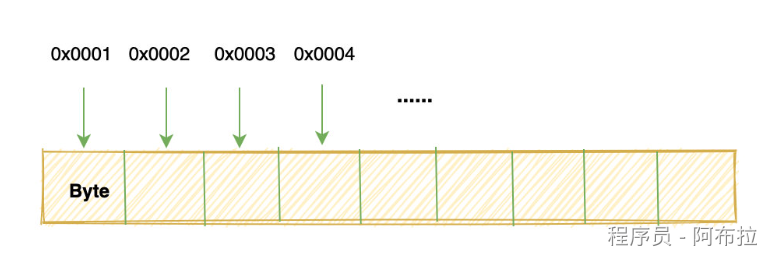

# C/C++ 内存是什么

## 内存本质

编程的本质其实就是操控数据，而数据存放在内存中。

内存就是计算机的存储空间，用于存储程序的指令、数据和状态。

在 C 语言中，内存被组织成一系列的字节，每个字节都有一个唯一的地址。程序中的变量和数据结构存储在这些字节中。

根据变量的类型和作用域，内存分为几个区域，如栈（stack）、堆（heap）和全局/静态存储区。

如果能更好地理解内存的模型，以及 C 如何管理内存，就能对程序的工作原理洞若观火，从而使编程能力更上一层楼。

大家真的别认为这是空话，我大一整年都不敢用 C 写上千行的程序也很抗拒写 C。

因为那时候写 C语言 一旦上千行，经常出现各种莫名其妙的内存错误，一不小心就发生了 coredump...... 而且还无从排查，分析不出原因。

相比之下，那时候最喜欢 Java，在 Java 里随便怎么写都不会发生类似的异常，顶多偶尔来个 NullPointerException，也是比较好排查的。

直到后来对内存和指针有了更加深刻的认识，才慢慢会用 C 写上千行的项目，也很少会再有内存问题了。（过于自信

「指针存储的是变量的内存地址」这句话应该任何讲 C 语言的书都会提到吧。

所以，要想彻底理解指针，首先要理解 C 语言中变量的存储本质，也就是内存。

### 1. 内存编址

计算机的内存是一块用于存储数据的空间，由一系列连续的存储单元组成，就像下面这样


每一个单元格都表示 1 个 Bit，一个 bit 在 EE 专业的同学看来就是高低电位，而在 CS 同学看来就是 0、1 两种状态。

由于 1 个 bit 只能表示两个状态，所以大佬们规定 8个 bit 为一组，命名为 byte。

并且将 byte 作为内存寻址的最小单元，也就是给每个 byte 一个编号，这个编号就叫内存的地址。



这就相当于，我们给小区里的每个单元、每个住户都分配一个门牌号： 301、302、403、404、501......

在生活中，我们需要保证门牌号唯一，这样就能通过门牌号很精准的定位到一家人。

同样，在计算机中，我们也要保证给每一个 byte 的编号都是唯一的，这样才能够保证每个编号都能访问到唯一确定的 byte。

### 2. 内存地址空间

上面我们说给内存中每个 byte 唯一的编号，那么这个编号的范围就决定了计算机可寻址内存的范围。

所有编号连起来就叫做内存的地址空间，这和大家平时常说的电脑是 32 位还是 64 位有关。

早期 Intel 8086、8088 的 CPU 就是只支持 16 位地址空间，寄存器和地址总线都是 16 位，这意味着最多对 2^16 = 64 Kb 的内存编号寻址。

这点内存空间显然不够用，后来，80286 在 8086 的基础上将地址总线和地址寄存器扩展到了20 位，也被叫做 A20 地址总线。

当时在写 mini os 的时候，还需要通过 BIOS 中断去启动 A20 地址总线的开关。

但是，现在的计算机一般都是 32 位起步了，32 位意味着可寻址的内存范围是 2^32 byte = 4GB。

所以，如果你的电脑是 32 位的，那么你装超过 4G 的内存条也是无法充分利用起来的。

好了，这就是内存和内存地址空间。

### 3. 变量的本质

有了内存，接下来我们需要考虑，int、double 这些变量是如何存储在 0、1 单元格的。 在 C 语言中我们会这样定义变量：

```cpp
int a = 999;
char c = 'c';
```

当你写下一个变量定义的时候，实际上是向内存申请了一块空间来存放你的变量。 我们都知道 int 类型占 4 个字节，并且在计算机中数字都是用补码（不了解补码的记得去百度）表示的。

999 换算成补码就是：0000 0011 1110 0111

这里有 4 个byte，所以需要四个单元格来存储：


有没有注意到，我们把高位的字节放在了低地址的地方。 那能不能反过来呢？ 当然，这就引出了大端和小端。 像上面这种将高位字节放在内存低地址的方式叫做大端 反之，将低位字节放在内存低地址的方式就叫做小端：


上面只说明了 int 型的变量如何存储在内存，而 float、char 等类型实际上也是一样的，都需要先转换为补码。

对于多字节的变量类型，还需要按照大端或者小端的格式，依次将字节写入到内存单元。

记住上面这两张图，这就是编程语言中所有变量的在内存中的样子，不管是 int、char、指针、数组、结构体、对象... 都是这样放在内存的。
