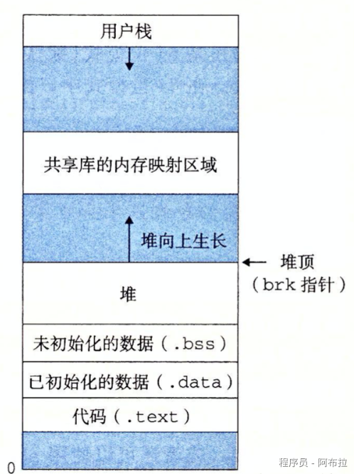

# C/C++内存分区

在这篇文章中: 内存是什么? (opens new window)大概给大家讲了内存是什么，以及数据是如何存放在内存中的。

但是，一般来说，程序运行时，代码、数据等都存放在不同的内存区域，这些内存区域从逻辑上做了划分，大概以下几个区域：代码区、全局/静态存储区、栈区、堆区和常量区。

在 CSAPP 第九章虚拟内存，就将内存分为堆、bss、data、txt、栈等区域。



## 代码区（Code Segment）

也就是 .text 段， 代码区存放程序的二进制代码，它是只读的，以防止程序在运行过程中被意外修改。

```cpp
#include <iostream>
int main() {
    std::cout << "Hello, World!" << std::endl;
    return 0;
}
```

比如上面这段代码中的 main 函数，编译为二进制后，函数的逻辑就存放在代码区。

当然这段区域也有可能包含一些只读的常数变量，例如字符串常量等。

## 全局/静态存储区（Global/Static Storage）

全局变量和静态变量都存放在全局/静态存储区。

以前在 C 语言中全局变量又分为初始化的和未初始化的，分别放在上面图中的 .bss 和 .data 段，但在 C++里面没有这个区分了，他们共同占用同一块内存区，就叫做全局存储区。

这个区域的内存在程序的生命周期几乎都是全局的，举例:

```cpp
#include <iostream>
int globalVar = 0; // 全局变量
void function() {
    static int staticVar = 0; // 静态变量
    staticVar++;
    std::cout << staticVar << std::endl;
}
int main() {
    function();
    function();
    return 0;
}
```

globalVar是一个全局变量，staticVar是一个静态变量，它们都存放在全局/静态存储区。

\#栈区（Stack）

栈区用于存储函数调用时的局部变量、函数参数以及返回地址。

当函数调用完成后，分配给这个函数的栈空间会被释放。例如：

```cpp
#include <iostream>
void function(int a, int b) {
    int localVar = a + b;
    std::cout << localVar << std::endl;
}
int main() {
    function(3, 4);
    return 0;
}
```

在这个例子中，a、b和localVar都是局部变量，它们存放在栈区。

当 function 函数调用结束后，对应的函数栈所占用的空间(参数 a、b，局部变量 localVar等)都会被回收。

## 堆区（Heap）

堆区是用于动态内存分配的区域，当使用new（C++）或者malloc（C）分配内存时，分配的内存块就位于堆区。

我们需要手动释放这些内存，否则可能导致内存泄漏。例如：

```cpp
#include <iostream>
int main() {
    int* dynamicArray = new int[10]; // 动态分配内存
    // 使用动态数组...
    delete[] dynamicArray; // 释放内存
    return 0;
}
```

## 常量区（Constant Storage）：

常量区用于存储常量数据，例如字符串字面量和其他编译时常量。这个区域通常也是只读的。例如：

```cpp
#include <iostream>
int main() {
	char* c="abc";  // abc在常量区，c在栈上。
  return 0;
}
```

## 总结

上面这些分区比较细节，最基础的要求是我们必须掌握下面这些概念：

1. 代码和数据是分开存储的
2. 堆和栈的不同区别
3. 全局变量和局部变量的存储区别
