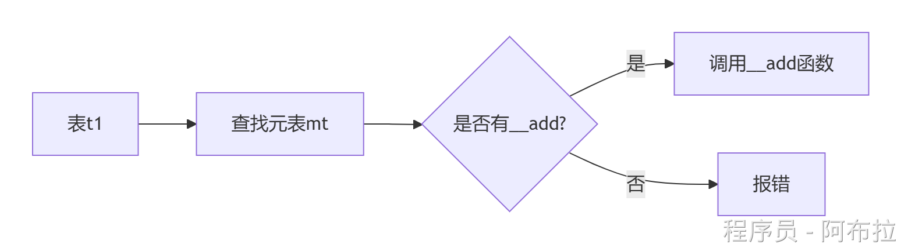

# 基础

# 📚Lua数据类型

**答案**

- 基本类型：`nil`、`boolean`、`number`、`string`
- 引用类型：`table`（表）、`function`（函数）、`userdata`（C数据结构）、`thread`（协程）
    **图示**：

```lua
local str = "Hello"  -- 字符串（不可变引用）
local tbl = {1, 2}   -- 表（可变引用）
```

📌 **注**：表是Lua的核心数据结构，可嵌套存储任意类型。

**传值与传引用**

- 对于基本数据类型而言，赋值语句就是数据复制
- 对于引用数据类型而言，赋值语句，就是让这两个变量指向同一个内存对象

# `pairs` vs `ipairs`

### 相同点

都是能遍历集合（表、数组）

### 不同点

1. ipairs 仅仅遍历值，按照索引升序遍历，索引中断停止遍历。

即不能返回 nil,只能返回数字 0，如果遇到 nil 则退出。

它只能遍历到集合中出现的第一个不是整数的 key。 

1. pairs 能遍历集合的所有元素。即 pairs 可以遍历集合中所有的 key，并且除了迭代器本身以及遍历表本身还可以返回 nil。

| **对比项**        | `ipairs`                   | `pairs`                  |
| ----------------- | -------------------------- | ------------------------ |
| **遍历范围**      | 仅连续数字索引（1,2,3...） | 所有键值对（含非数字键） |
| **遇到**`**nil**` | 停止遍历                   | 继续遍历                 |
| **顺序**          | 索引顺序                   | 任意顺序（哈希表结构）   |
| **代码示例**：    |                            |                          |

```csharp
local t = {1, nil, 3, key="val"}
for i,v in ipairs(t) do print(v) end -- 输出：1
for k,v in pairs(t) do print(k,v) end -- 输出：1、3、"key":"val"
local tabFiles = {
        [1] = "test2",
        [6] = "test3",
        [4] = "test1"
    }

for k, v in ipairs(tabFiles) do    --输出"test2",在key等于2处断开
    print(k, v)
end
local tabFiles = {
    [2] = "test2",
    [6] = "test3",
    [4] = "test1"
}

for k, v in ipairs(tabFiles) do  --[[什么都没输出，为什么？因为控制变量初始值是按升序来遍历的，当key为1时，value为nil，此时便停止了遍历， 所有什么结果都没输出]]--
    print(k, v)
end
local tabFiles = {
    [2] = "test2",
    [6] = "test3",
    [4] = "test1"
}

for k, v in pairs(tabFiles) do  --输出2 test2, 6 test3, 4 test1
    print(k, v)
end
local tabFiles = {"alpha", "beta", [3] = "no", ["two"] = "yes"}  for i,v in ipairs(tabFiles ) do    --输出前三个   备注：因为第四个key不是整数
    print( tabFiles [i] )   
end   
  
for i,v in pairs(tabFiles ) do    --全部输出   
    print( tabFiles [i] )   
end 
```

# 元表（Metatable）的作用

**答案**
元表通过**元方法**（如`__index`、`__add`）扩展表的行为，实现操作符重载、继承等特性。
**示例场景**：

```lua
local mt = {
  __add = function(t1, t2) -- 重载+运算符
    local sum = {}
    for i=1, #t1 do sum[i] = t1[i] + t2[i] end
    return sum
  end
}
setmetatable(t1, mt)
print(t1 + t2) -- 调用__add
```

**工作流程图示**



# Lua 中的userdata是什么

1. `userdata` 是一种用户自定义数据，用于表示一种由应用程序或 C/C++ 语言库所创建的类型，可以将任意 C/C++ 的任意数据类型的数据（通常是 struct 和 指针）存储到 Lua 变量中调用。
2. 它允许Lua程序与C语言（或其他通过C API与Lua交互的语言）中的数据结构进行交互。
3. `userdata` 本质上是一个指向内存中的任意C语言数据结构的指针，但Lua本身并不了解这个指针指向的数据结构的内部细节或布局。

因此，Lua提供了机制来允许C代码和Lua代码之间安全地交换这种类型的数据。  

### 作用

1. **数据共享**：`userdata` 最直接的作用是允许Lua和C之间共享数据。

例如，C代码可能管理着大量的复杂数据结构，而Lua脚本则负责处理这些数据的逻辑。

通过使用`userdata`，C代码可以将这些数据结构的指针传递给Lua，而Lua脚本则可以通过这些指针来访问和操作这些数据。

1. **扩展功能**：`userdata` 还可以用于在Lua中扩展功能。

通过将C语言编写的函数或方法绑定到`userdata`上，Lua脚本可以调用这些C函数，从而执行那些Lua本身无法高效完成或根本无法完成的任务。

1. **性能优化**：在某些情况下，C语言代码的性能可能优于Lua代码。

通过将性能敏感的代码部分用C实现，并通过`userdata`在Lua中调用，可以在保持Lua脚本灵活性和可读性的同时，获得接近C语言的性能。

# require的顺序

面试题：Lua语言中 require的顺序是怎样的

1. 这个是require的语法，首先是lua虚拟机从文件中读取lua代码，把lua代码装在进lua虚拟机
2. 执行lua代码里面的代码指令和函数调用
3. 如果有return, 返回结果
4. 如果重复require, 就只会执行里面的函数调用与代码指令，不会反复的装载
