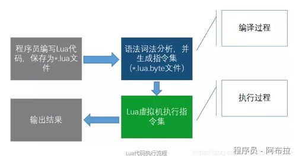
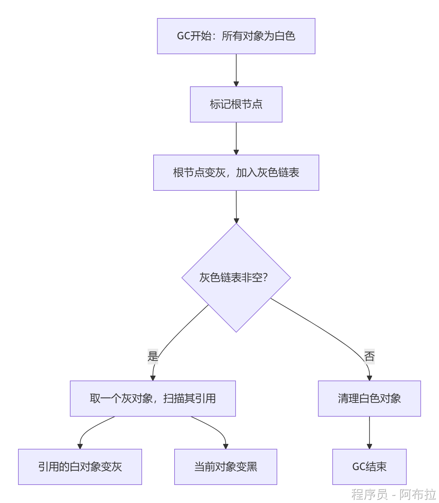

# GC算法与流程

## 面试题

1. Lua 执行代码执行流程
2. LuaGC 算法
3. GC 经历了哪五个阶段？
4. Lua5.4 GC 算法
5. Lua 优化策略

## Lua 代码执行流程



------

## 📊 **Lua GC核心算法**

#### 三色增量标记清除

- **三色标记法**：将对象分为白、灰、黑三色： 

- **白色**：初始状态，表示对象未被扫描，**可回收**。
- **灰色**：中间状态，表示对象**已被扫描但引用的子对象未扫描**。
- **黑色**：完成状态，表示对象及其引用链**已扫描完毕，不可回收**。

- **增量执行**：GC过程拆分为小步骤，避免一次性扫描导致卡顿（Stop-The-World）。

#### **工作流程图示**



------

### ⚙️**GC五阶段**

#### **初始化阶段（GCSpause）**

- **操作**：从根节点（全局表、主线程栈、注册表）开始，将直接引用对象**由白变灰**，加入灰色链表。
- **关键代码**：`restartcollection(g)`。

#### **传播标记阶段（GCSpropagate）**

- **操作**：遍历灰色链表，将每个灰对象： 

- 引用的**白对象变灰**（加入链表）。
- **自身变黑**（移出链表）。

- **增量控制**：每次扫描一定数量对象后暂停，避免单帧卡顿。

#### **原子阶段（GCSatomic）**

- **不可中断操作**：处理剩余灰色对象（如`grayagain`链表）和弱表： 

- **弱表处理**：若键/值为白色，则移除该条目。
- **元方法调用**：触发`__gc`方法（如Userdata的析构）。

- **白色切换**：将当前白色从`WHITE0`切换为`WHITE1`，新对象初始化为`WHITE1`，避免误删。

#### **清扫阶段（GCSsweep & GCSsweepstring）**

- **字符串清扫**：单独处理字符串池（因字符串无引用关系）。
- **对象清扫**：遍历所有对象： 

- **白色（旧白）**：回收内存。
- **灰/黑色**：重置为白色（`WHITE0`），等待下次GC。

#### **收尾阶段（GCSfinalize）**

- **处理残留对象**：如含`__gc`方法的Userdata，将其加入特殊链表，延迟到下次GC回收。

------

### 🛡️ **屏障机制：解决并发修改问题**

增量GC过程中，若已标记对象（黑色）**新增引用白色对象**，需通过屏障保护：

- **向前屏障（luaC_barrierf）**：直接将新引用的白对象**标记为灰色**（适用于Proto等稳定对象）。
- **向后屏障（luaC_barrierback）**：将黑色父对象**退灰**，加入`grayagain`链表（适用于Table等频繁修改对象）。

**图示示例**

```csharp
[黑色] --新增引用--> [白色对象]
         ↓ 触发向后屏障
[灰色] --加入grayagain--> [后续原子阶段处理]
```

------

## **Lua 5.4分代GC（可选模式）**

#### **核心思想**

- **分代假设**：多数对象生命周期短，少数长期存活。
- **晋升规则**：存活两轮GC的对象晋升**老年代**，后续GC仅扫描**新生代**对象。

#### **工作流程**


#### **风险**

- **老年代泄漏**：若老年代对象引用已失效的新生代对象，需周期性全量GC补偿。

------

### **优化策略**

1. **避免临时对象**：减少循环内创建表（如`{}`），改用对象复用。
2. **手动控制GC**。

```lua
collectgarbage("stop")  -- 关键逻辑前暂停GC
-- 执行高性能代码
collectgarbage("step")  -- 分步触发GC
```

1. **弱表管理**：对缓存数据使用弱引用，避免阻止回收： 

```lua
local cache = setmetatable({}, {__mode = "v"}) -- 值弱引用
```

1. **分帧回收**：在`Update`中分批次调用`collectgarbage("step")`，避免单帧卡顿。
2. **触发时机**：在场景切换时主动GC，减少实时帧压力。
3. **内存监控**：使用`LuaProfiler`定位高频生成临时对象的位置。

------

### **GC机制对比**

| **机制**       | **三色标记清除**   | **分代GC（Lua 5.4）**  |
| -------------- | ------------------ | ---------------------- |
| **适用场景**   | 内存敏感型实时应用 | 对象生命周期差异大场景 |
| **卡顿风险**   | 增量执行，卡顿低   | 全量GC时仍有卡顿       |
| **内存开销**   | 无分代记录开销     | 需维护老年代链表       |
| **回收完整性** | 每次全量扫描       | 可能遗漏跨代引用       |
