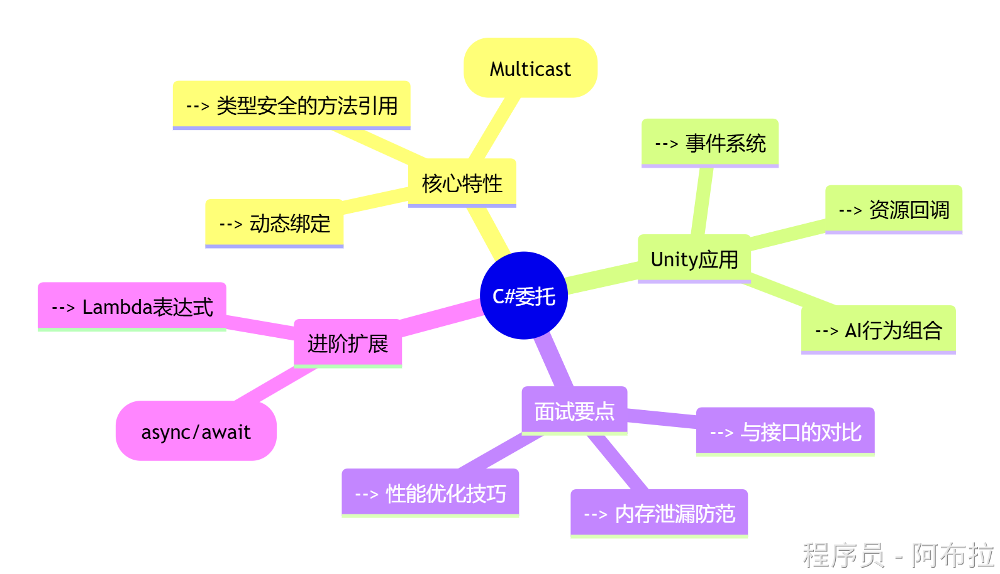
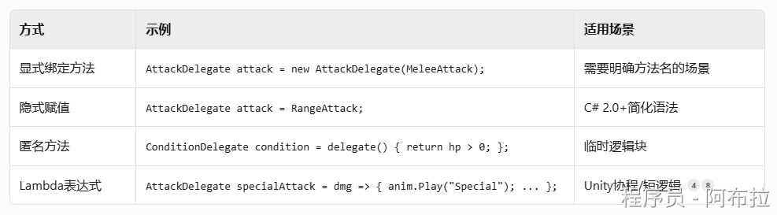
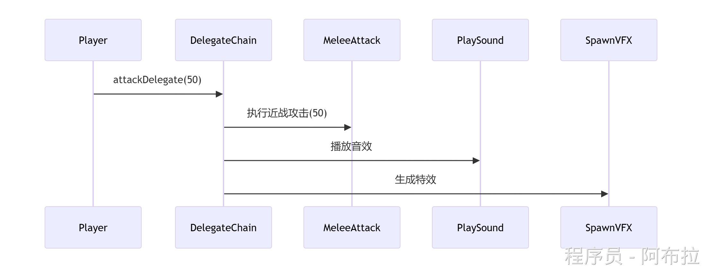
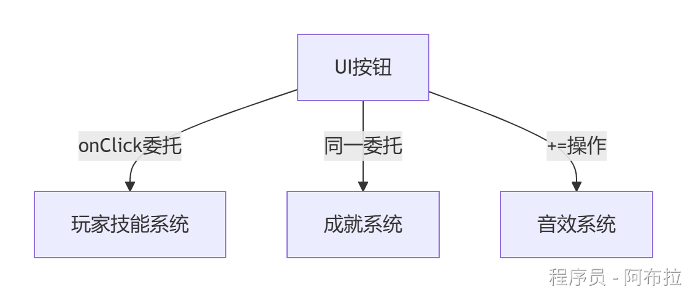

# 委托

在C#中，**委托（Delegate）**是一种类型安全的函数指针，属于**引用类型**数据，它允许将方法作为参数传递、存储或动态调用，是实现事件驱动编程、回调机制和多态行为的关键机制。

**委托是方法的容器，事件是加了权限控制的委托。它们让游戏模块像乐高一样自由组合——UI不需要知道玩家背包如何实现，只需订阅‘购买事件’；成就系统不关心谁死亡，只监听‘死亡事件**

在Unity中优先使用：

- `Action`/`Func`代替自定义委托（减少声明冗余）
- `event`关键字保护委托（防止外部误操作）
- `UnityEvent`用于Inspector可视化配置

想象你是个游戏导演🎬，想让不同演员（游戏对象）在特定时刻做动作。你不可能每次都亲自喊“开拍”，而是需要一种**“指令传递”**机制。

**委托（Delegate）就是这种“指令传递员”****📮****：**

它是C#中的一种**类型**（就像`int`、`string`），专门用来**安全地存储、传递和调用方法。**

它规定了能传递哪些指令：**方法的参数类型和返回值类型必须和委托声明一致**（这叫“**类型安全**”，比C++函数指针更安全）

**核心价值：** 让代码解耦，让A模块能通知B模块做事，而A完全**不需要知道B是谁**。	



------

- **定义**：委托是一种引用类型，用于封装具有特定签名（参数列表和返回类型）的方法。

```js
public delegate int MathOperation(int a, int b); // 定义委托类型
```

- **本质**：

- 委托是面向对象的、类型安全的，不同于C/C++的函数指针，它能够绑定实例方法或静态方法。
- 底层实现上，委托是一个类（如`System.MulticastDelegate`），存储方法地址和调用目标对象（如果是实例方法）。

- **特性：**

类型安全：委托在编译时检查方法签名，确保调用的方法参数和返回类型匹配，避免运行时错误。

拥有多播能力：一个委托实例可以绑定多个方法，形成调用链。通过`+=`和`-=`运算符添加或移除方法。

动态绑定：委托允许在运行时决定调用哪个方法，可绑定实例方法（需保留目标对象引用）或静态方法，支持灵活的策略模式实现。

```js
MathOperation op = Add;
op += Subtract; // 多播委托
op(5, 3); // 依次调用Add和Subtract
```

此委托可以引用任何接受两个`int`参数并返回`int`的方法。

**委托实例化**



**多播委托实战**



```js
// Unity中组合多个效果
AttackDelegate attackEffects = MeleeAttack;
attackEffects += PlaySound;
attackEffects += SpawnVFX;
attackEffects?.Invoke(50); // 安全调用
```

------

### **委托的常见用法**

#### **(1) 事件处理**

委托是事件的基础，例如按钮点击事件的实现

```js
public delegate void EventHandler(object sender, EventArgs e);
public event EventHandler Click; // 事件基于委托
Click += OnButtonClick; // 订阅事件
```

#### **(2) 回调机制**

在异步编程或耗时操作完成后执行回调

```js
public delegate void Callback(string result);
void FetchData(Callback callback) {
    string data = "Result";
    callback(data); // 执行回调
}
```

#### **(3) LINQ与高阶函数**

委托用于定义查询条件或转换逻辑

```js
List<int> numbers = new List<int> { 1, 2, 3 };
var evens = numbers.Where(x => x % 2 == 0); // Lambda表达式作为委托
```

------

### **简化委托的语法**

- **内置委托类型**：
    .NET提供了`Action`（无返回值）和`Func`（有返回值）泛型委托，避免手动声明

```js
Action<string> print = Console.WriteLine; // 无返回值
Func<int, int, int> add = (a, b) => a + b; // 有返回值
```

- **Lambda表达式**：
    简化匿名方法的定义

```js
MathOperation square = x => x * x; // Lambda替代匿名方法
```

------

### **委托与事件的区别**

- **事件**是特殊的委托，封装了`add`和`remove`访问器，限制外部直接调用，仅允许`+=`和`-=`操作。
- **委托**更灵活，可直接调用或赋值，常用于回调；
- **事件**则用于实现发布-订阅模式。

### 委托在Unity事件系统中的实现



```js
// Unity事件委托案例
public class SkillSystem : MonoBehaviour {
    private void OnEnable() {
        Button.onClick += CastSpell;
    }
    private void OnDisable() {
        Button.onClick -= CastSpell; // 必须显式解除
    }
    void CastSpell() {
        Instantiate(spellPrefab, transform.position, Quaternion.identity);
    }
}
```

### **面试避坑指南：委托的致命陷阱**

#### **1. 内存泄漏（90%面试官会问）**

**问题**：未取消订阅导致对象无法被GC回收

```js
// 错误！未在销毁时取消订阅
void OnEnable() => GameEvents.OnScoreChanged += UpdateUI;

// 正确做法
void OnEnable() => GameEvents.OnScoreChanged += UpdateUI;
void OnDisable() => GameEvents.OnScoreChanged -= UpdateUI; // 必须注销！[6,7](@ref)
```

#### **2. 匿名方法陷阱**

**问题**：Lambda中捕获`this`导致意外引用

```js
// 错误！匿名方法隐式捕获this
enemyDeathHandler += (name) => this.ShowKillUI(name);  

// 正确：静态方法或显式解绑
enemyDeathHandler += ShowKillUI; // 非匿名方法
```

#### **3. 空委托安全调用**

**总是使用**`?.Invoke()` 避免空指针异常：

```js
OnDamaged?.Invoke(dmg);  // 安全写法
```
