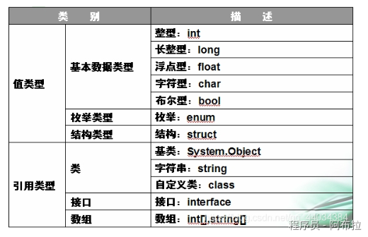

# 值类型与引用类型

## 1. C#中引用类型、值类型的基类分别是什么

在C#中，所有的引用类型都直接或间接地继承自一个特殊的类，这个类就是System.Object类。System.Object类是C#中所有类型的基类，无论是用户自定义的类、结构体（struct）、接口（interface）、委托（delegate）还是系统提供的类，它们最终都追溯到System.Object类。

需要注意的是，System.Object类是所有引用类型的基类，而System.ValueType是所有值类型的基类。虽然System.ValueType也是一个类（引用类型），但值类型本身不是从System.Object继承的。相反，值类型具有自己的特殊行为，并且它们的实例方法（如ToString和Equals）通常是通过编译器生成的代码来提供的。



**内存分布**

**值类型**

1. 值类型只需要一段单独的内存，用于存储实际的数据（单独定义的时候放在栈中）。
2. 值类型：值类型总是分配在它声明的地方，做为局部变量时，存储在栈上；类对象的字段时，则跟随此类存储在堆中。

**引用类型**

1. 引用类型需要两段内存

- 第一段存储实际的数据，它总是位于堆中。
- 第二段是一个引用，指向数据在堆中的存放位置。

1. 引用类型：引用类型存储在堆中。类型实例化的时候，会在堆中开辟一部分空间存储类的实例。类对象的引用还是存储在栈中。


## 2. 简述值类型和引用类型有何区别

下文中的值类型数据存储在栈中，但是值类型的变量可以存储在栈中也可以存储在堆中。

注意：值类型的数据包括了值类型变量，只不过值类型变量比较特殊。

1. 值类型继承自System.ValueType，引用类型继承自System.Object。
2. 值类型的数据存储在内存的栈中；引用类型的数据存储在内存的堆中，而内存单元中只存放堆中对象的地址。
3. 值类型存取速度快，引用类型存取速度慢。
4. 值类型表示实际数据，引用类型表示指向存储在内存堆中的数据的指针或引用。
5. 栈的内存分配是自动释放；而堆在.NET中会有GC来释放。
6. 值类型的变量直接存放实际的数据，保存在堆栈中，而引用类型的变量存放的则是数据的地址（即对象的引用），实际数据的地址保存在堆栈中。

## 3. 什么是装箱、拆箱

在C#中，装箱（Boxing）和拆箱（Unboxing）是两种与**值类型和引用类型之间的转换**相关的操作。

### 3.1. 装箱（Boxing）

装箱是将值类型转换为引用类型的过程。具体来说，它是将值类型的实例包装到一个对象中，这个对象在堆上分配，并包含该值类型实例的一个副本。装箱操作通常发生在以下情况：

- 将值类型赋值给引用类型的变量时。
- 将值类型作为参数传递给接受引用类型参数的方法时。
- 在值类型上调用需要引用类型接收者的方法时（例如，调用继承自 System.Object 的方法）。

装箱操作会引入额外的内存分配和复制成本，因为它需要在堆上创建一个新的对象来存储值类型的值。


### 3.2. 拆箱（Unboxing）

拆箱是从对象中提取值类型值的过程。它是装箱的逆操作，即从引用类型到值类型的转换。拆箱操作要求执行时的对象确实包含所需的值类型，否则将抛出 InvalidCastException 异常。

拆箱操作同样有成本，因为它需要检查对象的实际类型，并从对象中复制值到值类型的变量中。


### 3.3. 装箱和拆箱操作

```js
int value = 42; // 值类型变量  
object obj = value; // 隐式装箱：将int值包装到object类型的引用中  
Console.WriteLine(obj.GetType()); // 输出: System.Int32，证明obj引用了一个int类型的对象  
  
int unboxedValue = (int)obj; // 显式拆箱：从object类型的引用中提取int值  
Console.WriteLine(unboxedValue); // 输出: 42，拆箱成功，获取了原始的值42
```

在这个示例中，value 是一个 int 类型的值变量。当我们将它赋值给 object 类型的变量 obj 时，发生了隐式装箱操作。然后，我们通过显式拆箱将 obj 转换回 int 类型，并将结果存储在 unboxedValue 中。

然而，在实际编程中，应该尽量避免不必要的装箱和拆箱操作，以提高程序的性能。使用泛型集合和避免在值类型上调用虚拟方法是减少装箱和拆箱的常见做法。

## 4. 装箱、拆箱底层实现

### 4.1. 装箱的底层实现

装箱操作发生时，CLR会在托管堆上**分配一个新的对象实例**，并将值类型的字段复制到新分配的对象中。这个新对象包含两个额外的成员：类型对象指针（Type Object Pointer, 方法表指针）和同步块索引。类型对象指针指向该值类型对应的类型信息，而同步块索引用于线程同步（尽管在大多数情况下它并不被使用）。

1. 在堆上分配一个内存空间，大小等于需要装箱的值类型对象的大小加上两个引用类型对象都拥有的成员：类型对象指针和同步块引用。
2. 把堆栈上的值类型对象复制到堆上新分配的对象。
3. 返回一个指向堆上新对象的引用，并且存储到堆栈上被装箱的那个值类型的对象里。


### 4.2. 拆箱的底层实现

拆箱操作则是检查引用类型对象是否确实包含所需的值类型，并从对象中直接读取值类型的字段到栈上的变量中。如果引用类型对象不包含所需的值类型，则会抛出一个 InvalidCastException 异常。

### 4.3. 代码模拟实现

虽然我们不能直接通过C#代码来展示装箱和拆箱的底层实现（因为这涉及到CLR的内部机制），但我们可以通过编写一些示例代码来演示装箱和拆箱操作是如何在高级语言中使用的，并解释其背后的概念。

```js
// 定义一个值类型  
struct MyValueType  
{  
    public int Value;  
}  
  
class Program  
{  
    static void Main()  
    {  
        // 创建一个值类型实例  
        MyValueType value = new MyValueType { Value = 42 };  
          
        // 装箱操作：隐式地将值类型转换为引用类型（object）  
        object obj = value; // 这里发生了装箱，CLR在托管堆上分配内存并复制value的值  
          
        // 现在obj引用了一个在堆上的MyValueType的实例  
          
        // 拆箱操作：显式地将引用类型转换回值类型  
        MyValueType unboxedValue = (MyValueType)obj; // 这里发生了拆箱，从obj中提取出MyValueType的值到unboxedValue中  
          
        // 输出拆箱后的值，以验证拆箱操作的成功  
        Console.WriteLine(unboxedValue.Value); // 输出: 42  
          
        // 尝试将错误的类型拆箱为MyValueType，这将抛出InvalidCastException异常  
        object wrongObj = "This is a string";  
        try  
        {  
            MyValueType invalidUnbox = (MyValueType)wrongObj; // 这里将抛出异常，因为wrongObj不是一个MyValueType的实例  
        }  
        catch (InvalidCastException ex)  
        {  
            Console.WriteLine(ex.Message); // 输出异常信息，指示无法转换类型  
        }  
    }  
}
```

我们定义了一个简单的值类型 MyValueType，并在 Main 方法中创建了一个该类型的实例 value。然后，我们将 value 装箱到一个 object 类型的变量 obj 中。随后，我们演示了如何将 obj 拆箱回 MyValueType 类型的变量 unboxedValue，并输出了其值以验证拆箱操作的成功。最后，我们尝试将一个字符串类型的对象拆箱为 MyValueType 类型，以演示拆箱操作在类型不匹配时会抛出异常的情况。

## 5. 项目中怎么减少装箱拆箱的操作

## 措施

1. **避免不必要的装箱**

尽量使用值类型而不是引用类型，除非有明确的理由需要使用引用类型。避免在不需要的情况下对值类型进行装箱。

2. **使用泛型**

使用泛型集合替代非泛型集合如`List<T>`、`Dictionary<TKey, TValue>`等，而不是非泛型集合如`ArrayList`或`Hashtable`。

非泛型集合会将值类型转换为`object`类型(装箱)，而泛型集合直接存储值类型，避免了转换。

```js
// 不推荐 - 会导致装箱
ArrayList list = new ArrayList();
list.Add(42); // 装箱发生

// 推荐 - 避免装箱
List<int> intList = new List<int>();
intList.Add(42); // 无装箱
```

3. **设计类型专属的消息系统**

对于事件系统，可以设计泛型的事件处理器来避免参数传递时的装箱：

```js
public static class MessageSystem
{
    private static class MessageHandler<TEvent, TParam> where TEvent : struct
    {
        public static readonly Dictionary<TEvent, Action<TParam>> eventTable = 
            new Dictionary<TEvent, Action<TParam>>(32);
    }
    
    // 注册监听（无拆箱）
    public static void Register<TEvent, TParam>(TEvent eventType, Action<TParam> handler) 
        where TEvent : struct
    {
        var handlers = MessageHandler<TEvent, TParam>.eventTable;
        if (handlers.TryGetValue(eventType, out var existing))
        {
            existing += handler;
            handlers[eventType] = existing;
        }
        else
        {
            handlers.Add(eventType, handler);
        }
    }
    
    // 触发事件（无装箱）
    public static void Trigger<TEvent, TParam>(TEvent eventType, TParam param) 
        where TEvent : struct
    {
        if (MessageHandler<TEvent, TParam>.eventTable.TryGetValue(eventType, out var handlers))
        {
            handlers?.Invoke(param);
        }
    }
}
```

4. **使用结构体(struct)与接口优化**

当多个结构体需要实现相同接口时，可以通过以下方式优化：

```js
interface IBehavior
{
    void Execute();
}

struct BehaviorA : IBehavior { /*...*/ }
struct BehaviorB : IBehavior { /*...*/ }

// 调用方法时提前装箱一次，避免内部多次装箱
void ProcessBehavior(IBehavior behavior)
{
    behavior.Execute();
}
```

5. **避免在协程中使用值类型**

使用协程时，避免`yield return 0`，这会导致装箱。应该使用`yield return null`：

```js
// 不推荐 - 会导致装箱
yield return 0;

// 推荐 - 无装箱
yield return null;
```

6. **重载常用方法避免装箱**

对于自定义结构体，重载常用方法如`ToString()`、`GetType()`等可以避免隐式装箱：

```js
struct MyStruct
{
    public int Value;

    // 重载ToString避免装箱
    public override string ToString()
    {
        return Value.ToString();
    }
}
```

如果不重载这些方法，调用时会隐式装箱，因为方法定义在`object`类中。

7. **使用**`**in**`**关键字传递大型结构体**

当需要传递大型结构体时，使用`in`关键字可以避免复制开销，同时明确表示参数不会被修改：

```js
void ProcessLargeStruct(in BigStruct data)
{
    // 读取data但不修改
}
```

这种方法特别适合需要频繁传递大型结构体但又想避免复制开销的场景。

8. **缓存装箱后的对象**

如果确实需要装箱且该对象会被频繁使用，可以缓存装箱后的对象：

```js
object cachedBoxedInt = 42; // 装箱一次

// 多次使用缓存的对象
Method(cachedBoxedInt);
Method(cachedBoxedInt);
```

1. **避免在值类型上调用虚拟方法**：值类型上的虚拟方法调用会导致装箱，因为虚拟方法是通过对象的方法表来调用的。
2. **显式拆箱**：在需要拆箱的情况下，尽量显式地进行拆箱，而不是依赖于隐式拆箱和类型转换。这可以提高代码的可读性和维护性。
