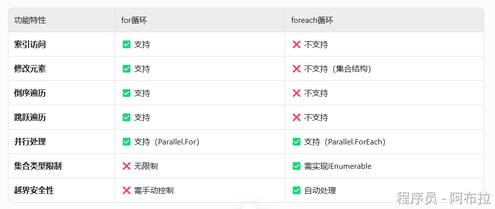

# for与foreach循环

### for循环

for循环是一种通用的循环结构，通过初始化、条件判断和迭代三个部分来控制循环流程。其标准语法为：

```js
for (初始化; 条件; 迭代) 
{
    // 循环体
}
for (int i = 0; i < 10; i++) 
{
    Console.WriteLine(i); // i仅在循环内有效
}
```

需要手动管理循环变量（如索引），可以精确控制循环的起始点、结束条件和步长，适用于各种数据结构，包括数组、集合等，可以在循环体内修改循环变量和集合元素。

- 编译为简单的计数器循环
- 直接通过索引访问数组或集合元素
- 对于数组，编译器能直接计算元素地址，访问速度快

可以在循环中修改集合，但需注意索引可能失效（如删除元素时）

### foreach循环

foreach循环（增强型for循环）是专门为遍历集合和数组设计的简化语法。其标准语法为：

```js
foreach (元素类型 元素变量 in 集合或数组) 
{
    // 循环体
}
int[] numbers = {1, 2, 3, 4, 5};
foreach (int num in numbers) 
{
    Console.WriteLine(num); // num为只读
}
```

自动遍历集合中的每个元素，无需管理索引，适用于实现了`IEnumerable`或`IEnumerable<T>`接口的集合和数组**，**在遍历过程中不能直接修改集合结构！

- 依赖于IEnumerable/IEnumerator接口
- 编译器生成状态机管理迭代过程

禁止在循环中增删集合元素，否则会抛出InvalidOperationException

迭代变量是只读的，不能直接修改（对于引用类型，可以修改其属性）

### 比较

- **数组遍历**：对于数组，for循环通常比foreach循环快5-15%，因为for循环直接通过索引访问元素，而foreach需要通过迭代器
- **List\<T\>遍历**：对于List\<T\>，foreach循环的性能接近for循环，因为编译器会进行优化
- **自定义集合**：对于没有优化索引器的自定义集合，foreach循环可能更高效，因为它使用集合内置的迭代器


