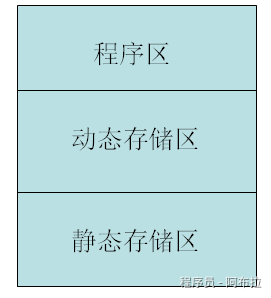

# static

## 1. C#中静态字段和非静态字段的区别

在C#中，静态字段（Static Fields）和非静态字段（Instance Fields）是两种不同的字段类型，它们之间存在几个主要区别。

### 静态字段（Static Fields）

静态字段属于类本身，而不是类的任何特定实例。它们是通过在字段声明前添加static关键字来定义的。静态字段在程序执行期间只存在一个副本，无论创建多少个类的实例。静态字段通常用于存储与类相关的数据，这些数据不依赖于类的任何特定实例。

#### 特点

- 静态字段在程序加载包含该类的类型时初始化。
- 静态字段通过类名直接访问，不需要类的实例。
- 静态字段的生命周期与应用程序域的生命周期相同，当应用程序域卸载时，静态字段将被销毁。
- 静态字段是线程不安全的，除非通过适当的同步机制（如lock语句）进行保护。
- 静态字段存储在静态静态存储区内。



### 非静态字段（Instance Fields）

非静态字段属于类的实例。每个类实例都有自己的一组非静态字段，这些字段在实例创建时初始化，并在实例销毁时释放。非静态字段用于存储与特定实例相关的数据。

#### 特点

- 非静态字段在创建类的新实例时初始化。
- 非静态字段通过类的实例访问，需要使用实例名称和点（.）运算符。
- 非静态字段的生命周期与它们所属的实例相同。当实例不再使用时，非静态字段将被垃圾回收器释放（假设没有其他引用指向该实例）。
- 非静态字段的线程安全性取决于它们是如何被访问和修改的。如果多个线程同时访问和修改同一个实例的非静态字段，并且没有适当的同步，则可能会出现数据不一致的问题。但是，如果每个线程都有自己的实例，并且只访问和修改自己的实例字段，那么就不需要额外的同步。

### 代码示例

下面是一个简单的代码示例，演示了静态字段和非静态字段的区别：

```js
public class MyClass  
{  
    // 静态字段  
    public static int StaticField;  
  
    // 非静态字段  
    public int InstanceField;  
  
    // 静态构造函数（可选，用于初始化静态字段）  
    static MyClass()  
    {  
        StaticField = 0; // 静态字段初始化  
    }  
  
    // 实例构造函数（用于初始化非静态字段）  
    public MyClass()  
    {  
        InstanceField = 0; // 非静态字段初始化  
    }  
}  
  
class Program  
{  
    static void Main()  
    {  
        // 访问静态字段（不需要实例）  
        MyClass.StaticField = 10;  
        Console.WriteLine(MyClass.StaticField); // 输出 10  
  
        // 访问非静态字段（需要实例）  
        MyClass instance1 = new MyClass();  
        instance1.InstanceField = 20;  
        Console.WriteLine(instance1.InstanceField); // 输出 20  
  
        MyClass instance2 = new MyClass();  
        Console.WriteLine(instance2.InstanceField); // 输出 0，因为这是一个新的实例，其非静态字段未被修改过  
    }  
}
```

## 2. 静态构造函数

静态构造函数（Static Constructor）在C#中是一种特殊的构造函数，它用于初始化类的静态成员或执行只需要在类加载时执行一次的操作。静态构造函数与实例构造函数不同，它不需要与类的任何实例相关联，而是与类本身相关联。

静态构造函数有以下几个特点：

1. 静态构造函数没有访问修饰符，也没有参数。
2. 静态构造函数不能被直接调用，它会在类被加载到内存时自动执行，且只执行一次。
3. 静态构造函数在类的任何静态成员被引用之前执行。
4. 如果没有定义静态构造函数，编译器会自动生成一个默认的静态构造函数。

下面是一个简单的C#代码示例，演示了静态构造函数的使用：

```js
using System;  
  
public class MyClass  
{  
    // 静态字段  
    public static int StaticField;  
  
    // 静态构造函数  
    static MyClass()  
    {  
        Console.WriteLine("静态构造函数被调用");  
        StaticField = 42; // 初始化静态字段  
    }  
  
    // 实例构造函数  
    public MyClass()  
    {  
        Console.WriteLine("实例构造函数被调用");  
    }  
  
    public static void PrintStaticField()  
    {  
        Console.WriteLine("静态字段的值是: " + StaticField);  
    }  
}  
  
class Program  
{  
    static void Main()  
    {  
        // 访问静态方法，触发静态构造函数的执行  
        MyClass.PrintStaticField();  
  
        // 创建类的实例，此时静态构造函数已经执行过了，所以不会再执行  
        MyClass obj = new MyClass();  
  
        // 再次访问静态字段，静态构造函数依然不会执行  
        MyClass.PrintStaticField();  
    }  
}
```

输出将是：

```js
静态构造函数被调用  
静态字段的值是: 42  
实例构造函数被调用  
静态字段的值是: 42
```

在这个例子中，MyClass 类有一个静态字段 StaticField 和一个静态构造函数。当 Main 方法中第一次通过 MyClass.PrintStaticField() 访问 MyClass 的静态成员时，静态构造函数会被自动调用，并且只调用一次。之后，无论是创建 MyClass 的实例还是再次访问静态成员，静态构造函数都不会再执行。静态构造函数中初始化了 StaticField 字段，并通过 PrintStaticField 方法打印其值。

## 3. Unity 中 static 常用的使用方法

在Unity中，`static`关键字用于定义静态成员（变量、方法、类等），这些成员属于类本身而非实例，具有全局共享、持久化等特性。覆盖了数据共享、性能优化、工具封装等场景。

以下是我总结的 Unity中`static`的典型应用范例及注意事项

------

### **全局数据共享**

**游戏管理器（GameManager）**

静态变量常用于存储全局游戏状态，如分数、游戏是否结束等，所有脚本均可直接访问：

```js
public class GameManager : MonoBehaviour {
    public static int score;  // 全局分数
    public static bool isGameOver;  // 游戏结束标志
}
```

其他脚本中可直接调用：

```js
void Update() {
    if (GameManager.isGameOver) {
        // 显示结束界面
    }
}
```

**优点**：无需实例化类即可访问数据，简化代码结构。

#### **单例模式（Singleton）**

单例模式也是面试特别爱考的一个点，单例分很多种类，以下是继承于 MonoBehaviour 的。

通过静态变量实现单例，确保关键管理器（如音频、场景加载）唯一存在：

```js
public class AudioManager : MonoBehaviour {
    private static AudioManager _instance;
    public static AudioManager Instance {
        get {
            if (_instance == null) {
                _instance = FindObjectOfType<AudioManager>();
                if (_instance == null) {
                    GameObject obj = new GameObject("AudioManager");
                    _instance = obj.AddComponent<AudioManager>();
                }
            }
            return _instance;
        }
    }
}
```

**应用场景**：资源管理、全局配置。

------

### **性能优化**

#### **静态物体标记**

将场景中不移动的物体（如地形、建筑）标记为`Static`，Unity会优化其渲染和光照计算：

- **操作**：在Inspector面板勾选`Static`复选框。
- **效果**：启用光照烘焙（Lightmapping）和遮挡剔除（Occlusion Culling），减少运行时开销。

#### **共享资源缓存**

静态变量存储常用资源（如字体、纹理），避免重复加载：

```js
public class ResourceCache {
    public static Texture2D sharedTexture;
    void Start() {
        sharedTexture = Resources.Load<Texture2D>("Textures/Background");
    }
}
```

**优势**：降低内存碎片化，提升加载速度。

------

### **工具类与辅助方法**

静态方法提供无需实例化的工具函数，如数学计算、日志输出：

```js
public class MathUtils {
    public static float LerpWithEase(float a, float b, float t) {
        return a + (b - a) * t * t;  // 缓动插值
    }
}
// 调用示例
float value = MathUtils.LerpWithEase(0, 10, 0.5f);
```

**适用场景**：通用工具函数、调试工具。

------

### **额外注意**

1. **线程安全**：多线程环境下修改静态变量需加锁（如`lock`语句）。
2. **内存泄漏**：静态引用类型变量（如`List`）需手动释放，或使用`WeakReference`。
3. **场景切换**：静态变量默认跨场景保留，需在`OnDestroy`中重置（如`GameManager.score = 0`）。
4. **过度使用风险**：滥用静态变量会导致代码耦合度高，建议优先依赖注入或事件系统。（一般情况下游戏框架中是会封装事件系统的）

------
