# List原理

List 源码用数组（动态数组）实现的，常用接口的时间复杂度为线性时间，多次元素增加，扩容方式为2的指数，（4，8，16，32，64，128，256，512，1024…依次类推）如果元素数量有65个，则扩容（64*2）128，造成大量的内存空间的浪费。

没有对多线程做任何的加锁安全处理，无法处理并发情况下_size++ 的执行顺序，因此在多线程使用的时候 要进行加锁等安全处理操作。List 兼容性强，但效率并不高。

List 集合往往会配合着泛型使用，能避免一定程度的装箱拆箱带来的性能问题。泛型约束也更好的让程序员知道集合中包含的是什么数据类型，约束了集合添加数据的规范。

使用List的时候，如果能提前知道List的最大容量，可以**直接在初始化的时候初始化容量**，这样List就不必频繁扩容（每次new数组），加剧GC负担了。

这边额外说有些 foreach 语法糖，面试常常会拿 for 做对比。foreach 也是可以遍历 List 集合的，在 Unity 不是很推荐使用。

## foreach

一些情况下用foreach很合适，方便。而在Unity中使用C#，尽量不使用foreach，所有foreach的地方统统用for/while代替，**foreach会产生额外的GC**。

foreach每次获取迭代器时，会new一个Enumerator，如果大量使用迭代器的话，比如foreach就会造成大量的垃圾对象，这也是为什么我们常常告诫程序员们，尽量不要用foreach，因为 List 的 foreach 会增加有新的 Enumerator 实例，最后由GC垃圾回收掉。

```js
 List<int> list = new List<int>();
    public void Test()
    {
        foreach (int current in list)
        {
            Debug.Log(current);
        }
    }

--反编译以后，foreach语法糖会被展开：

 private List<int> list = new List<int>();

	public void Test()
	{
		using (List<int>.Enumerator enumerator = this.list.GetEnumerator())
		{
			while (enumerator.MoveNext())
			{
				int current = enumerator.get_Current();
				Debug.Log(current);
			}
		}
	}

        public Enumerator GetEnumerator() {
            return new Enumerator(this);
        }
```

## 以下是涉及到的 List 实现函数

## List 构造函数

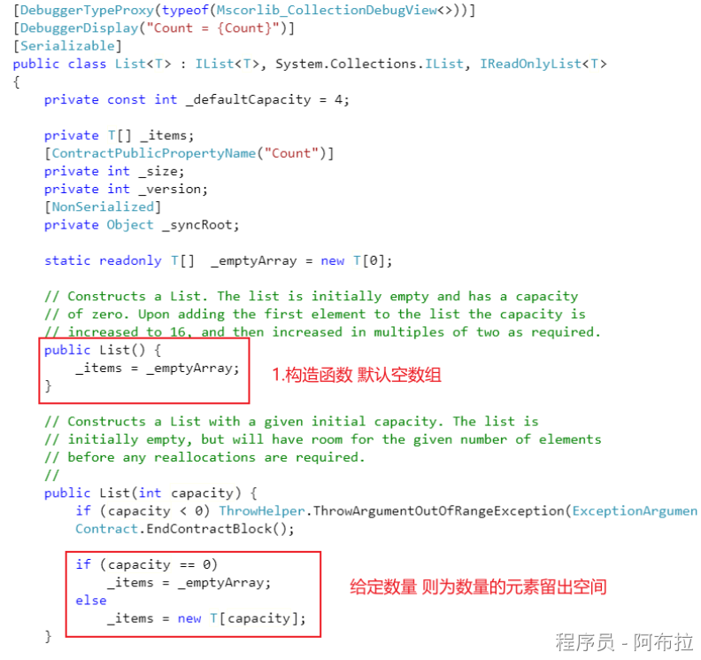

## Add 函数

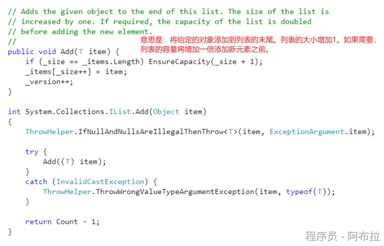

## Remove 函数

**使用Array.IndexOf ()  获取Item 的索引，然后用RemoveAt 来移除，RemoveAt里面用的是 Array.Copy 来拷贝数组，从index处之后的元素往前移一位。时间复杂度为O（n）线性时间。**

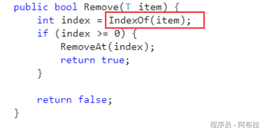

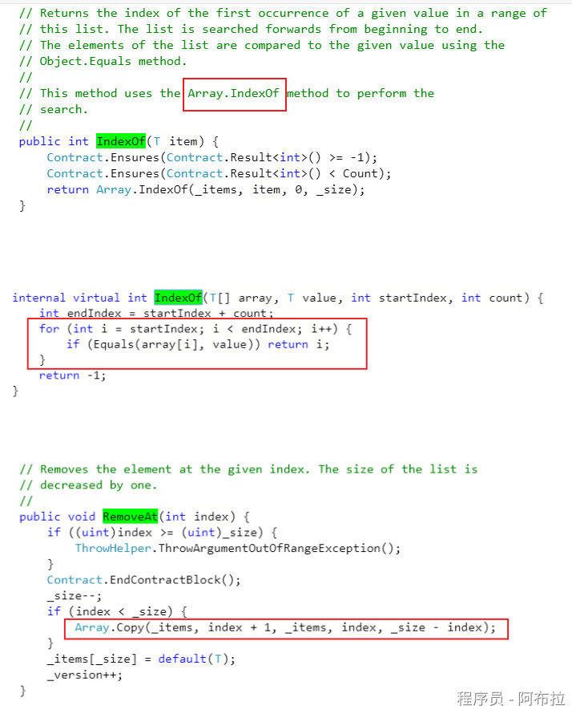

## Insert 函数

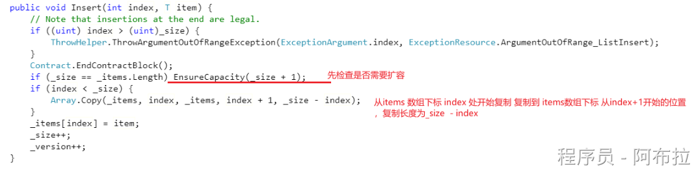

## EnsureCapacity 函数扩容

## 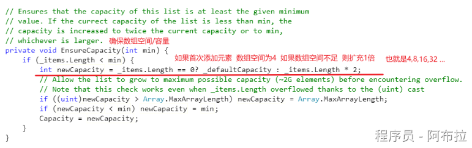Clear 和 Contains 函数

## 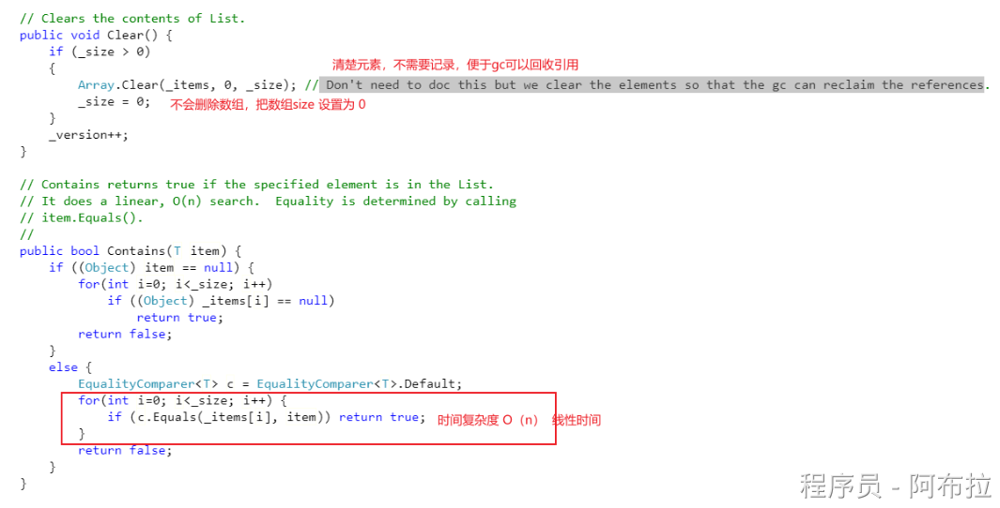ToArray 函数

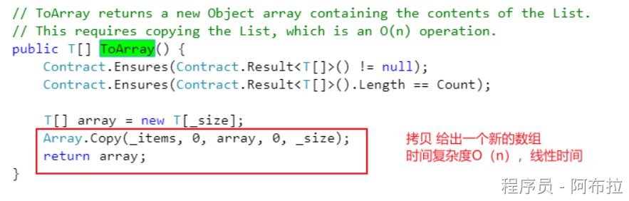

## Sort 函数

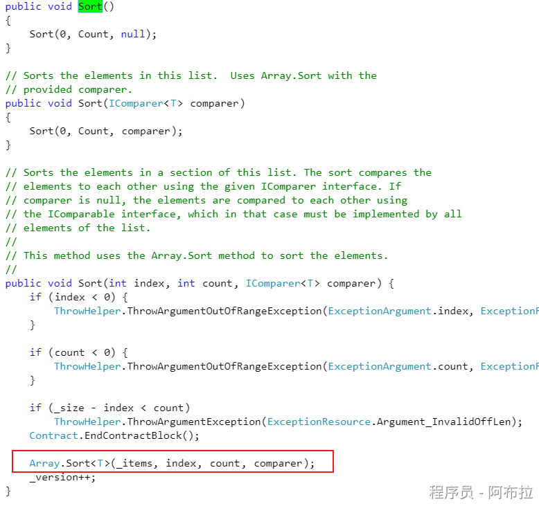

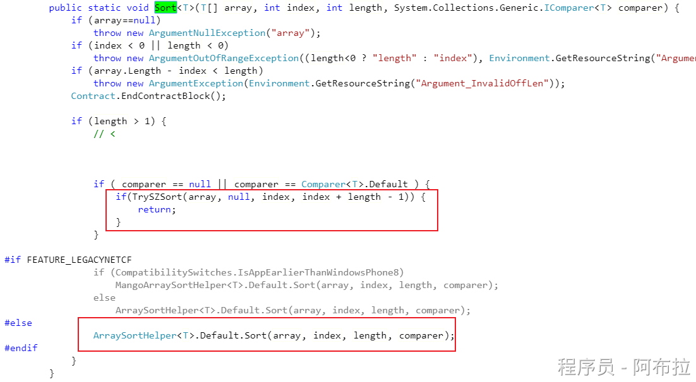

## Array.Sort 排序算法

**时间复杂度为O（n logn）快速排序**

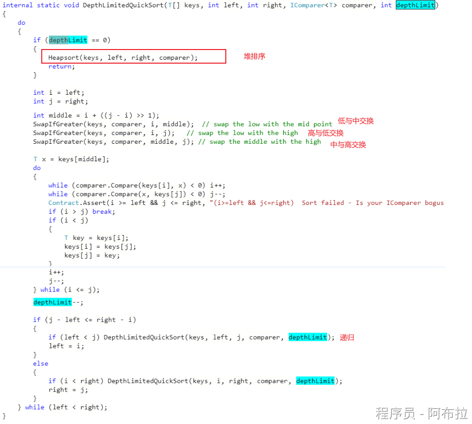
