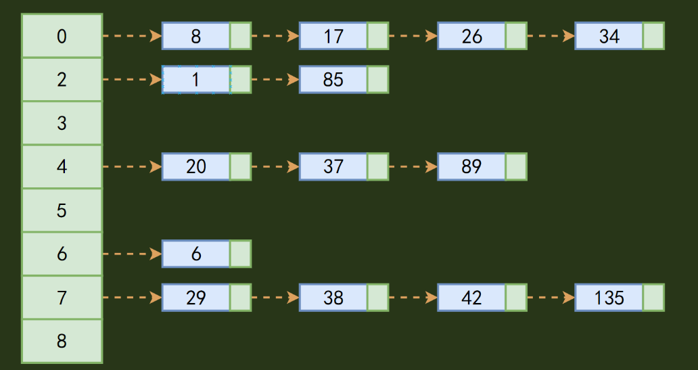
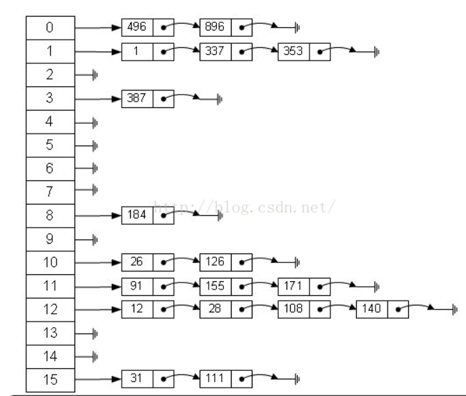
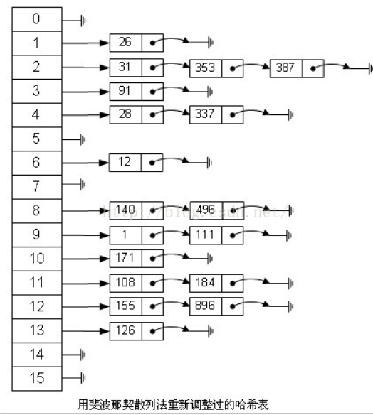

# 散列表（哈希表）

## 什么是哈希表（哈希表原理）

## 1. 概念

哈希表（Hash table，也叫散列表），是根据关键码值(Key value)而直接进行访问的数据结构。也就是说，它通过把关键码值映射到表中一个位置来访问记录，以加快查找的速度。这个映射函数叫做散列函数，存放记录的**数组**叫做散列表。

记录的存储位置=f(关键字)

这里的对应关系f称为散列函数，又称为哈希（Hash函数），采用散列技术将记录存储在一块连续的存储空间中，这块连续存储空间称为散列表或哈希表（Hash table）。

哈希表hashtable(key，value) 

就是把Key通过一个固定的**算法函数**既所谓的哈希函数转换成一个整型数字，然后就将该数字对**数组长度进行取余**，取余结果就当作**数组的下标**，将value存储在以该数字为下标的数组空间里。（或者：把任意长度的输入（又叫做预映射， pre-image），通过散列算法，变换成固定长度的输出，该输出就是散列值。这种转换是一种压缩映射，也就是，散列值的空间通常远小于输入的空间，不同的输入可能会散列成相同的输出，而不可能从散列值来唯一的确定输入值。简单的说就是一种将任意长度的消息压缩到某一固定长度的消息摘要的函数。）



在散列表中，左边是个数组，数组的每个成员包括一个指针，指向一个链表的头，当然这个链表可能为空，也可能元素很多。我们根据元素的一些特征把元素分配到不同的链表中去，也是根据这些特征，找到正确的链表，再从链表中找出这个元素。

## 2. 查询哈希表

而当使用哈希表进行查询的时候，就是再次使用哈希函数将key转换为对应的数组下标，并定位到该空间获取value，如此一来，就可以充分利用到数组的定位性能进行数据定位。

数组的特点是：寻址容易，插入和删除困难；

而链表的特点是：寻址困难，插入和删除容易。

那么我们能不能综合两者的特性，做出一种寻址容易，插入删除也容易的数据结构？答案是肯定的，这就是我们要提起的哈希表，哈希表有多种不同的实现方法，我接下来解释的是最常用的一种方法——拉链法，我们可以理解为“链表的数组”，如图：



左边很明显是个数组，数组的每个成员包括一个指针，指向一个链表的头，当然这个链表可能为空，也可能元素很多。我们根据元素的一些特征把元素分配到不同的链表中去，也是根据这些特征，找到正确的链表，再从链表中找出这个元素。

## 3. Hash的应用

1. Hash主要用于**信息安全领域中加密算法**，它把一些不同长度的信息转化成杂乱的128位的编码,这些编码值叫做Hash值. 也可以说，Hash就是找到一种**数据内容和数据存放地址**之间的映射关系。
2. 查找：哈希表，又称为散列，是一种更加快捷的查找技术。

我们之前的查找，都是这样一种思路：集合中拿出来一个元素，看看是否与我们要找的相等，如果不等，缩小范围，继续查找。而哈希表是完全另外一种思路：当我知道key值以后，我就可以直接计算出这个元素在集合中的位置，根本不需要一次又一次的查找！

**举例**

举一个例子，假如我的数组A中，第i个元素里面装的key就是i，那么数字3肯定是在第3个位置，数字10肯定是在第10个位置。哈希表就是利用利用这种基本的思想，建立一个从key到位置的函数，然后进行直接计算查找。

1. Hash表在海量数据处理中有着广泛应用。

Hash Table的查询速度非常的快，几乎是**O(1)**的时间复杂度。

hash就是找到一种数据内容和数据存放地址之间的映射关系。

散列法：元素特征转变为数组下标的方法。

我想大家都在想一个很严重的问题：“如果两个字符串在哈希表中对应的位置相同怎么办？”,毕竟一个数组容量是有限的，这种可能性很大。解决该问题的方法很多，我首先想到的就是用“链表”。我遇到的很多算法都可以转化成链表来解决，只要在哈希表的每个入口挂一个链表，保存所有对应的字符串就OK了。

当存储记录时，通过散列函数计算出记录的散列地址

当查找记录时，我们通过同样的是散列函数计算记录的散列地址，并按此散列地址访问该记录

关键字——散列函数（哈希函数）——散列地址

1. 优点：一对一的查找效率很高；
2. 缺点：一个关键字可能对应多个散列地址；需要查找一个范围时，效果不好。
3. 散列冲突：不同的关键字经过散列函数的计算得到了相同的散列地址。

好的**散列函数=计算简单+分布均匀（计算得到的散列地址分布均匀）**

哈希表是种数据结构，它可以提供快速的插入操作和查找操作。

## 4. 优缺点

**优点**

不论哈希表中有多少数据，查找、插入、删除（有时包括删除）只需要接近常量的时间即0(1）的时间级。实际上，这只需要几条机器指令。哈希表运算得非常快，在计算机程序中，如果需要在一秒种内查找上千条记录通常使用哈希表（例如拼写检查器)哈希表的速度明显比树快，树的操作通常需要O(N)的时间级。哈希表不仅速度快，编程实现也相对容易。如果不需要有序遍历数据，并且可以提前预测数据量的大小。那么哈希表在速度和易用性方面是无与伦比的。

**缺点**

它是基于数组的，数组创建后难于扩展，某些哈希表被基本填满时，性能下降得非常严重，所以程序员必须要清楚表中将要存储多少数据（或者准备好定期地把数据转移到更大的哈希表中，这是个费时的过程）。

元素特征转变为数组下标的方法就是散列法。

散列法当然不止一种，下面列出三种比较常用的：

1. 除法散列法 
    最直观的一种，上图使用的就是这种散列法，公式： 
          index = value % 16 
    学过汇编的都知道，求模数其实是通过一个除法运算得到的，所以叫“除法散列法”。
2. 平方散列法 
    求index是非常频繁的操作，而乘法的运算要比除法来得省时（对现在的CPU来说，估计我们感觉不出来），所以我们考虑把除法换成乘法和一个位移操作。公式： 
          index = (value * value) >> 28   （右移，除以2^28。记法：左移变大，是乘。右移变小，是除。）
    如果数值分配比较均匀的话这种方法能得到不错的结果，但我上面画的那个图的各个元素的值算出来的index都是0——非常失败。也许你还有个问题，value如果很大，value * value不会溢出吗？答案是会的，但我们这个乘法不关心溢出，因为我们根本不是为了获取相乘结果，而是为了获取index。
3. 斐波那契（Fibonacci）散列法

平方散列法的缺点是显而易见的，所以我们能不能找出一个理想的乘数，而不是拿value本身当作乘数呢？答案是肯定的。

1，对于16位整数而言，这个乘数是40503 
2，对于32位整数而言，这个乘数是2654435769 
3，对于64位整数而言，这个乘数是11400714819323198485

这几个“理想乘数”是如何得出来的呢？这跟一个法则有关，叫黄金分割法则，而描述黄金分割法则的最经典表达式无疑就是著名的斐波那契数列，即如此形式的序列：0, 1, 1, 2, 3, 5, 8, 13, 21, 34, 55, 89, 144, 233,377, 610， 987, 1597, 2584, 4181, 6765, 10946，…。另外，斐波那契数列的值和太阳系八大行星的轨道半径的比例出奇吻合。

对我们常见的32位整数而言，公式： 
            index = (value * 2654435769) >> 28

如果用这种斐波那契散列法的话，那上面的图就变成这样了：



注：用斐波那契散列法调整之后会比原来的取摸散列法好很多。 

适用范围
    快速查找，删除的基本数据结构，通常需要总数据量可以放入内存。

基本原理及要点
    hash函数选择，针对字符串，整数，排列，具体相应的hash方法。 
碰撞处理，一种是open hashing，也称为拉链法；另一种就是closed hashing，也称开地址法，opened addressing。

## 5. 散列冲突（哈希冲突）的解决方案

1. 建立一个缓冲区，把凡是拼音重复的人放到缓冲区中。当我通过名字查找人时，发现找的不对，就在缓冲区里找。
2. 进行再探测。就是在其他地方查找。探测的方法也可以有很多种。

（1）在找到查找位置的index的index-1，index+1位置查找，index-2，index+2查找，依次类推。这种方法称为线性再探测。

（2）在查找位置index周围随机的查找。称为随机在探测。

（3）再哈希。就是当冲突时，采用另外一种映射方式来查找。

这个程序中是通过取模来模拟查找到重复元素的过程。对待重复元素的方法就是再哈希：对当前key的位置+7。最后，可以通过全局变量来判断需要查找多少次。我这里通过依次查找26个英文字母的小写计算的出了总的查找次数。显然，当总的查找次数/查找的总元素数越接近1时，哈希表更接近于一一映射的函数，查找的效率更高。

## 6. 问题实例（海量数据处理）

 我们知道hash 表在海量数据处理中有着广泛的应用。

百度面试题题目：

海量日志数据，提取出某日访问百度次数最多的那个IP。方案：IP的数目还是有限的，最多2^32个，所以可以考虑使用hash将ip直接存入内存，然后进行统计。

## C#中的哈希表实现

在C#中，哈希表的主要实现原理涉及几个关键部分：哈希函数的计算、冲突解决策略、动态扩容以及内部数据结构的设计。下面，我将通过Dictionary\<TKey, TValue\>类的例子来详细解释这些原理，并提供相应的C#代码示例。

### 1. 哈希函数的计算

哈希函数负责将键（Key）转换为一个整数，这个整数用作内部数组（通常称为“桶”或“槽”）的索引。在C#中，Dictionary\<TKey, TValue\>使用键类型的**GetHashCode**方法来获取哈希码。如果键是自定义类型，你可能需要重写GetHashCode方法以确保良好的哈希分布。

```js
public class Person  
{  
    public string Name { get; set; }  
    public int Age { get; set; }  
  
    // 重写 GetHashCode 方法以提供自定义哈希码计算  
    public override int GetHashCode()  
    {  
        unchecked // Overflow is fine, just wrap  
        {  
            int hash = 17;  
            hash = hash * 23 + Name.GetHashCode();  
            hash = hash * 23 + Age.GetHashCode();  
            return hash;  
        }  
    }  
}
```

### 2. 冲突解决策略

当两个或多个键的哈希码相同时，就发生了冲突。C#中的Dictionary\<TKey, TValue\>使用链地址法（也称为分离链接法）来解决冲突。每个桶实际上是一个链表，用于存储具有相同哈希码的键值对。

```js
Dictionary<Person, string> peopleDict = new Dictionary<Person, string>();  
  
Person alice = new Person { Name = "Alice", Age = 30 };  
Person bob = new Person { Name = "Bob", Age = 25 };  
Person aliceClone = new Person { Name = "Alice", Age = 30 }; // 与alice有相同的哈希码  
  
peopleDict.Add(alice, "Alice's info");  
peopleDict.Add(bob, "Bob's info");  
  
// 尝试添加具有相同哈希码的aliceClone将导致异常，因为键必须是唯一的  
// peopleDict.Add(aliceClone, "AliceClone's info"); // 这将抛出 ArgumentException
```

在上面的代码中，如果alice和aliceClone的GetHashCode方法返回相同的哈希码，它们将被放在同一个桶的链表中。但是，由于字典要求键是唯一的，尝试添加具有相同键的项会抛出异常。

### 3. 动态扩容

当Dictionary\<TKey, TValue\>中的元素数量超过内部数组长度的某个阈值时（通常是容量的75%左右），它会创建一个新的、更大的数组，并将现有的元素重新哈希并插入到新数组中。这个过程称为扩容或重新哈希。

```csharp
Dictionary<int, string> numberDict = new Dictionary<int, string>();  
  
// 添加元素直到触发扩容  
for (int i = 0; i < 100; i++)  
{  
    numberDict.Add(i, i.ToString());  
}  
  
// 扩容后，内部数组会变大，且所有元素都会被重新哈希到新位置
```

在上面的代码中，当numberDict中的元素数量接近其内部数组长度的75%时，它会自动扩容，并重新计算所有元素的哈希码和位置。

### 4. 内部数据结构

Dictionary\<TKey, TValue\>的内部主要由**两个数组**组成：

一个用于存储桶的数组，另一个用于存储每个桶中链表的数组。

桶数组的每个元素实际上是一个指向链表节点的指针，链表节点包含键值对信息以及指向下一个节点的指针。

这些内部细节通常对使用者是隐藏的，你可以通过Dictionary\<TKey, TValue\>的公共API（如Add、ContainsKey、TryGetValue等）来操作哈希表，而无需关心其内部实现。

最后，请一定要记住 C#中的哈希表通过计算键的**哈希码（使用GetHashCode方法）**来确定其在内部数组中的位置，使用链地址法解决冲突，并在必要时通过动态扩容来优化性能。

## 哈希表与字典对比

## 字典

1. 内部用了Hashtable作为存储结构
2. 如果我们试图找到一个不存在的键，它将返回 / 抛出异常。
3. 它比哈希表更快，因为没有装箱和拆箱，尤其是值类型。
4. 仅公共静态成员是线程安全的。
5. 字典是一种通用类型，这意味着我们可以将其与任何数据类型一起使用（创建时，必须同时指定键和值的数据类型）。
6. Dictionay 是 Hashtable 的类型安全实现， Keys和Values是强类型的。
7. Dictionary遍历输出的顺序，就是加入的顺序。

## 哈希表

1. 如果我们尝试查找不存在的键，则返回 null。
2. 它比字典慢，因为它需要装箱和拆箱。
3. 哈希表中的所有成员都是线程安全的。
4. 哈希表不是通用类型。
5. HashTable 是松散类型的数据结构，我们可以添加任何类型的键和值。
6. HashTable是经过优化的，访问下标的对象先散列过，所以内部是无序散列的。
