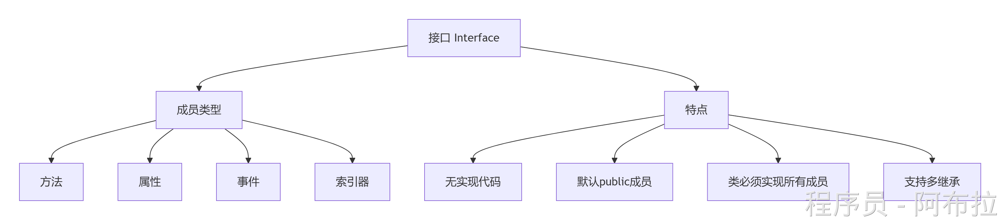

# 面向接口

### **接口（Interface）的定义与本质**

**接口是行为的抽象契约**，它仅定义类“必须做什么”（方法、属性等签名），而不规定“如何实现”

- **核心特点**： 

- 📜 **纯抽象规范**：不包含字段、构造函数或具体实现（C#8前）
- 🔗 **多继承支持**：类可同时实现多个接口（解决C#单继承限制）
- ⚙️ **多态基石**：通过接口引用调用不同实现类的方法

**代码示例**

```js
public interface IShape {
    double Area();      // 方法签名
    string Name { get; } // 属性签名
}
```

### **接口的核心特性**



### **接口的实现与多态应用**

**实现步骤**

1. **类继承接口**：`class Circle : IShape`
2. **提供具体实现**：必须实现所有接口成员

```js
// 不同实现类
public class Circle : IShape {
    public double Radius { get; set; }
    public string Name => "圆形";
    public double Area() => Math.PI * Radius * Radius;
}

public class Square : IShape {
    public double Side { get; set; }
    public string Name => "正方形";
    public double Area() => Side * Side;
}

// 多态调用
List<IShape> shapes = new List<IShape> {
    new Circle { Radius = 5 },
    new Square { Side = 4 }
};

foreach (var shape in shapes) {
    Console.WriteLine($"{shape.Name} 面积: {shape.Area():F2}");
}
```

**输出结果**

```csharp
圆形 面积: 78.54  
正方形 面积: 16.00
```

------

### **接口/抽象类区别**

| **特性**     | **接口（Interface）**            | **抽象类（Abstract Class）** |
| ------------ | -------------------------------- | ---------------------------- |
| **实现方式** | 纯抽象契约（无实现）             | 可包含部分实现               |
| **继承限制** | 支持多继承                       | 仅支持单继承                 |
| **成员类型** | 无字段/构造函数                  | 可包含字段、构造函数         |
| **适用场景** | 定义跨层级行为规范（如插件接口） | 提供基础实现（如动物基类）   |

------

### **应用场景**

- **🔌** **插件系统开发**：定义`IPlugin`接口，动态加载不同实现
- **🧩** **依赖注入**：通过接口解耦调用方与实现方（如`ILogger`）
- **🧪** **单元测试**：用Mock类实现接口替代真实依赖
- **🔄** **策略模式**：通过接口切换算法实现（如`ISortAlgorithm`）

------

### **设计原则与最佳实践**

- **⚖️** **接口隔离原则（ISP）**：拆分臃肿接口为多个小接口 

```js
// 错误：胖接口
public interface IWorker {
    void Work();
    void Eat();
}

// 正确：拆分
public interface IWorkable { void Work(); }
public interface IEatable { void Eat(); }
```

- **⬇️** **依赖倒置原则（DIP）**：高层模块依赖接口而非具体类 

```js
public class ReportGenerator {
    private readonly IDataProvider _dataProvider;
    public ReportGenerator(IDataProvider dataProvider) {
        _dataProvider = dataProvider; // 注入接口实现
    }
}
```
