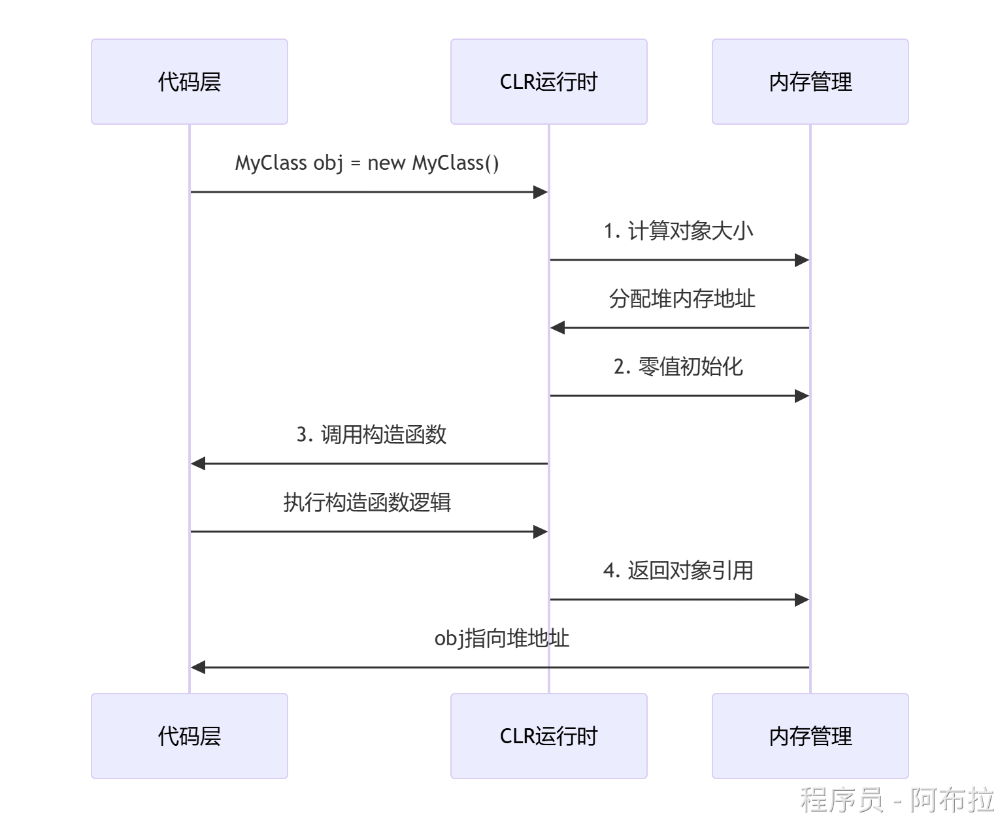
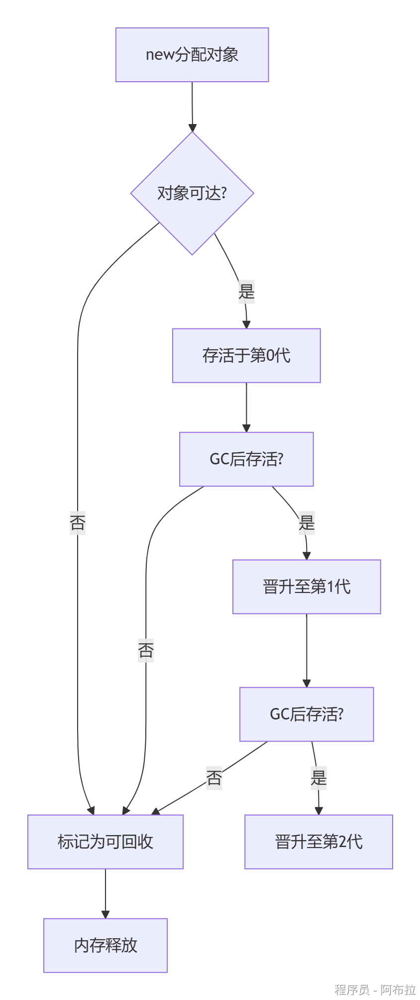

# New关键字

new关键字是C#中最基础也是最重要的操作符之一，它在对象创建、成员隐藏和泛型约束等方面发挥着关键作用。

面试官考察面试者 C#掌握得是否扎实，往往会考 New 关键字的作用以及实现原理！

## 作用

在C#中，new关键字主要有三种用途：

1. **new运算符**：用于创建对象实例并调用构造函数
2. **new修饰符**：用于在派生类中隐藏基类成员
3. **new约束**：用于泛型声明，指定类型参数必须有无参构造函数

其中，new作为运算符是最常见的使用方式，当使用new创建对象时，它主要完成以下操作：

- 在托管堆上分配内存空间
- 调用对象的构造函数进行初始化
- 返回对新创建对象的引用

## new运算符（底层执行流程）

### 内存分配阶段

当使用`MyClass obj = new MyClass()`这样的代码时，CLR（公共语言运行时）首先会在**托管堆(Managed Heap)**上分配内存空间。托管堆是CLR专门用于管理对象内存的区域，与传统的malloc等手动内存分配方式不同，它提供了自动内存管理的能力。

内存分配的具体过程包括：

- **计算对象所需内存大小**：根据类的字段布局和开销（如同步块索引、类型句柄等）计算总大小
- **寻找合适的内存位置**：CLR维护一个指针（称为下一个对象指针），指示托管堆中下一个可用内存位置
- **更新分配指针**：分配内存后，指针向前移动相应字节数

值得注意的是，如果托管堆空间不足，将触发垃圾回收(GC)来释放不再使用的对象内存

### 对象初始化阶段

内存分配完成后，new关键字会**调用构造函数**来初始化对象状态。构造函数调用遵循以下顺序：

1. **字段初始化**：所有字段被设置为默认值（如数值类型为0，引用类型为null）
2. **基类构造函数调用**：如果存在继承关系，先调用基类的构造函数
3. **当前类构造函数执行**：执行构造函数体内的代码

从底层看，构造函数调用是通过**修改this指针**实现的。new操作会确保构造函数中的this指向新创建的对象实例

### 返回对象引用

对象初始化完成后，new表达式会**返回对象引用**，这个引用实际上是指向托管堆中对象内存位置的指针。在C#中，所有引用类型变量存储的都是这样的指针，而非对象本身。

### **流程示意图**



**关键步骤解析**

1. **内存分配**：CLR在托管堆上分配连续内存块，大小由对象类型决定。
2. **零值初始化**：所有字段置为默认值（如int=0，引用类型=null）。
3. **构造函数调用**：执行用户定义的初始化逻辑（如属性赋值）。
4. **返回引用**：栈上的变量`obj`存储指向堆内存的地址。

------

## new修饰符的隐藏机制

当new作为修饰符用于派生类成员时，它会**隐藏基类同名成员**而非重写。其底层实现原理是：

1. **名称修饰(Name Mangling)**：编译器为派生类成员生成不同的元数据标识
2. **静态绑定**：在编译时决定调用哪个版本的方法（与virtual/override的动态绑定不同）
3. **警告抑制**：使用new可以消除编译器关于隐藏基类成员的警告

例如：

```js
public class Base { public void Method() {} }
public class Derived : Base { new public void Method() {} }
```

这里Derived.Method隐藏了Base.Method，调用时根据变量编译时类型决定调用哪个版本。

## new约束的反射实现

在泛型中，new约束（`where T : new()`）要求类型参数必须有公共无参构造函数。令人意外的是，其底层是通过**反射**实现的：

1. **编译时检查**：编译器确保类型T有无参构造函数
2. **运行时调用**：使用`System.Activator.CreateInstance<T>()`方法
3. **性能影响**：反射调用比直接构造慢，在热路径代码中需谨慎使用

IL代码示例：

```js
.method public static !!T CreateInstance<.ctor T>() cil managed {
    IL_0000: call !!0 [System.Private.CoreLib]System.Activator::CreateInstance<!!T>()
        IL_0005: ret
    }
```

可见泛型new约束最终转换为对Activator.CreateInstance的调用。

## new关键字与内存管理

### **内存分配结构图**

```js
栈 (Stack)                         堆 (Heap)
+-------------------+              +-------------------+
| obj (0x1000)      | -----------> | MyClass实例       |
|                   |              | - 字段1: 默认值   |
| 局部变量/方法参数 |              | - 字段2: 构造函数值|
+-------------------+              +-------------------+
```

**说明**：

- **栈**：存储局部变量`obj`（引用类型指针）和方法调用帧。
- **堆**：存储实际对象数据，包括字段和方法表指针。
- **特殊场景**：若为值类型（如`struct`），直接存储在栈上。

### 托管堆与垃圾回收

new关键字分配的内存位于托管堆，由CLR的**垃圾回收器(Garbage Collector, GC)**自动管理

。GC采用分代算法优化回收效率：

- **第0代**：新创建的对象，回收最频繁
- **第1代**：经历一次GC后仍存活的对象
- **第2代**：长期存活的对象

当new分配内存导致空间不足时，GC会自动触发回收不再使用的对象。

### 与栈分配的对比

与托管堆不同，值类型（如int、struct）通常分配在**栈(Stack)**上。栈分配的特点包括：

- 分配/释放速度快（只需移动栈指针）
- 生命周期与方法调用绑定
- 无需垃圾回收

但new也可用于值类型（如`int i = new int()`），这时会在栈上分配并初始化为默认值

**分代回收机制**：

- **第0代**：新对象，GC最频繁。
- **第1/2代**：长期存活对象，回收频率递减。
- **触发条件**：堆内存不足或显式调用`GC.Collect()`。



------

##  对比其他语言的`new`实现

| 特性             | C#             | C++            | JavaScript                      |
| ---------------- | -------------- | -------------- | ------------------------------- |
| **内存分配位置** | 托管堆（默认） | 自由存储（堆） | 堆（通过隐藏的`[[Prototype]]`） |
| **初始化方式**   | 零值+构造函数  | 仅构造函数     | 原型链绑定+构造函数             |
| **管理机制**     | 自动GC         | 手动`delete`   | 自动GC（标记-清除）             |

## 对象的生命周期

- 对象在创建时，会在堆上分配内存。
- 当对象不再被引用时（即没有任何变量指向它），它成为垃圾回收的目标。
- GC在适当的时候运行，检测并回收这些不再使用的对象占用的内存。
