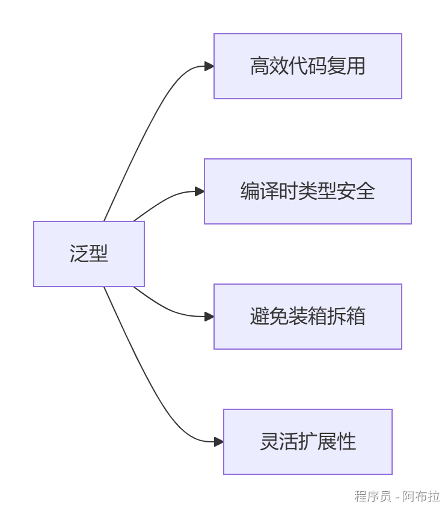
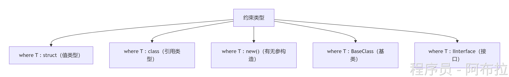
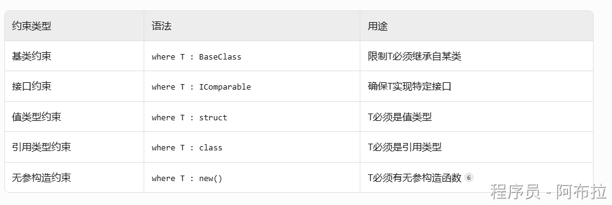

# 泛型

### **泛型是什么？**

**泛型（Generics）** 是C#中的**类型参数化技术**，允许编写可处理多种数据类型的代码，避免为每种类型重复编写逻辑。

**核心思想**：用占位符`T`表示类型，使用时再指定具体类型。




**示例对比**：

```js
// 非泛型：只能处理int类型
public class IntList { 
    private int[] items; 
}

// 泛型：可处理任意类型
public class List<T> { 
    private T[] items;  // T是类型占位符
}
```

💡 当调用`List<int>`时，编译器将`T`替换为`int`，生成专用类。

### **泛型的核心类型**

#### **(1) 泛型类**

```js
public class Box<T> {
    private T _value;
    public void SetValue(T value) => _value = value;
    public T GetValue() => _value;
}

// 使用
var intBox = new Box<int>();
intBox.SetValue(123);
```

一个类可支持多种类型参数，如`Dictionary<TKey, TValue>`。

#### **(2) 泛型方法**

```js
public static T Max<T>(T a, T b) where T : IComparable<T> {
    return a.CompareTo(b) > 0 ? a : b;
}

// 调用（类型自动推断）
int max = Max(10, 20); // T被推断为int
```

即使非泛型类中也可定义泛型方法。

#### **(3) 泛型接口**

```js
public interface IRepository<T> {
    void Add(T entity);
    T GetById(int id);
}

public class UserRepository : IRepository<User> {
    // 实现接口方法
}
```

接口契约可复用，实现类指定具体类型。

------

### **泛型约束**

约束确保类型参数符合要求，提升安全性





**示例**

```js
public class DataProcessor<T> where T : class, IEntity, new() {
    public void Process() {
        var obj = new T(); // 安全创建实例
        obj.Id = 1;       // 可访问IEntity成员
    }
}
```

若无约束，`new T()`或`obj.Id`会编译报错。

------

### **泛型核心优势**

| **优势**     | **说明**                           | **示例对比**                                                 |
| ------------ | ---------------------------------- | ------------------------------------------------------------ |
| **类型安全** | 编译时检查类型错误，避免运行时异常 | `List<int>`添加字符串会报错 vs `ArrayList`添加任意类型导致运行时错误 |
| **性能优化** | 避免值类型的装箱/拆箱操作          | `List<int>`直接操作栈内存，`ArrayList`需装箱到堆             |
| **代码复用** | 一套逻辑处理多种类型               | `Max<T>`方法支持int/string/double等                          |
| **可读性**   | 代码意图明确，减少类型转换噪音     | `Dictionary<string, User>` vs `Hashtable`                    |

------

### **实际应用场景**

#### **(1) 集合类（最常用）**

```js
List<int> numbers = new List<int>();  // 动态数组
Dictionary<string, User> userCache;   // 键值对
Queue<Order> orderQueue;              // 先进先出
```

优先使用泛型集合而非`ArrayList`/`Hashtable`。

#### **(2) 泛型缓存**

```js
public static class Cache<T> {
    static Cache() {
        // 每个T类型生成独立缓存
    }
    public static T Get(string key) { ... }
}
```

比字典缓存更快，因类型信息在编译时确定。

#### **(3) 工厂模式**

```js
public class Factory<T> where T : new() {
    public T Create() => new T();
}
var userFactory = new Factory<User>();
User user = userFactory.Create();
```

约束`new()`确保可实例化。

### **高级特性：协变与逆变**

- **协变（out）**：子类泛型→父类泛型（安全） 

```js
IEnumerable<Dog> dogs = new List<Dog>();
IEnumerable<Animal> animals = dogs; // 合法
```

- **逆变（in）**：父类泛型→子类泛型（需谨慎） 

```js
Action<Animal> feedAnimal = a => a.Feed();
Action<Dog> feedDog = feedAnimal; // 合法
```

仅适用于接口/委托，通过`out`/`in`关键字实现。
