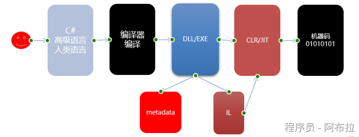
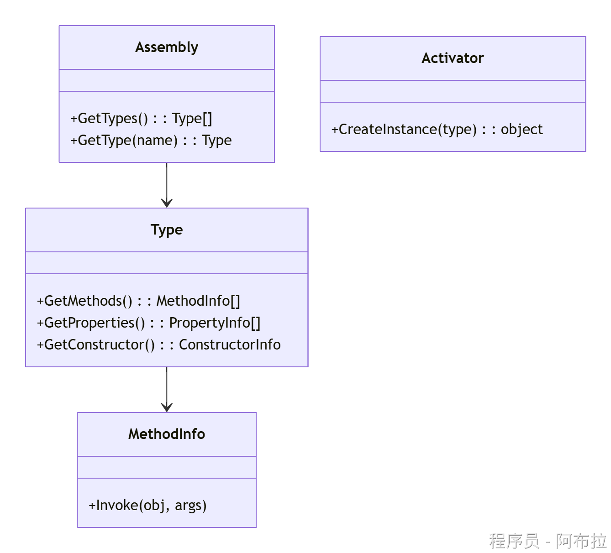
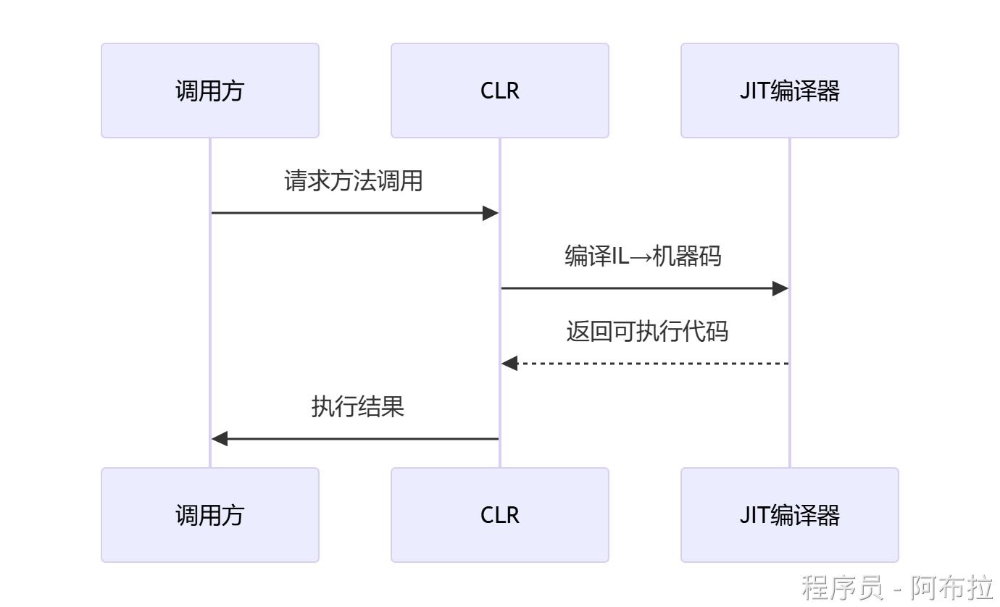
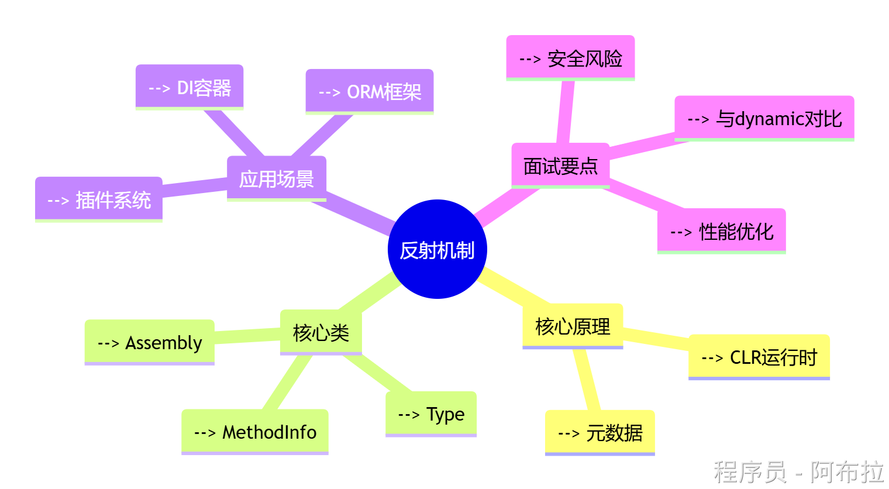

# 反射原理

C# 中的反射（Reflection）是一种强大的技术，它使您能够在运行时获取关于程序集、模块、类型（如类、结构、委托、枚举等）及其成员（如构造函数、方法、属性、字段、事件等）的详细信息，并且可以对这些类型进行实例化、调用方法等操作。反射在.NET框架中是通过System.Reflection命名空间提供的。

### 一、反射的核心原理图示



1. **元数据（Metadata）**

- 编译时生成的类型描述信息，包含： 

- 类名/命名空间
- 继承关系
- 方法签名
- 特性标记等

2. **CLR运行时加载**

- 程序运行时，CLR解析元数据和IL代码
- 反射通过`System.Reflection`命名空间访问这些数据

### 反射核心类与工作流程

#### 关键类说明



- **Assembly**：程序集入口（如`Assembly.Load("MyLib.dll")`）
- **Type**：反射核心（获取方式：`typeof()`/`GetType()`/`Assembly.GetType()`）
- **MethodInfo/PropertyInfo**：动态调用成员

#### 典型工作流程

```js
// 1. 加载程序集
Assembly assembly = Assembly.LoadFrom("MyLib.dll");

// 2. 获取类型信息
Type type = assembly.GetType("MyNamespace.MyClass");

// 3. 创建实例
object instance = Activator.CreateInstance(type);

// 4. 调用方法
MethodInfo method = type.GetMethod("MyMethod");
method.Invoke(instance, new object[] { "参数" });
```

------

### 反射的底层实现（面试重点）

1. **元数据表结构**

- CLR维护的二进制表结构，包括： 

- TypeDef表（类定义）
- MethodDef表（方法定义）
- FieldDef表（字段定义）

2. **动态调用过程**



- 反射调用比直接调用多出元数据查找和JIT编译步骤

3. **性能损耗来源**

- 元数据解析开销
- 动态类型安全检查
- 缺少编译时优化

### 反射应用场景

**插件系统开发**

```js
// 动态加载插件DLL
Assembly plugin = Assembly.LoadFrom("Plugin.dll");
Type pluginType = plugin.GetTypes().First(t => t.GetInterface("IPlugin") != null);
IPlugin instance = (IPlugin)Activator.CreateInstance(pluginType);
```

**依赖注入框架**

- 通过反射分析构造函数参数
- 动态创建服务实例

**ORM映射**

```js
// 动态读取属性并赋值
foreach (PropertyInfo prop in entity.GetType().GetProperties()) {
    prop.SetValue(entity, dataReader[prop.Name]);
}
```

------

### 面试常见问题



**反射的性能问题如何优化？**

1. 缓存Type/MethodInfo对象（避免重复解析）
2. 使用`Delegate.CreateDelegate`转换为强类型委托
3. 对高频调用改用表达式树编译

**反射能访问私有成员吗？**

- 可以，通过`BindingFlags.NonPublic`标记，但会破坏封装性

**反射与动态类型（dynamic）的区别？** 

| 特性       | 反射               | dynamic          |
| ---------- | ------------------ | ---------------- |
| 编译时检查 | 无                 | 有（运行时绑定） |
| 性能       | 较低               | 较高             |
| 使用场景   | 需要完整元数据操作 | 仅需后期绑定     |
