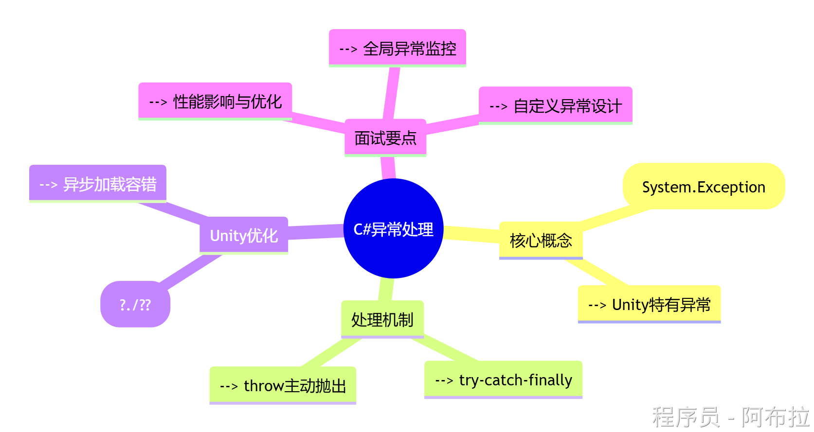
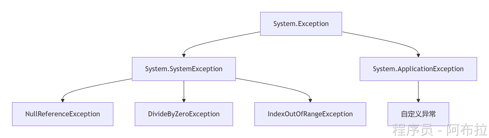
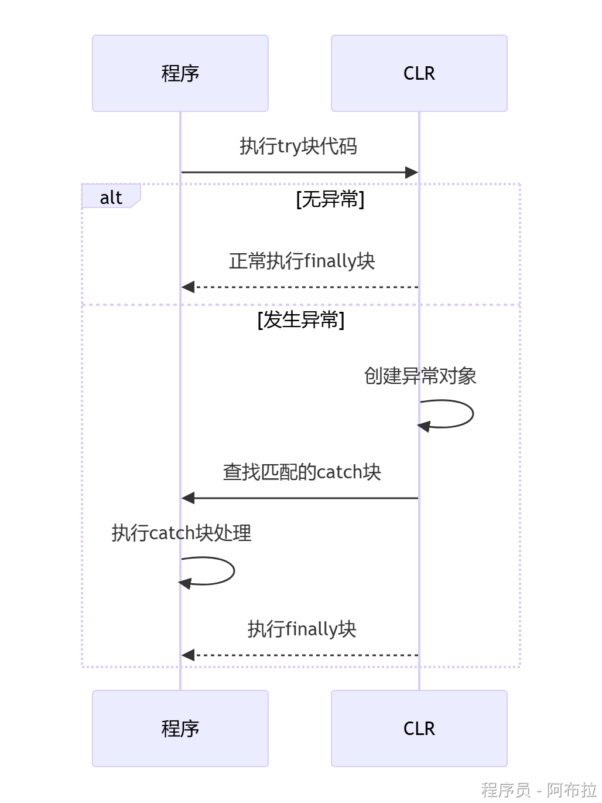

# 异常



在C#中，异常是程序执行期间出现的问题或意外情况，它中断了正常的程序流程。异常通常是由程序错误、外部资源失败（如文件不存在或数据库连接失败）或不可预见的用户输入等情况引起的。

异常处理对于创建健壮、可靠和可维护的软件系统至关重要。

1. try块包含可能引发异常的代码。
2. catch块捕获并处理try块中抛出的异常。你可以有**多个catch块**来处理不同类型的异常。在这个例子中，有一个特定的catch块来捕获DivideByZeroException异常，以及一个更一般的catch块来捕获所有其他类型的异常。
3. finally块包含无论是否发生异常都应该执行的代码。这通常用于清理资源，如关闭文件或数据库连接。
4. throw语句（在此示例中未显示）用于显式引发异常。你可以在自定义的验证逻辑中使用它，当检测到无效状态时引发异常。

------

### 异常的本质与分类

#### 异常定义

异常是程序运行时发生的意外情况（如空引用、除零错误等），会中断正常执行流程。在C#中，所有异常都继承自`System.Exception`类。



#### Unity常见异常类型

| **异常类型**                | **触发场景**                          | **示例**                         |
| --------------------------- | ------------------------------------- | -------------------------------- |
| `NullReferenceException`    | 访问未初始化的对象或组件              | `transform.position`未赋值       |
| `MissingReferenceException` | 引用的Unity对象被销毁但代码仍尝试访问 | 动态加载的Prefab被删除后调用方法 |
| `DivideByZeroException`     | 数学运算中除数为零                    | `int x = 10 / 0;`                |
| `IndexOutOfRangeException`  | 数组/集合越界访问                     | `arr[10]`（数组长度=5）          |

------

### 异常处理机制（面试核心）

#### 1. 处理流程图示



#### 2. 关键代码结构

```js
try {
    // 可能抛出异常的代码（如加载资源）
    GameObject prefab = Resources.Load<GameObject>("Enemy");
    Instantiate(prefab);
}
catch (NullReferenceException ex) {
    Debug.LogError($"资源加载失败: {ex.Message}");
    // 创建默认对象替代
    Instantiate(defaultEnemy); 
}
catch (Exception ex) { // 兜底处理
    Debug.LogError($"未知错误: {ex.StackTrace}");
}
finally {
    // 必执行（如释放资源）
    Resources.UnloadUnusedAssets(); 
}
```

------

### Unity特有问题与解决方案

#### 高频异常处理技巧

- **空引用预防**：使用`?.`运算符和对象池

```js
// 传统写法
if (player != null) player.Move();

// 优化写法（避免NullReferenceException）
player?.Move();
```

- **资源加载异常**：

```js
IEnumerator LoadAsset(string path) {
    ResourceRequest request = Resources.LoadAsync(path);
    yield return request;
    if (request.asset == null) {
        throw new FileNotFoundException($"资源{path}加载失败");
    }
}
```

#### 自定义异常示例（业务逻辑异常）

```js
public class InsufficientManaException : Exception {
    public float CurrentMana { get; }
    public InsufficientManaException(float mana) 
        : base($"魔力不足！当前魔力值: {mana}") {
            CurrentMana = mana;
        }
}

// 使用场景
void CastSpell(float cost) {
    if (currentMana < cost) {
        throw new InsufficientManaException(currentMana);
    }
    // 施法逻辑...
}
```

------

### 面试常见问题与回答策略

#### Unity中如何避免MissingReferenceException？

1. 使用`GameObject.ReferenceEquals`检查对象是否被销毁
2. 通过事件系统解耦（如Action代替直接调用）
3. 对动态生成的对象采用对象池管理

#### try-catch会影响性能吗？如何优化？

- **影响**：异常捕获比正常代码慢约1000倍（因需堆栈展开）
- **优化方案**： 

1. 预检查替代异常（如用`int.TryParse`代替`Convert.ToInt32`）
2. 对高频代码使用`Debug.Assert`在开发期暴露问题
3. 避免在Update中频繁try-catch

#### Unity中如何实现全局异常处理？

```js
void Start() {
    Application.logMessageReceived += (condition, stackTrace, type) => {
        if (type == LogType.Exception) {
            // 上报错误或显示友好提示
            Analytics.LogError(condition);
            ShowErrorPopup("游戏遇到问题，已自动保存进度");
        }
    };
}
```
