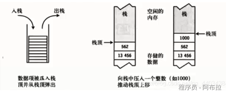
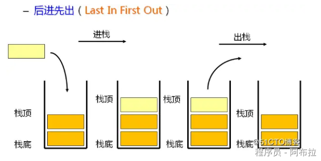
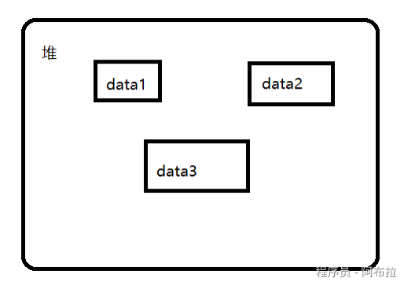
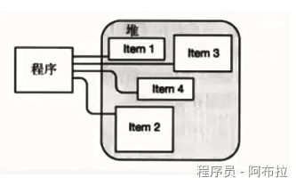
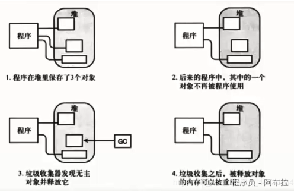

# 内存分布

C#内存分为：**栈、托管堆、非托管堆、静态数据区、常量数据区、程序代码区**

C#程序在CLR上运行的时候，内存从逻辑上划分三大块：栈，堆，静态存储区（静态数据区）。

这 3 个基本元素组成我们C#程序的运行环境。

## 栈

由编译器自动分配释放 ，存放值类型的对象本身，引用类型的引用地址（指针），[静态区](https://zhida.zhihu.com/search?content_id=113355503&content_type=Article&match_order=1&q=静态区&zhida_source=entity)对象的引用地址（指针），[常量区](https://zhida.zhihu.com/search?content_id=113355503&content_type=Article&match_order=1&q=常量区&zhida_source=entity)对象的引用地址（指针）等。其操作方式类似于数据结构中的栈。

保存**局部变量**和**局部函数**的，函数结束，其局部变量和参数的生命就结束了（当然是不包括static变量）即释放了栈的空。

栈空间比较小，但是读取速度快。

**栈内存无需我们管理，也不受GC管理。**

**当栈顶元素使用完毕（栈空间内值变量出了作用域后），系统能自动回收的，而堆则需要GC清理。**

栈的分配运算内置于处理器的指令集中，效率极高，但是分配的内存容量有限。

**特征**

栈(Stack)最明显的特征就是“先进后出”，本质上讲堆栈也是一种线性结构。

数据只能从栈的顶端插⼊和删除，把数据放⼊栈顶称为⼊栈（push） ，从栈顶删除数据称为出栈（pop）。

## 堆（托管堆）

在c 语言中叫堆，在c#中其实叫托管堆，**也称动态内存分配区**。

堆(Heap)是一块内存区域，与栈不同，堆里的内存能够以任意顺序存入和移除。

程序员向操作系统申请的内存空间。程序在运行的时候用new 关键字申请任意大小的内存，程序员自己负责在适当的时候用free或delete释放内存。动态内存的生存期可以由我们决定，如果我们不释放内存，程序将在最后才释放掉动态内存。可存储较大的数据。堆空间比较大，但是读取速度慢。

它是由CLR（公共语言运行库(Common Language Runtime)）管理，当堆中满了之后，会自动清理堆中的垃圾。存放着引用类型的对象，由CLR释放。所以，做为.net开发，我们不需要关心内存释放的问题。

## 非托管堆

- 非托管堆用于存储非托管代码（如C++）中分配的对象。
- 非托管代码通过内存分配函数（如 malloc）来创建和管理非托管堆。

## 静态数据区

- 静态数据区用于存储静态变量(包静态字段、静态属性和静态方法)，这些变量在程序的整个生命周期内存在。
- 这些变量在编译时就被分配并初始化，存储在程序的数据段中。
- 主要存放**静态数据**、**全局数据**和**常量**
- 由于存在栈内的引用地址都在程序运行开始最先入栈，因此静态区和常量区内的对象的生命周期会持续到程序运行结束时，届时静态区内和常量区内对象才会被释放和回收（编译器自动释放）。所以应限制使用静态类，静态成员（静态变量，静态方法），常量，否则程序负荷高。

## 常量数据区

- 常量数据区用于存储常量值，如字符串常量。
- 这些常量值在编译时就被确定，存储在程序的数据段中。

## 程序代码区

- 程序代码区存储编译后的程序指令（二进制代码）。
- 这些指令在程序运行时被执行。

## GC(Garbage Collection)垃圾收集器

**CLR的GC就是内存管理机制，我们写程序不需要关心内存的使用，因为这些都是CLR帮我们做了。**

