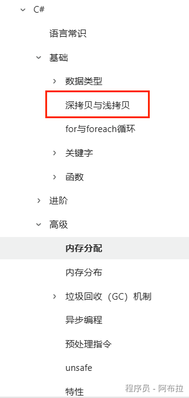

# 内存分配

值类型肯定直接在栈上分配空间。

引用类型（对象）在堆区分配空间，但是**引用地址（指针）还是在栈区，通过引用地址去堆区内寻找对象本身**的值。

所以只有引用类型对象会涉及到深拷贝的问题，而值类型都是深拷贝，因为不存在指针，直接栈上就分配了。

值得注意的是，静态变量应该是在你或者系统代码第一次访问这个类的时候，CLR 会去加载这个类，当然也有其他说法比如说分情况：

- 编译时已知数据，静态成员直接写入PE文件
- 加载时可以决定的数据，程序加载时初始化。
- 运行时才能决定的数据，调用type initialize

**总的来说，静态变量生命周期大致是从程序加载到程序销毁，所以变量的指针存放在栈区，值本身存放在静态存储区。**

文中涉及到的深、浅拷贝详情可以在C#模块中找到或如图查看《Unity客户端面试宝典》。

