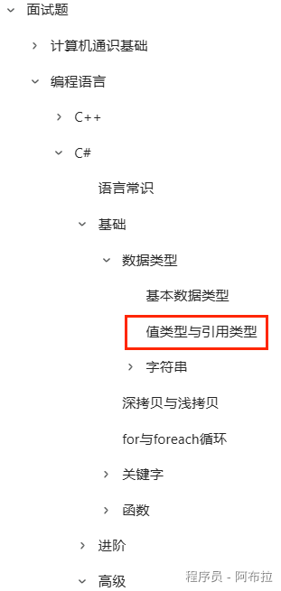
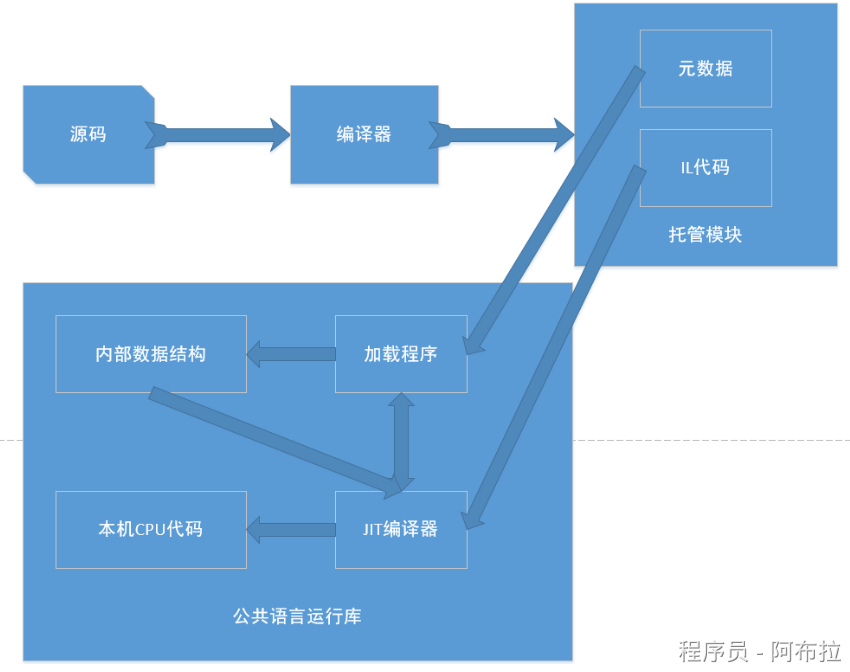
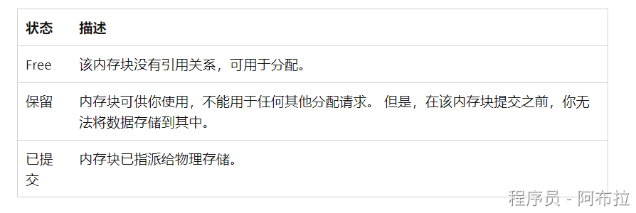

# 内存管理

## 面试题

1. 引用类型和值类型的内存分布
2. CLR 是什么？
3. 垃圾回收条件

## 内存管理池

C#内部有两个内存管理池：堆内存和栈内存。

C#中的变量只会在堆栈或者堆内存上进行内存分配，变量要么存储在栈内存上，要么处于堆内存上。

栈内存(stack)主要用来存储较小的和短暂的数据

堆内存(heap)主要用来存储较大的和存储时间较长的数据

只要变量处于激活状态，则其占用的内存会被标记为使用状态，则该部分的内存处于被分配的状态。

一旦变量不再激活，则其所占用的内存不再需要，该部分内存可以被回收到内存池中被再次使用，这样的操作就是内存回收。处于栈上的内存回收及其快速，处于堆上的内存并不是及时回收的，此时其对应的内存依然会被标记为使用状态。不再使用的内存只会在GC的时候才会被回收。

## 引用类型和值类型

- 这部分略过（详细可看如图《Unity客户端面试宝典》文章），基本都有相关的认识，本质是看其分配的内存位于内存堆上还是栈上。

- **堆**：一个大的区域，用于存储对象。用于存储引用类型的对象。GC负责在堆上分配和回收内存。
- **栈**：一系列小的、有序的存储空间，用于存储局部变量和值类型。用于存储值类型和方法的局部变量。栈上的内存分配和释放是自动的，不需要GC介入。

- 每个进程会分配一个对应的进程堆，这就是我们常说的程序内存申请区域，不同进程是不会有交叉的。在堆上还是在栈上进行内存分配，是没有速度差异的，都很快。

## CLR内存

CLR（Common Language Runtime） 公共语言运行库，是一种可以支持多种语言的运行时，其基本的核心功能包含

- 内存管理
- 程序集加载和卸载
- 类型安全
- 异常处理
- 线程同步

- 每个进程都有其自己单独的虚拟地址空间。 同一台计算机上的所有进程共享相同的物理内存和页文件（如果有）。
- 默认情况下，32 位计算机上的每个进程都具有 2 GB 的用户模式虚拟地址空间。
- 作为一名应用程序开发人员，你只能使用虚拟地址空间，请勿直接操控物理内存。 垃圾回收器为你分配和释放托管堆上的虚拟内存。

如果你编写的是本机代码，请使用 Windows 函数处理虚拟地址空间。

 这些函数为你分配和释放本机堆上的虚拟内存。

**虚拟内存有三种状态**

- 可能会存在虚拟地址空间碎片，这意味着地址空间中存在一些被称为孔的可用块。 当请求虚拟内存分配时，虚拟内存管理器必须找到满足该分配请求的足够大的单个可用块。 即使有 2 GB 可用空间，2 GB 分配请求也会失败，除非所有这些可用空间都位于一个地址块中。
- 如果没有足够的可供保留的虚拟地址空间或可供提交的物理空间，则可能会用尽内存。

即使在物理内存压力（物理内存的需求）较低的情况下也会使用页文件。 首次出现物理内存压力较高的情况时，操作系统必须在物理内存中腾出空间来存储数据，并将物理内存中的部分数据备份到页文件中。 该数据只会在需要时进行分页，所以在物理内存压力较低的情况下也可能会进行分页。

## 内存分配

初始化新进程时，运行时会为进程保留一个连续的地址空间区域。 

这个保留的地址空间被称为托管堆。 托管堆维护着一个指针，用它指向将在堆中分配的下一个对象的地址。 最初，该指针设置为指向托管堆的基址。 托管堆上包含了所有引用类型。 应用程序创建第一个引用类型时，将为托管堆的基址中的类型分配内存。 应用程序创建下一个对象时，运行时在紧接第一个对象后面的地址空间内为它分配内存。 只要地址空间可用，运行时就会继续以这种方式为新对象分配空间。

从托管堆中分配内存要比非托管内存分配速度快。 由于运行时通过为指针添加值来为对象分配内存，所以这几乎和从堆栈中分配内存一样快。 另外，由于连续分配的新对象在托管堆中是连续存储，所以应用程序可以快速访问这些对象。

## 内存释放

垃圾回收器的优化引擎根据所执行的分配决定执行回收的最佳时间。 垃圾回收器在执行回收时，会释放应用程序不再使用的对象的内存。 

它通过检查应用程序的根来确定不再使用的对象。 应用程序的根包含线程堆栈上的静态字段、局部变量、CPU 寄存器、GC 句柄和终结队列。 每个根或者引用托管堆中的对象，或者设置为空。 垃圾回收器可以为这些根请求其余运行时。 垃圾回收器使用此列表创建一个图表，其中包含所有可从这些根中访问的对象。

垃圾回收器会考虑无法访问的对象垃圾，并释放为它们分配的内存。 在回收中，垃圾回收器检查托管堆，查找无法访问对象所占据的地址空间块。 发现无法访问的对象时，它就使用内存复制功能来压缩内存中可以访问的对象，释放分配给不可访问对象的地址空间块。

在压缩了可访问对象的内存后，垃圾回收器就会做出必要的指针更正，以便应用程序的根指向新地址中的对象。 它还将托管堆指针定位至最后一个可访问对象之后。

只有在回收发现大量的无法访问的对象时，才会压缩内存。 如果托管堆中的所有对象均未被回收，则不需要压缩内存。

为了改进性能，运行时为单独堆中的大型对象分配内存。 垃圾回收器会自动释放大型对象的内存。 但是，为了避免移动内存中的大型对象，通常不会压缩此内存。

## 垃圾回收的条件

- 系统具有低的物理内存。 内存大小是通过操作系统的内存不足通知或主机指示的内存不足检测出来的。
- 由托管堆上已分配的对象使用的内存超出了可接受的阈值。 随着进程的运行，此阈值会不断地进行调整。
- 调用 [GC.Collect](https://learn.microsoft.com/zh-cn/dotnet/api/system.gc.collect) 方法。 几乎在所有情况下，你都不必调用此方法，因为垃圾回收器会持续运行。 此方法主要用于特殊情况和测试。
