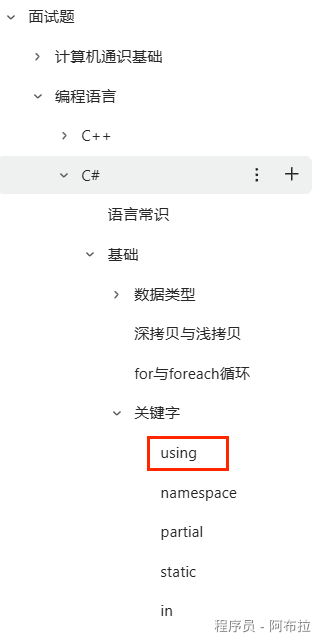

# 托管与非托管资源

## 面试题

1. 什么是托管/非托管资源？

## 托管资源

由.NET运行时自动管理的内存资源，如对象。这些资源的分配和回收由GC自动处理。

**托管模块的基本组成**

- PE32/PE32+(64位)
- CLR头
- 元数据
- IL代码(托管代码)

在 CLR 初始化垃圾回收器后，它会分配一段内存用于存储和管理对象。

此内存称为托管堆（与操作系统中的本机堆相对）。

每个托管进程都有一个托管堆。 进程中的所有线程都在同一堆上为对象分配内存。

若要保留内存，垃圾回收器会调用 Windows VirtualAlloc 函数，并且每次为托管应用保留一个内存段。 垃圾回收器还会根据需要保留内存段，并调用 Windows VirtualFree 函数，将内存段释放回操作系统（在清除所有对象的内存段后）。

垃圾回收器分配的段大小特定于实现，并且随时可能更改（包括定期更新）。 应用程序不应假设特定段的大小或依赖于此大小，也不应尝试配置段分配可用的内存量。

堆上分配的对象越少，垃圾回收器必须执行的工作就越少。分配对象时，请勿使用超出你需求的舍入值，例如在仅需要 15 个字节的情况下分配了 32 个字节的数组。

当触发垃圾回收时，垃圾回收器将回收由非活动对象占用的内存。 回收进程会对活动对象进行压缩，以便将它们一起移动，并移除死空间，从而使堆更小一些。 此进程可确保一起分配的对象全都位于托管堆上，从而保留它们的局部性。

垃圾回收的侵入性（频率和持续时间）是由分配的数量和托管堆上保留的内存数量决定的。

此堆可视为两个堆的累计：大对象堆和小对象堆。 大对象堆包含大小不少于 85,000 个字节的对象，这些对象通常是数组。 非常大的实例对象是很少见的。（可以配置阈值大小，以使对象能够进入大型对象堆。）

## 非托管资源

**非托管资源**：如文件句柄、数据库连接、网络连接等，这些资源不由GC自动管理，需要程序员显式地创建和销毁。

- 使用IDisposable和Dispose方法显式释放非托管资源。
- 在Dispose方法中调用非托管资源的释放逻辑。
- 使用using语句确保Dispose方法被正确调用。

**（using 关键字可以查看Unity客户端面试宝典）**

在垃圾回收期间，如果垃圾回收器在托管代码中找到对对象的一个或多个引用，则垃圾回收器将不会释放对象。 但是，垃圾回收器无法识别对非托管代码中对象的引用，并且可能会释放在非托管代码中独占使用的对象，除非明确阻止这样做。 该方法 KeepAlive提供了一种机制，可防止垃圾回收器收集仍在非托管代码中使用的对象。

除了托管内存分配之外，垃圾回收器的实现不会维护有关对象持有的资源的信息，例如文件句柄或数据库连接。 当类型使用必须在回收类型实例之前释放的非托管资源时，该类型可以实现终结器。

在大多数情况下，终结器是通过重写 Object.Finalize 方法来实现的;但是，用 C# 或 C++ 编写的类型实现析构函数，编译器会转换为重写 Object.Finalize。 在大多数情况下，如果对象具有终结器，垃圾回收器会在释放对象之前调用它。 	

但是，在所有情况下，垃圾回收器都不需要调用终结器;例如，该方法 SuppressFinalize显式阻止调用对象的终结器。 此外，垃圾回收器不需要使用特定线程来终结对象，或保证对相互引用但可用于垃圾回收的对象调用终结器的顺序。

在特定时间必须释放资源的情况下，类可以实现 IDisposable接口，该接口包含 IDisposable.Dispose执行资源管理和清理任务的方法。 实现Dispose的类必须指定其类协定的一部分，如果类使用者调用该方法来清理对象，则必须指定此类协定的一部分。 

默认情况下，垃圾回收器不会调用 Dispose 该方法;但是，该方法的 Dispose实现可以调用类中的 GC方法来自定义垃圾回收器的最终化行为。
