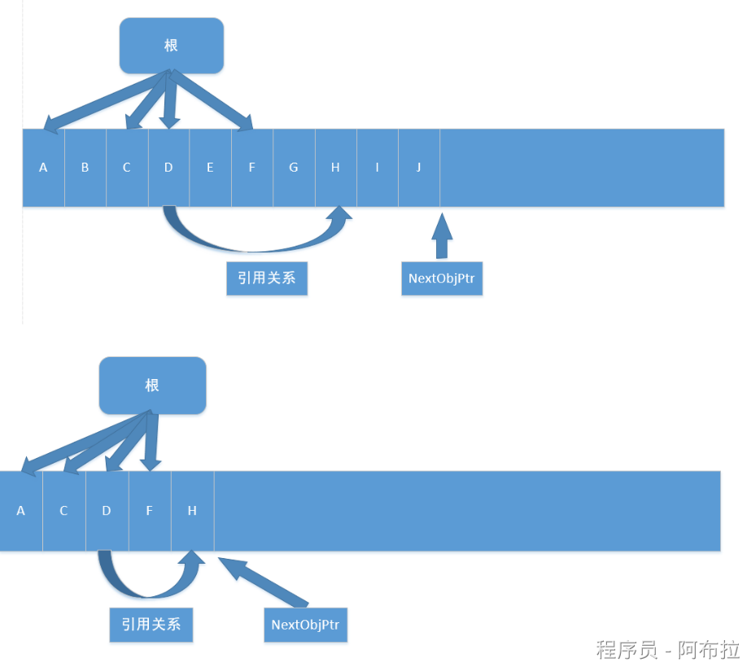
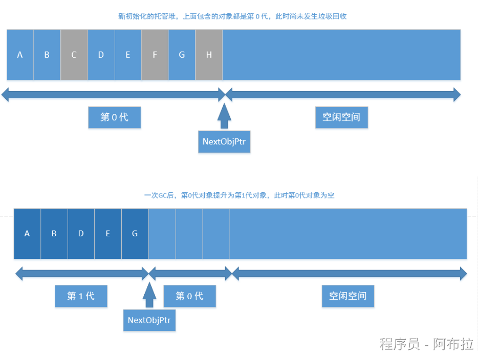
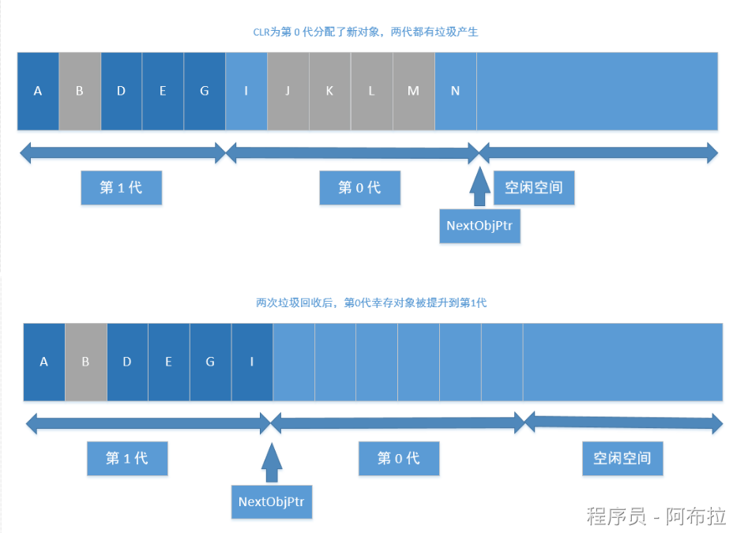
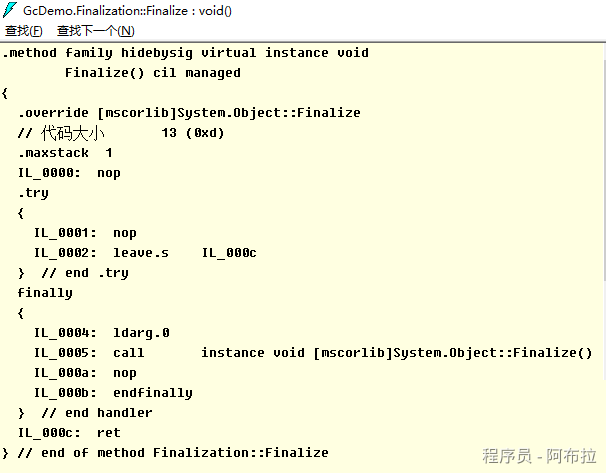

# 垃圾回收模型

## 面试题

1. 垃圾回收触发时机？
2. 垃圾回收流程？
3. 垃圾回收分代思想？
4. Finalize 是什么？
5. IDisposable 是什么？

## 垃圾回收的目

内存是有限的，为了避免内存溢出，需要清理无效内存

## 触发时机

GC的运行时机是不确定的，由.NET运行时根据系统的内存使用情况和其他因素来决定

- 申请分配内存时内存不足(本身不足或者内存碎片过多没有足够大小的内存片)
- 强制调用 System.GC.Collect
- CLR卸载应用程序域 (AppDomain)
- CLR正在关闭 (后面2种在进程运行时不会触发)

- 程序员可以通过调用 GC.Collect() 方法来请求执行垃圾回收，但通常不建议这样做，因为这可能会打断程序的正常执行流程。

## 垃圾回收的流程

### GC准备阶段 

- 暂停进程中的所有线程，避免线程在CLR检测根期间访问堆内存

### GC的标记阶段 

- 首先，会默认托管堆上所有的对象都是垃圾(可回收对象)，然后开始遍历根对象并构建一个由所有和根对象之间有引用关系的对象构成的对象图，然后GC会挨个遍历根对象和其引用对象，如果根对象没有任何引用对象(null)GC会忽略该根对象。对于含有引用对象的根对象以及其引用对象，GC将其纳入对象图中，如果发现已经处于对象图中，则换一个路径遍历，避免无限循环。PS： 所有的全局和静态对象指针是应用程序的根对象。

### 垃圾回收阶段 

- 完成遍历操作后，对于没有被纳入对象图中的对象，执行清理操作

### 碎片整理阶段

-  如果垃圾回收算法包含这个阶段，则会对剩下的保留的对象进行一次内存整理，重新归类到堆内存中，相应的引用地址也会对应的整理，避免内存碎片的产生。



## 分代垃圾回收的过程

### 分代的基本设计思路

- 对象越新，生命周期越短，反之也成立
- 回收托管堆的一部分，性能和速度由于回收整个托管堆

**基本的分代**

- 0代	从未被标记为回收的新分配对象
- 1代	上一次垃圾回收中没有被回收的对象
- 2代	在一次以上的垃圾回收后任然未被回收的对象

**分代原则**	

- 低一代的GC触发，移动到高一代后，未必会触发高一代的GC，只有高一代的内存不足时才会触发高一代的GC
- 不同代的自动GC频率是可以设置的，一般 0：1：2 的频率为100：10：1

## 操作图解释分代的过程





## 非托管对象的回收

- 对于非托管对象的管理，不受CLR的自动内存管理操作，这部分需要借鉴CLR的自动管理或者手动执行内存回收，这就是两种非托管对象的管理方式: Finalize和Dispose
- 非托管资源: 原始的操作系统文件句柄，原始的非托管数据库连接，非托管内存或资源

## Finalize

- System.Object定义了Finalize()虚方法，不能用override重写，其写法类似c++的析构函数
- **Finalizers**：是对象上的一个特殊方法，当对象被GC回收时自动调用。但由于GC的运行时机不确定，依赖Finalizers来释放非托管资源是不可靠的。

```js
class Finalization{
    ~Finalization()
    {
        //这里的代码会进入Finalize方法
        Console.WriteLine("Enter Finalize()");
    }
}
```

**转换的IL**



- 基类方法放入到Finally中，其本质还是交给GC进行处理，只是其执行的时间不确定，是在GC完后在某个时间点触发执行Finalize方法，使用这个方法的唯一好处就是: 非托管资源是必然会被释放的。

## IDisposable

- 继承了该接口，则需要实现Disposable接口，需要手动调用，这就确保了回收的及时性，对应的问题是如果不显示调用Dispose方法，则这部分非托管资源是不会被回收的。
- c#中的using关键字，转换成IL语句，就是内部实现了IDispoable方法，最终的try/finally中，会在finally中调用dispose方法。
- 通过实现IDisposable接口并提供Dispose方法，程序员可以显式地释放非托管资源。使用using语句可以确保在代码块结束时自动调用Dispose方法。

## Unity中的C# GC

- 目前 Unity2018.4还是 Boehm–Demers–Weiser garbage collector
- Unity2019.1 中已经开始引入: Incremental Garbage Collection增量式垃圾回收功能
