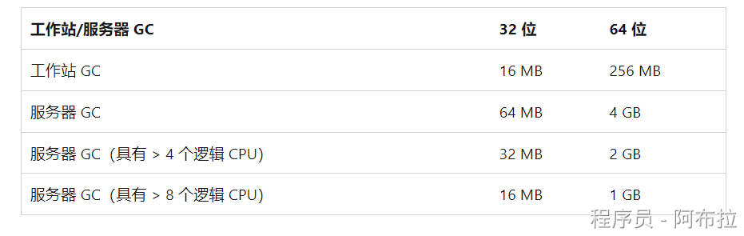
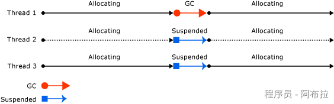

# 分代回收算法

## 面试题

1. C#分代回收算法？
2. 垃圾回收过程中发生了什么？

## GC 算法注意事项

- 压缩托管堆的一部分内存要比压缩整个托管堆速度快。
- 较新的对象生存期较短，而较旧的对象生存期则较长。
- 较新的对象趋向于相互关联，并且大致同时由应用程序访问。

垃圾回收主要在回收短生存期对象时发生。

为优化垃圾回收器的性能，将托管堆分为三代：第 0 代、第 1 代和第 2 代，因此它可以单独处理长生存期和短生存期对象。

 垃圾回收器将新对象存储在第 0 代中。 在应用程序生存期的早期创建的对象如果未被回收，则被升级并存储在第 1 级和第 2 级中。 因为压缩托管堆的一部分要比压缩整个托管堆速度快，所以此方案允许垃圾回收器在每次执行回收时释放特定级别的内存，而不是整个托管堆的内存。

## 第 0 代

这一代是最年轻的，其中包含短生存期对象。 短生存期对象的一个示例是临时变量。

垃圾回收最常发生在此代中。

新分配的对象构成新一代对象，并隐式地成为第 0 代集合。 但是，如果它们是大型对象，它们将延续到大型对象堆 (LOH)，这有时称为第 3 代。 第 3 代是在第 2 代中逻辑收集的物理生成。

大多数对象通过第 0 代中的垃圾回收进行回收，不会保留到下一代。

如果应用程序在第 0 代托管堆已满时尝试创建新对象，垃圾回收器将执行收集，为该对象释放地址空间。 垃圾回收器从检查第 0 级托管堆中的对象（而不是托管堆中的所有对象）开始执行回收。 单独回收第 0 代托管堆通常可以回收足够的内存，这样，应用程序便可以继续创建新对象。

## 第 1 代

这一代包含短生存期对象并用作短生存期对象和长生存期对象之间的缓冲区。

垃圾回收器执行第 0 代托管堆的回收后，会压缩可访问对象的内存，并将其升级到第 1 代。 因为未被回收的对象往往具有较长的生存期，所以将它们升级至更高的级别很有意义。

 垃圾回收器不必在每次执行第 0 代托管堆的回收时，都重新检查第 1 代和第 2 代托管堆中的对象。

如果第 0 代托管堆的回收没有回收足够的内存供应用程序创建新对象，垃圾回收器就会先执行第 1 代托管堆的回收，然后再执行第 2 代托管堆的回收。 第 1 级托管堆中未被回收的对象将会升级至第 2 级托管堆。

## 第 2 代

这一代包含长生存期对象。 

长生存期对象的一个示例是服务器应用程序中的一个包含在进程期间处于活动状态的静态数据的对象。

第 2 代托管堆中未被回收的对象会继续保留在第 2 代托管堆中，直到在将来的回收中确定它们无法访问为止。

大型对象堆上的对象（有时称为 *第 3 代*）也在第 2 代中收集。

当条件得到满足时，垃圾回收将在特定代上发生。 回收某个代意味着回收此代中的对象及其所有更年轻的代。 第 2 代垃圾回收也称为完整垃圾回收，因为它回收所有代中的对象（即，托管堆中的所有对象）。

## 幸存和提升

垃圾回收中未回收的对象也称为幸存者，并会被提升到下一代：

- 第 0 代垃圾回收中未被回收的对象将会升级至第 1 代。
- 第 1 代垃圾回收中未被回收的对象将会升级至第 2 代。
- 第 2 代垃圾回收中未被回收的对象将仍保留在第 2 代。

当垃圾回收器检测到某个代中的幸存率很高时，它会增加该代的分配阈值。 

下次回收将回收非常大的内存。 

CLR 持续在以下两个优先级之间进行平衡：不允许通过延迟垃圾回收，让应用程序的工作集获取太大内存，以及不允许垃圾回收过于频繁地运行。

## 暂时代和暂时段

因为第 0 代和第 1 代中的对象的生存期较短，因此，这些代被称为“暂时代”。

暂时代在称为“暂时段”的内存段中进行分配。

垃圾回收器获取的每个新段将成为新的暂时段，并包含在第 0 代垃圾回收中幸存的对象。 旧的暂时段将成为新的第 2 代段。

根据系统为 32 位还是 64 位以及它正在哪种类型的垃圾回收器（工作站或服务器 GC）上运行，暂时段的大小发生相应变化。 

**下表显示了暂时段的默认大小**

暂时段可以包含第 2 代对象。 第 2 代对象可使用多个段，只要在进程需要且内存允许的数量范围内即可。

从暂时垃圾回收中释放的内存量限制为暂时段的大小。 释放的内存量与死对象占用的空间成比例。

## 垃圾回收过程中发生的情况

垃圾回收分为以下几个阶段：

- 标记阶段，找到并创建所有活动对象的列表。
- 重定位阶段，用于更新对将要压缩的对象的引用。
- 压缩阶段，用于回收由死对象占用的空间，并压缩幸存的对象。 压缩阶段将垃圾回收中幸存下来的对象移至段中时间较早的一端。

因为第 2 代回收可以占用多个段，所以可以将已提升到第 2 代中的对象移动到时间较早的段中。 可以将第 1 代幸存者和第 2 代幸存者都移动到不同的段，因为它们已被提升到第 2 代。

通常，由于复制大型对象会造成性能下降，因此不会压缩大型对象堆 (LOH)。 但是，在 .NET Core 和 .NET Framework 4.5.1 及更高版本中，可以根据需要使用 GCSettings.LargeObjectHeapCompactionMode 属性按需压缩大型对象堆。 此外，当通过指定以下任一项设置硬限制时，将自动压缩 LOH：

- 针对容器的内存限制。
- GCHeapHardLimit 或 GCHeapHardLimitPercent 运行时配置选项。

垃圾回收器使用以下信息来确定对象是否为活动对象：

- **堆栈根**：由实时 (JIT) 编译器和堆栈查看器提供的堆栈变量。 JIT 优化可以延长或缩短报告给垃圾回收器的堆栈变量内的代码的区域。
- **垃圾回收句柄**：指向托管对象且可由用户代码或公共语言运行时分配的句柄。
- **静态数据**：应用程序域中可能引用其他对象的静态对象。 每个应用程序域都会跟踪其静态对象。

在垃圾回收启动之前，除了触发垃圾回收的线程以外的所有托管线程均会挂起。

下图演示了触发垃圾回收并导致其他线程挂起的线程：

