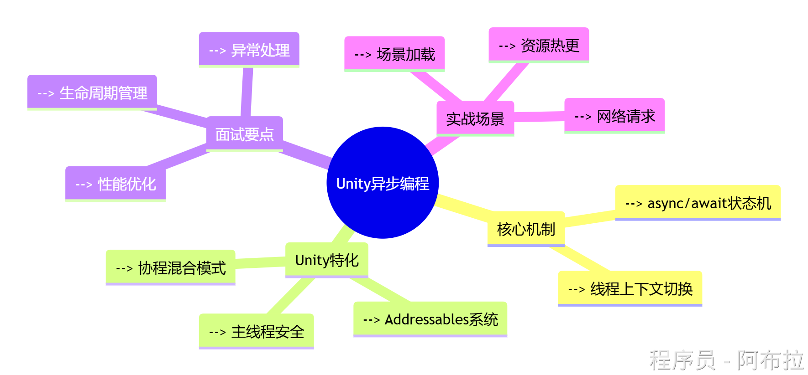

# 异步编程



在C#中，await 关键字用于异步编程，它允许你等待一个异步操作（例如网络请求或长时间运行的计算任务）的完成，而不会阻塞主线程的执行。await 只能在标记为 async 的方法内部使用，并且只能与返回 Task 或 Task\<TResult\> 的方法一起使用。

### 异步编程核心原理图示

#### 1. 同步/异步执行流程对比


**关键区别**：异步编程通过线程池分流耗时操作，避免主线程阻塞（尤其在Unity中需保持60FPS渲染）

#### 2. async/await状态机原理


编译器会将async方法转换为实现`IAsyncStateMachine`接口的状态机类，管理await断点与恢复

------

### Unity中5大异步实现方式

#### 1. async/await（推荐方案）

```js
// Unity资源加载示例
public async Task<GameObject> LoadAssetAsync(string path) {
    ResourceRequest request = Resources.LoadAsync<GameObject>(path);
    await request; // 等待异步加载完成
    return request.asset as GameObject;
}

// 调用示例
async void Start() {
    var prefab = await LoadAssetAsync("Enemies/Dragon");
    Instantiate(prefab);
}
```

**优势**：代码简洁如同步，自动处理线程切换

#### 2. Coroutine（协程）与异步混用


```js
IEnumerator LoadSceneCoroutine() {
    var webRequest = UnityWebRequest.Get("https://api.gamedata");
    yield return webRequest.SendWebRequest(); // 传统Yield
    var data = JsonUtility.FromJson<GameData>(webRequest.downloadHandler.text);

    // 与await混用
    await LoadAssetsAsync(data.assetList); 
}
```

**适用场景**：兼容旧代码或需要与WWW/UnityWebRequest配合

#### 3. Task.Run（CPU密集型计算）

```js
public async Task<int> CalculateDamageAsync() {
    return await Task.Run(() => {
        // 复杂伤害计算（避免卡主线程）
        int result = 0;
        for (int i = 0; i < 1000000; i++) {
            result += i % 10;
        }
        return result;
    });
}
```

**注意**：Unity部分API（如Transform）需回到主线程执行

#### 4. UniTask（第三方优化方案）

```js
// 避免GC分配的传统Task
using Cysharp.Threading.Tasks;

async UniTaskVoid LoadAllAssets() {
    await UniTask.WhenAll(
        LoadPrefabAsync("Player"),
        LoadSceneAsync("Level1")
    );
    Debug.Log("All loaded!");
}
```

**优势**：零GC分配、支持取消操作，专为Unity优化

#### 5. EAP模式（旧版网络请求）

```js
void DownloadFile(string url) {
    WebClient client = new WebClient();
    client.DownloadFileCompleted += (sender, e) => {
        // 回到主线程执行
        UnityMainThreadDispatcher.Instance.Enqueue(() => {
            Debug.Log("Download complete!");
        });
    };
    client.DownloadFileAsync(new Uri(url), "localPath");
}
```

**现状**：已被TAP模式（async/await）取代，但需了解。

------

### Unity特化面试问题与优化策略

#### 异步加载资源时如何避免"MissingReferenceException"？

**解决方案**：

使用`MonoBehaviour`生命周期检测

```js
if (this == null) return; // 对象已销毁
```

通过`CancellationToken`取消任务

```js
var cts = new CancellationTokenSource();
void OnDestroy() {
    cts.Cancel();
}
await LoadAssetAsync("path", cts.Token);
```

通过`GameObject.activeInHierarchy`检查对象有效性

#### 如何优化高频异步调用（如伤害计算）？

**性能优化方案**：

1. **对象池+缓存Task**

```js
static Dictionary<string, Task<GameObject>> _prefabCache = new();

public static Task<GameObject> GetPrefabAsync(string path) {
    if (!_prefabCache.TryGetValue(path, out var task)) {
        task = Resources.LoadAsync<GameObject>(path).AsTask();
        _prefabCache[path] = task;
    }
    return task;
}
```

1. **使用ValueTask减少堆分配**：

```js
public async ValueTask<int> OptimizedCalculation() {
    if (_cachedResult != null) 
        return _cachedResult.Value;
    return await Task.Run(...);
}
```

#### async/await会创建新线程吗？

- **I/O操作**（如网络请求）：不创建线程，使用操作系统回调机制
- **CPU密集型任务**：`Task.Run`会使用线程池线程
- **Unity主线程**：await默认回到原同步上下文（主线程）

#### 异步编程性能优化方案


------

### 异步编程禁忌与最佳实践

#### 1. **Unity主线程限制**


**解决方案**：通过`UnitySynchronizationContext`回到主线程

```js
await Task.Run(() => {
    // 后台线程计算
}).ContinueWith(t => {
    // 自动切换回主线程
}, TaskScheduler.FromCurrentSynchronizationContext());
```

#### 2. **异常处理模板**

```js
async void SafeAsyncMethod() {
    try {
        var result = await RiskyOperation();
    }
    catch (UnityWebRequestException ex) {
        Debug.LogError($"网络错误: {ex.ResponseCode}");
    }
    catch (OperationCanceledException) {
        Debug.Log("任务已取消");
    }
    finally {
        // 资源清理
    }
}
```

1. **帧率敏感场景优化**


详情可以看《Unity 客户端面试宝典》中 Unity 游戏引擎 - 优化策略 - 分帧处理


1. **调试技巧**

- 使用`Debug.Log($"Thread: {Thread.CurrentThread.ManagedThreadId}")`查看线程切换
- Unity Profiler中观察`Task`对象分配情况
