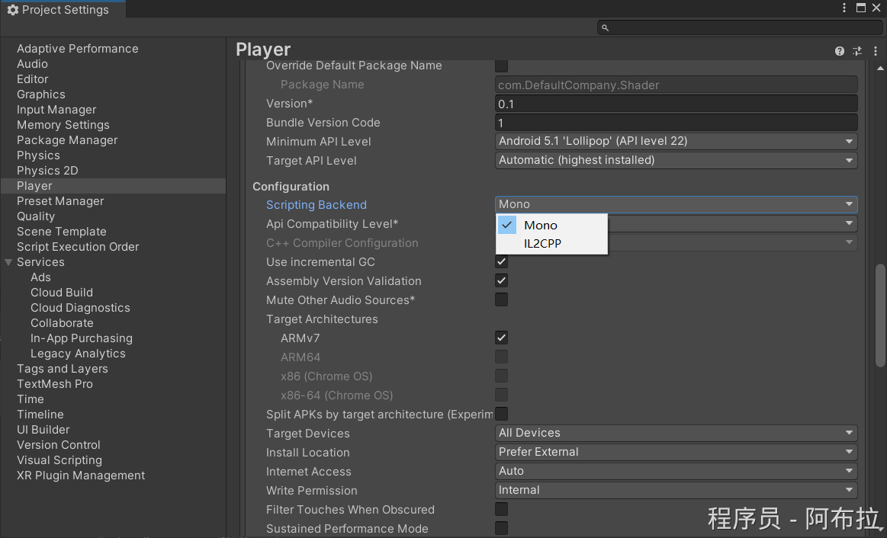

# 脚本后端

## 面试题

1. JIT 和 AOT 分别是什么？俩者有什么区别？
2. Unity 脚本后端包含哪两种？

## 开发场景

可以做 AR/VR、手游、工艺仿真、端游、页游、实时渲染动画跨平台的游戏引擎。

## 引擎大体架构

**核心系统**

- 渲染引擎：负责图形的绘制，包括网格渲染、光照、阴影、后处理效果等。
- 物理引擎：基于NVIDIA的PhysX，处理碰撞检测和物理模拟。
- 音频系统：处理音效的播放和3D音效空间模拟。
- 输入系统：管理用户输入，包括键盘、鼠标、游戏手柄和触摸输入。
- 资源管理：负责加载和管理资源，如纹理、模型、动画和AssetBundle。

**抽象层**

- 场景管理：Unity中的场景管理系统，负责管理游戏对象的加载和卸载。
- 对象组件系统：Unity的核心设计模式，游戏对象（GameObject）可以附加多种组件（Component），如Transform、Renderer、Collider等。

**脚本系统**

- Unity支持两个主要的脚本后端：Mono和IL2CPP，允许开发者使用C#编写游戏逻辑。

**编辑器层**

- Unity编辑器：提供了一个可视化界面，用于场景构建、资源管理、脚本编写和游戏测试。
- Inspector视图：允许开发者查看和编辑游戏对象的属性。
- Asset Pipeline：资源导入管线，自动将各种格式的资源转换为Unity可用的格式。

**数据驱动**

- 序列化系统：Unity的序列化系统允许对象状态的保存和加载，这对于编辑器的状态保持和游戏数据的持久化至关重要。
- ScriptableObject：用于保存和管理游戏数据，可以在编辑器和运行时使用。

**扩展性**

- 插件系统：Unity允许开发者通过插件扩展编辑器的功能，例如自定义窗口、菜单项和编辑器工具。
- 自定义渲染管线：从Unity 2018开始，Unity引入了Scriptable Render Pipeline（可编程渲染管线），允许开发者更深入地控制渲染过程。

**网络通信**

- Unity支持多种网络通信方案，如SocketIOUnity插件，它封装了socket.io-client-csharp与Unity的交互，支持socket.io服务器v2/v3/v4，并实现了http轮询和websocket等功能。

请注意，以上列举的是Unity引擎后端的一些主要组成部分和特性，随着Unity版本的更新，可能会添加新的功能或优化现有功能。

Unity 支持两种主要的脚本后端：Mono 和 IL2CPP（Intermediate Language to C++）。

这两个后端的主要目的是将 C# 代码转换为可以在目标平台上执行的代码。

## 什么是 JIT 和 AOT 有什么区别

在Unity中，AOT（Ahead-Of-Time）编译和JIT（Just-In-Time）编译是两种不同的代码编译和执行方式.

主要用于将C#代码（或其他.NET语言）转换为可在目标平台上执行的本地机器码。

JIT(Just-In-Time)：实时编译，执行慢安装快占空间小一点。

AOT(Ahead-Of-Time )：预先编译，执行快安装慢占内存占外存大。

### AOT（Ahead-Of-Time）编译

AOT编译是在程序运行之前，将源代码或中间代码（如C#的IL代码）预先编译为特定平台上的本地机器码。这意味着在程序启动之前，所有的代码都已经被编译成了可以直接被处理器执行的二进制代码。

**特点**

1. 由于代码在程序启动前就已经被编译，因此在运行时无需再进行编译，这通常可以提高程序的启动速度和执行效率。
2. AOT编译的代码比JIT编译的代码更难被反编译，因为攻击者没有机会在运行时查看或修改源代码，这提供了一定程度的安全性增强。
3. AOT编译是直接将代码编译为特定平台的机器码，因此可能存在跨平台兼容性问题。但Unity的IL2CPP后端通过抽象层解决了这个问题，使得C#代码可以在多个平台上使用AOT编译。
4. 虽然AOT编译的代码在运行时无需再编译，但由于需要在程序启动前进行编译，这可能会增加编译时间和打包大小。

### JIT（Just-In-Time）编译

JIT编译是在程序运行时，将源代码或中间代码（如C#的IL代码）动态地编译为特定平台上的本地机器码。这意味着在程序执行到某段代码时，该段代码才会被编译成机器码并执行。

**特点**

1. JIT编译可以根据程序的运行情况动态地优化代码，例如通过内联函数、消除无用的代码分支等方式来提高执行效率。但是，由于每次执行代码时都需要进行编译，因此可能会比AOT编译稍慢。
2. JIT编译的代码相对容易被反编译，因为攻击者可以在运行时通过调试工具或内存分析工具来查看或修改源代码。
3. JIT编译是动态地将代码编译为特定平台的机器码，因此具有较好的跨平台兼容性。Unity的Mono后端就使用了JIT编译技术，使得C#代码可以在多个平台上运行。
4. 由于代码是在运行时动态编译的，因此JIT编译通常不会影响程序的启动时间，但可能会影响第一次执行某段代码时的响应时间。

## AOT与JIT的区别

**编译时间**

AOT编译在程序启动前进行

JIT编译在程序运行时进行

**性能**

AOT编译通常具有更快的启动速度和执行效率

JIT编译可以根据程序的运行情况动态优化代码

**安全性**

AOT编译的代码更难被反编译

JIT编译的代码相对容易被反编译

**兼容性**

AOT编译可能存在跨平台兼容性问题，但Unity的IL2CPP后端通过抽象层解决了这个问题

JIT编译具有较好的跨平台兼容性

**启动时间**

AOT编译可能会增加编译时间和打包大小，但不会影响程序的启动时间

JIT编译通常不会影响程序的启动时间，但可能会影响首次执行某段代码时的响应时间

**注意**

在Unity中，开发者可以根据项目的具体需求选择使用**AOT编译（如IL2CPP后端）**还是**JIT编译（如Mono后端）**。

## Unity 中脚本后端

## Mono

Mono 是一个开源的跨平台实现，用于运行 C# 和其他基于 .NET 的语言。在 Unity 中，Mono 后端允许开发者使用 C# 编写脚本，并将这些脚本编译为 Mono 字节码（也称为 Common Intermediate Language, CIL 或 MSIL）。Mono 运行时在目标平台上执行这些字节码。

**优点**

- 跨平台支持：Mono 可以在多种操作系统上运行，包括 Windows、Linux、macOS 和移动平台（如 Android 和 iOS）。
- 调试功能：Mono 提供了强大的调试工具，如 MonoDevelop 和 Visual Studio for Mac，可以帮助开发者调试 C# 脚本。
- 兼容性：由于 Mono 是一个长期存在的项目，许多第三方库和工具都与它兼容。

**缺点**

- 性能：在某些平台上，Mono 的性能可能不如 IL2CPP。
- AOT（Ahead-Of-Time）编译限制：虽然 Mono 支持 JIT（Just-In-Time）编译，但在某些平台（如 iOS）上，Apple 要求使用 AOT 编译，这可能会限制 Mono 的功能。

#### 总结

**Mono是.net的一个开源跨平台工具，就类似java虚拟机，java本身不是跨平台语言，但运行在虚拟机上就能够实现了跨平台。.net只能在windows下运行，Mono可以实现跨平台跑，可以运行于linux，Unix，Mac OS等（因为不同平台上有各自对应的虚拟机，字节码在虚拟机上运行，实现跨平台）。**

## IL2CPP

IL2CPP 是 Unity 开发的一种技术，它将 C# 代码转换为 C++ 代码，然后使用目标平台的本地编译器（如 gcc 或 clang）将 C++ 代码编译为本地机器码。这种方法使得 Unity 可以在不使用 Mono 运行时的情况下运行 C# 代码，从而提高了性能并减少了运行时依赖。

**优点**

- 性能：由于 IL2CPP 将 C# 代码直接转换为本地机器码，因此它通常比 Mono 更快。
- AOT 编译支持：IL2CPP 支持 AOT 编译，这使它成为在 iOS 等平台上发布游戏的理想选择。
- 安全性：由于 C++ 代码比 Mono 字节码更难反编译，因此 IL2CPP 提供了更高的安全性。

**缺点**

- 调试功能：与 Mono 相比，IL2CPP 的调试功能可能较为有限。然而，Unity 一直在努力改进 IL2CPP 的调试支持。
- 兼容性：由于 IL2CPP 是 Unity 特有的技术，因此某些第三方库和工具可能不完全兼容。然而，随着 IL2CPP 的普及，这种情况正在逐渐改善。

#### 总结

Mono 和 IL2CPP 各有优缺点，选择哪个后端取决于项目的具体需求。对于需要高性能或需要在 iOS 等平台上发布的游戏，IL2CPP 通常是更好的选择。而对于需要强大调试功能和广泛兼容性的项目，Mono 可能更适合。在 Unity 中，开发者可以在构建设置中选择要使用的脚本后端。

## 3D名词基础概念

#### **3D 三维（three dimension）**

客观世界中静止的物体都是三维的，在计算机图形学中常在一定的坐标系中用（x，y，z）坐标系列表示物体。

#### **3D modeling 3D建模**

用三维坐标来描述物体的形状。在各种计算机图形应用领域中有不同的三维建模方法，用不同的算法来描述这些领域中的物体和对象。

#### **3D transformation 3D变换**

在三维空间中把物体的三维坐标从一个位置变换至另一位置，或者从一个坐标系变换至另一坐标系。这是一种对物体的三维坐标（x，y，z）进行数据操作的一种形式。
