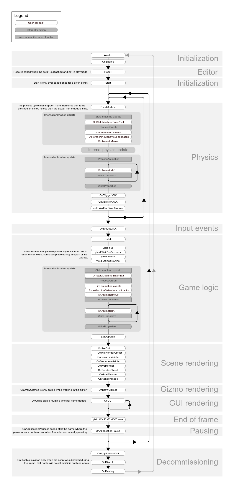

# 生命周期函数

## 面试题

1. Unity 常用的生命周期函数都有哪一些？
2. Unity 常用的生命周期函数执行顺序？
3. 哪些函数可能在同一个对象周期中反复的发生？
4. 销毁一个UnityEngine.Object或其子类的通常方法 ？
5. 物理更新一般放在哪个系统函数里？
6. 更新函数有哪些？  

## 概念

Unity中的生命周期函数（也称为回调方法或事件函数）是MonoBehaviour类中的一系列方法，它们在特定的时间点自动被Unity调用。

这些函数为开发者提供了在特定时刻执行代码的机会，比如当对象被创建、更新、销毁时，或者当对象接收到特定的事件时。

**执行顺序**

**Awake - OnEnable - Start - FixedUpdate - Update - LateUpdate - OnDisable - OnDestroy**

**Awake()**

- 当脚本实例被加载时调用。常用于初始化变量或组件。
- 在所有对象的Awake()被调用完毕后，才调用Start()。

**OnEnable()**

- 当对象变为可用（active）时调用。
- 在对象变为可用之前，它的所有子对象也会变为可用，并且它们的OnEnable()也会先被调用。

**Start()**

- 在对象的首次帧更新之前调用。通常用于进一步的初始化工作。
- 在Awake()之后，Update()之前调用。

**FixedUpdate()**

- 在每一帧的物理更新之前调用。用于处理物理相关的操作。
- 与Update()不同，FixedUpdate()的调用频率由物理设置决定，而不是每一帧都调用。

**Update()**

- 在每一帧中调用。用于处理游戏逻辑。

**LateUpdate()**

- 在所有Update()之后调用。常用于处理需要在其他更新之后进行的操作，比如跟随相机的移动。

**OnDisable()**

- 当对象变为不可用（inactive）时调用。
- 在对象变为不可用之前，它的所有子对象也会变为不可用，并且它们的OnDisable()也会先被调用。

**OnDestroy()**

- 当MonoBehaviour实例被销毁时调用。常用于清理资源。

#### **暂停与恢复**

1. `OnApplicationPause(bool pauseStatus)`

- **调用时机**：当应用程序被暂停或恢复时调用（如切换到后台或返回前台）。
- **参数**：`pauseStatus` 为 `true` 表示暂停，为 `false` 表示恢复。
- **特点**：适合用于保存游戏状态或暂停音乐。

```js
void OnApplicationPause(bool pauseStatus)
{
    if (pauseStatus)
        Debug.Log("Application paused");
    else
        Debug.Log("Application resumed");
}
```

2. `OnApplicationFocus(bool hasFocus)`

- **调用时机**：当应用程序获得或失去焦点时调用。
- **参数**：`hasFocus` 为 `true` 表示获得焦点，为 `false` 表示失去焦点。
- **特点**：适合用于处理输入焦点相关的逻辑。

```js
void OnApplicationFocus(bool hasFocus)
{
    if (hasFocus)
        Debug.Log("Application gained focus");
    else
        Debug.Log("Application lost focus");
}
```

------

**退出应用程序**

3. `OnApplicationQuit()`

- **调用时机**：在应用程序退出时调用。
- **特点**：适合用于保存数据或释放资源。
- **注意**：在编辑器中运行时，该方法会在停止播放时被调用。

```js
csharp复制代码void OnApplicationQuit()
{
    Debug.Log("Application is quitting");
}
```

4. `Application.Quit()`

- **调用时机**：主动调用以退出应用程序。
- **特点**：适合用于在特定条件下退出游戏（如菜单中的退出按钮）。
- **注意**：在编辑器中无效，但可以通过 `UnityEditor.EditorApplication.isPlaying = false` 模拟退出。

```js
void QuitGame()
{
    Application.Quit();
    Debug.Log("Quit game");
}
```

------

#### **对象禁用与销毁**

1. `OnDisable()`

- **调用时机**：当脚本或其所属的 GameObject 被禁用时调用。
- **特点**：适合用于取消订阅事件或停止特定逻辑。

```js
void OnDisable()
{
    Debug.Log("OnDisable called");
}
```

2. `OnDestroy()`

- **调用时机**：当脚本或其所属的 GameObject 被销毁时调用。
- **特点**：适合用于清理资源或释放引用。

```js
void OnDestroy()
{
    Debug.Log("OnDestroy called");
}
```

## 官方图示

# 
