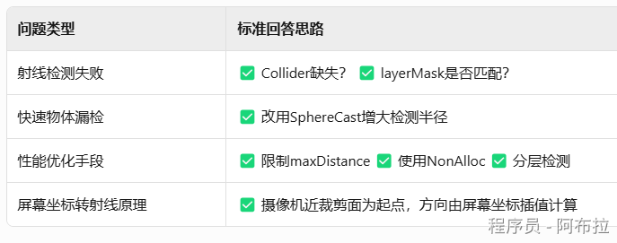

# 射线检测原理

## 面试题



### 1. 如何检测物体是否被其他对象遮挡？

| **方法**         | **精度** | **性能** | **适用场景**                   |
| ---------------- | -------- | -------- | ------------------------------ |
| **射线检测**     | ⭐⭐⭐⭐     | ⭐⭐       | 动态物体遮挡检测（如射击游戏） |
| **渲染器回调**   | ⭐⭐       | ⭐⭐⭐⭐     | 粗略视野判断（不要求遮挡区分） |
| **视锥体+射线**  | ⭐⭐⭐⭐     | ⭐⭐       | 综合视野与遮挡检测             |
| **内置遮挡剔除** | ⭐⭐⭐      | ⭐⭐⭐⭐     | 静态场景优化（减少Draw Call）  |
| **Hi-Z GPU剔除** | ⭐⭐⭐⭐     | ⭐⭐⭐      | 超大规模动态物体（如开放世界） |

#### a. 射线检测法（Raycast）

**原理**：从观察点（如摄像机或玩家角色）向目标物体发射射线，若射线在到达目标前命中其他物体，则目标被遮挡。
**实现步骤**：

**计算方向与距离**：

```js
Vector3 origin = Camera.main.transform.position; // 观察点
Vector3 targetPos = target.transform.position;
Vector3 direction = (targetPos - origin).normalized;
float distance = Vector3.Distance(origin, targetPos);
```

**发射射线检测遮挡**：

```js
if (Physics.Raycast(origin, direction, out RaycastHit hit, distance)) {
    if (hit.collider.gameObject != target) {
        return true; // 目标被其他物体遮挡
    }
}
```

#### b. 渲染器回调（Renderer Callbacks）

**原理**：利用Unity内置的回调函数 `OnBecameVisible()` 和 `OnBecameInvisible()`，自动触发物体进入/离开摄像机视野的事件。
**实现方式**

```js
void OnBecameVisible() {
    // 物体进入任何摄像机视野时触发
}  
void OnBecameInvisible() {
    // 物体离开所有摄像机视野时触发（可能被遮挡或移出视野）
}
```

**局限性**：

- 仅判断物体是否在**摄像机视锥体内**，无法区分是否被遮挡（如墙后的物体仍可能触发 `OnBecameVisible`）。

#### c. 视锥体与包围盒检测

**原理**：结合物体是否在相机视野内（视锥体检测）和遮挡关系（射线检测）。
**完整判断逻辑**：

```js
public bool IsTargetVisible(GameObject target) {
    // 步骤1：检查目标是否在相机视锥体内
    Bounds bounds = target.GetComponent<Renderer>().bounds;
    Plane[] planes = GeometryUtility.CalculateFrustumPlanes(Camera.main);
    if (!GeometryUtility.TestPlanesAABB(planes, bounds)) return false;  

    // 步骤2：检查目标是否被遮挡
    Vector3 origin = Camera.main.transform.position;
    Vector3 dir = (target.transform.position - origin).normalized;
    float dist = Vector3.Distance(origin, target.transform.position);
    if (Physics.Raycast(origin, dir, dist, obstacleLayer)) return false;  

    return true;
}
```

**适用场景**：需同时处理视野外和被遮挡的情况。

#### d. 高级遮挡剔除技术

**内置遮挡剔除（Occlusion Culling）**

- **原理**：预计算静态物体间的遮挡关系，运行时动态剔除被遮挡物体。
- **步骤**： 

1. 标记静态物体为 `Occluder Static`（遮挡物）或 `Occludee Static`（被遮挡物）。
2. 在 `Window > Rendering > Occlusion Culling` 中烘焙数据。

- **适用场景**：大型静态场景（如建筑群）的性能优化。

**Hi-Z遮挡剔除（GPU Driven）**

- **原理**：利用深度图（Depth Texture）生成多级Mipmap，快速比较物体深度与场景深度值。
- **优势**：适用于海量物体（如数万棵草）的实时遮挡判断。
- **实现**：需结合Compute Shader和深度图处理，复杂度较高。

### 2. 小球运动速度太快击穿墙壁，有什么解决方法吗？

| **方案**           | **精度** | **性能开销** | **适用场景**         |
| ------------------ | -------- | ------------ | -------------------- |
| 连续动态碰撞检测   | ⭐⭐⭐⭐⭐    | ⭐⭐⭐⭐         | 子弹、高速飞行物     |
| 射线预检测         | ⭐⭐⭐⭐     | ⭐⭐           | 玩家角色移动         |
| 减小Fixed Timestep | ⭐⭐⭐⭐     | ⭐⭐⭐          | 中低速物体           |
| 预测物理           | ⭐⭐⭐      | ⭐⭐           | 竞技游戏（预判反弹） |
| 增大碰撞体厚度     | ⭐⭐       | ⭐            | 静态场景优化         |

#### a. 调整碰撞检测模式

为小球的`Rigidbody`组件设置更高精度的碰撞检测模式：

- **连续碰撞检测（Continuous）**：适用于中高速物体，但性能开销中等。 

```js
GetComponent<Rigidbody>().collisionDetectionMode = CollisionDetectionMode.Continuous;
```

- **连续动态碰撞检测（Continuous Dynamic）**：针对高速运动物体（如子弹），精度最高但性能消耗最大。 

```js
GetComponent<Rigidbody>().collisionDetectionMode = CollisionDetectionMode.ContinuousDynamic;
```

**原理**：默认的离散检测（Discrete）按固定时间步长采样位置，高速物体可能跳过碰撞体；连续模式通过插值预测路径，避免漏检。

#### b. 提高物理更新频率

减小`Fixed Timestep`值，增加物理模拟频率：

- **修改项目设置**：`Edit > Project Settings > Time > Fixed Timestep`（默认0.02秒，改为0.01秒或更低）。
- **动态调整**（根据帧率）： 

```js
void Update() {
    Time.fixedDeltaTime = Mathf.Lerp(0.02f, 0.005f, Mathf.InverseLerp(30, 60, Time.frameRate));
}
```

**原理**：更短的步长意味着单位时间内更多次碰撞检测，减少单步位移过大导致的穿透。

#### c. 预检测与运动约束

**射线预检测**：在移动前向运动方向发射射线，若前方有墙体则阻止移动：

```js
void Move() {
    Vector3 moveDir = transform.forward * speed * Time.deltaTime;
    if (!Physics.Raycast(transform.position, moveDir, moveDir.magnitude, wallLayer)) {
        transform.Translate(moveDir);
    }
}
```

**预测物理**：计算下一帧位置并提前检测碰撞：

```js
void FixedUpdate() {
    Vector3 predictedPos = transform.position + _rb.velocity * Time.fixedDeltaTime;
    if (Physics.CheckSphere(predictedPos, 0.5f, wallLayer)) {
        _rb.velocity *= 0.5f; // 提前减速
    }
}
```

**原理**：主动预测运动轨迹，提前规避碰撞。

#### d. 优化碰撞体设计

- **增大墙体厚度**：薄墙体更容易被穿透，增加`Collider`尺寸（如从0.1单位增至0.5单位）。
- **使用复合碰撞体**：为墙体添加多个重叠的简单碰撞体（如多个Box Collider），增加检测覆盖率。
- **简化碰撞形状**：用`Box/Capsule`代替`Mesh Collider`，降低计算复杂度。

### 3. 射线检测碰撞物的原理是？

## 核心原理

射线（Ray）是从**起点**（Origin）沿**方向**（Direction）无限延伸的虚拟直线，通过与场景中的**碰撞体**（Collider）相交实现物理检测。

1. **射线（Ray）**

- 由**起点**（`origin: Vector3`）和**方向**（`direction: Vector3`）定义的无限长直线
- 示例：`Ray ray = new Ray(Vector3.zero, Vector3.forward);`
- 方向向量需标准化（`direction.normalized`），否则检测结果可能异常

1. **碰撞检测**

- 存储碰撞信息：交点坐标（`point`）、碰撞物体（`collider`）、距离（`distance`）、表面法线（`normal`）
- 射线与场景中带**Collider组件的物体**求交，返回碰撞信息`RaycastHit`
- **无Collider的物体无法被检测到**（面试高频考点）

起点 (Origin)             →    方向 (Direction)             →       碰撞体 (Collider)

​      |                                            |

Vector3坐标               标准化向量（需调用direction.normalized）

#### **基础检测方法：**`**Physics.Raycast()**`

- `maxDistance`：射线最大长度（默认无限）
- `layerMask`：层级过滤（仅检测指定层，大幅提升性能）

```js
if (Physics.Raycast(ray, out RaycastHit hit, maxDistance, layerMask)) {
    // hit.collider：命中碰撞体
    // hit.point：命中点坐标（世界空间）
    // hit.normal：命中表面法线（用于反弹计算）
}
```

#### **摄像机到鼠标的射线**

原理：将**屏幕坐标**转换为**世界空间射线**

摄像机  → 屏幕点击位置 → 3D物体

```js
void Update() {
    if (Input.GetMouseButtonDown(0)) {
        Ray ray = Camera.main.ScreenPointToRay(Input.mousePosition);
        if (Physics.Raycast(ray, out hit)) {
            Debug.Log("点击物体：" + hit.collider.name);
        }
    }
}
```

## 实战

#### **射击游戏命中判定**

```js
void Fire() {
    Ray ray = new Ray(gunMuzzle.position, gunMuzzle.forward);
    if (Physics.Raycast(ray, out hit, 100f, enemyLayer)) {
        hit.collider.GetComponent<Enemy>().TakeDamage(10);
    }
}
```

**优化点**：

- 使用`enemyLayer`过滤非敌人物体
- 预存枪口位置避免每帧计算`gunMuzzle.position`

#### **角色地面检测**

**技巧**：短距离检测（如0.1m）解决快速移动时的漏检问题

角色底部  → 向下短射线（0.1m） → 地面

```js
bool isGrounded = Physics.Raycast(
    transform.position, 
    Vector3.down, 
    groundCheckDistance, 
    groundLayer
);
```

#### **视线遮挡判断（AI逻辑）**

**考点**：方向向量标准化 + 距离精确计算

```js
bool CanSeePlayer() {
    Vector3 dir = (player.position - transform.position).normalized;
    return !Physics.Raycast(transform.position, dir, dir.magnitude, obstacleLayer);
}
```

#### 穿透检测（如狙击枪穿墙）

```js
RaycastHit[] hits = Physics.RaycastAll(ray, maxDistance);
Array.Sort(hits, (a,b) => a.distance.CompareTo(b.distance)); // 按距离排序
```

#### 零GC优化（高频检测场景必用）

```js
RaycastHit[] results = new RaycastHit[10]; // 预分配数组
int hitCount = Physics.RaycastNonAlloc(ray, results, maxDistance);
```

#### 体积检测解决漏检

- **球形检测**：`Physics.SphereCast(origin, 0.5f, direction, out hit)`
- **盒形检测**：`Physics.BoxCast(center, halfSize, direction, out hit)`
