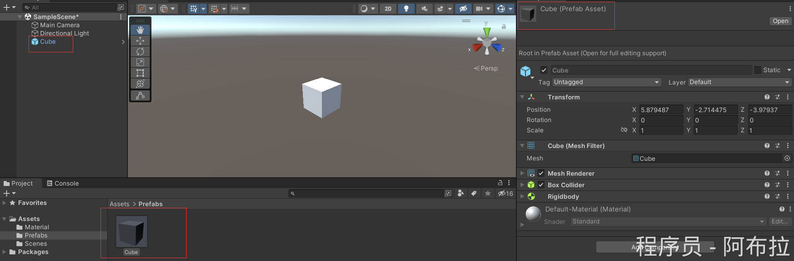
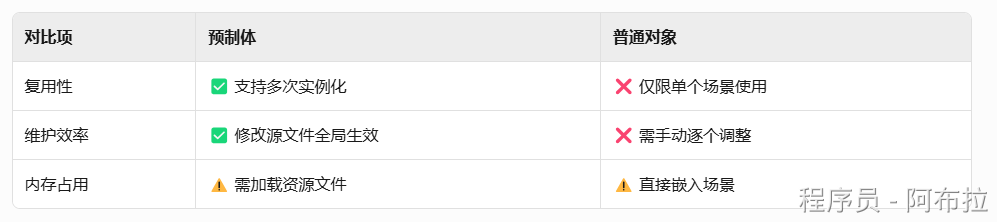
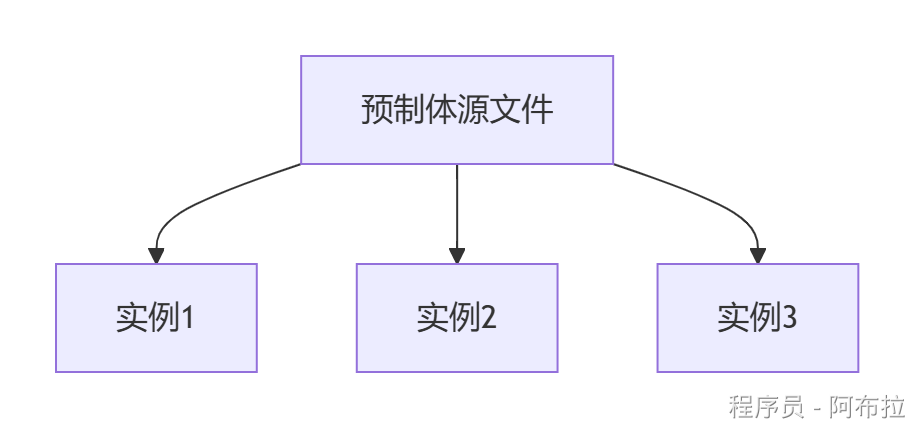
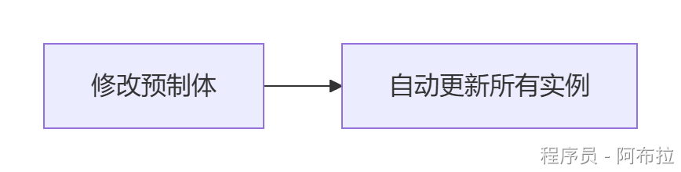
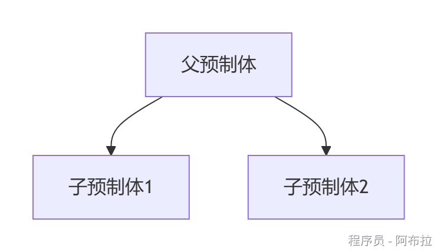
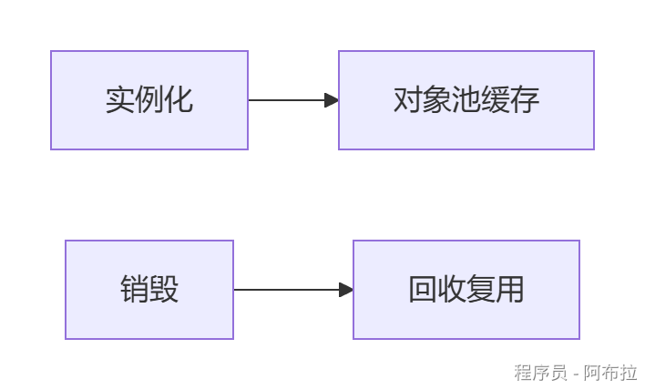

# Prefab

## 面试题

1. Prefab 是什么？
2. 使用 Prefab 有什么好处？

## 概念

预制体是Unity中的一种**资源类型**（.prefab文件），本质是游戏对象（GameObject）及其组件（如Transform、脚本、渲染器等）的**可复用模板**。

预制体可显著提升开发效率，尤其适合需要大量重复对象或团队协作的项目！结合Unity的**Prefab Mode**和**嵌套预制体**功能进行复杂对象管理.

在Project视图中显示为蓝色方块图标。

一次创建，多次实例化，修改源预制体可自动更新所有实例。

#### **高效复用性**

**批量生成**：如子弹、敌人、环境道具等重复对象

**跨场景共享**：同一预制体可在不同场景中复用，避免重复制作

#### **一致性维护**

- 修改预制体的材质或脚本 → 所有实例同步更新
- 实例可单独调整部分属性（属性名变粗体），不影响源预制体

#### **模块化开发**

- 复杂对象（如角色=身体+武器）可拆分为多层预制体，便于团队协作

#### 对象池技术

- 频繁创建/销毁的对象（如子弹、特效），减少GC开销

