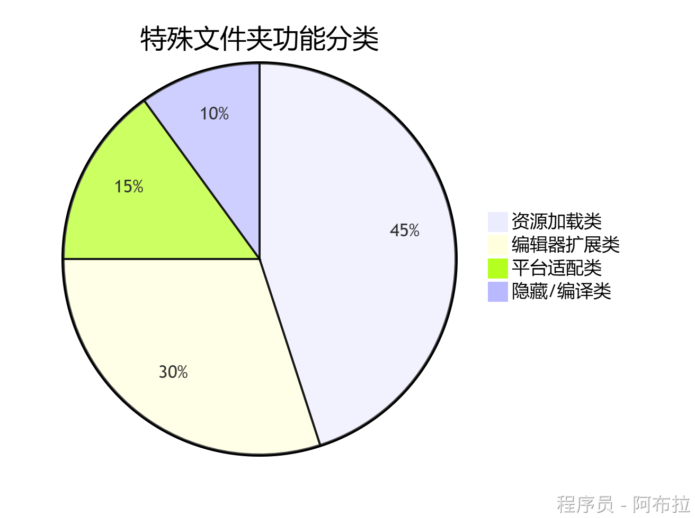
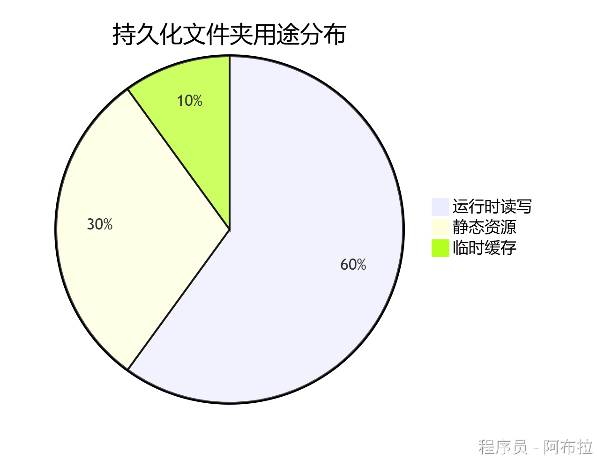

# 特殊文件夹

## 面试题

1. Unity 中特殊文件夹都有哪一些？
2. Unity 中持久化文件夹都有哪一些？

## 📂 特殊文件夹

| **文件夹**        | **是否打包** | **访问方式**                      | **典型用途**     |
| ----------------- | ------------ | --------------------------------- | ---------------- |
| `Resources`       | ✅ 强制打包   | `Resources.Load()`                | 动态加载的预制体 |
| `StreamingAssets` | ✅ 原样拷贝   | `Application.streamingAssetsPath` | 视频/配置文件    |
| `Editor`          | ❌ 不打包     | 仅编辑器脚本                      | 扩展Unity编辑器  |
| `Plugins/Android` | ✅ 平台适配   | 自动链接                          | Android SDK集成  |

### 1️⃣ **资源加载类文件夹**

#### **Resources**

- **作用**：通过`Resources.Load()`动态加载资源，所有内容无条件打包到最终构建中。
- **特点**： 

- 支持多层级嵌套（如`Resources/UI/Buttons`）
- 资源加密压缩，适合预制体/小纹理
- **慎用**：过度使用会导致包体膨胀。

#### **StreamingAssets**

- **作用**：存放需原样打包的原始文件（如视频、JSON配置），通过`Application.streamingAssetsPath`访问。
- **跨平台差异**： 

- Android：压缩在APK内，需用`WWW/UnityWebRequest`加载
- iOS：直接拷贝到沙盒路径

### 2️⃣ **编辑器扩展类文件夹**

#### **Editor**

- **作用**：存放编辑器脚本，可调用`UnityEditor` API，**不参与运行时构建**。
- **规则**： 

- 可存在于任意层级（如`Assets/Scripts/Editor`）
- 禁止挂载到GameObject

#### **Editor Default Resources**

- **作用**：存储编辑器GUI资源（如图标），仅能通过`EditorGUIUtility.Load()`加载。
- **路径限制**：必须直接位于`Assets`根目录下。

### 3️⃣ **平台适配类文件夹**

#### **Plugins**

- **子目录**

- `x86`/`x86_64`：平台原生库（如`.dll`）
- `Android`：存放`.jar`或`.so`文件
- `iOS`：`.a`或`.m`文件。

- **编译顺序**：优先编译，供其他脚本调用。

#### **Standard Assets**

- **作用**：存放优先编译的标准资源脚本，编译到`Assembly-CSharp-firstpass`。
- **Pro版专属**：`Pro Standard Assets`为付费功能资源。

### 4️⃣ **辅助功能类文件夹**

#### **Gizmos**

- **作用**：存放场景编辑器的辅助图标，通过`Gizmos.DrawIcon`调用。

#### **Hidden Assets**

- **规则**：以下内容被Unity忽略： 

- 以`.`开头的文件夹（如`.temp`）
- `cvs`或`.tmp`文件。

## 📂 持久化文件夹

| **文件夹**            | **读写权限** | **数据保留策略** | **典型用途**   |
| --------------------- | ------------ | ---------------- | -------------- |
| `persistentDataPath`  | 读写         | 永久保存         | 用户存档、设置 |
| `streamingAssetsPath` | 只读         | 随应用包存在     | 初始配置、视频 |
| `temporaryCachePath`  | 读写         | 可能被系统清理   | 临时缓存、下载 |

### 1️⃣ Application.persistentDataPath（全平台读写）

- **作用**：存储需长期保存的用户数据（如存档、配置），**唯一全平台可读写路径**。
- **跨平台路径示例**

- **Android**：`/data/data/<包名>/files`
- **iOS**：`/var/mobile/Containers/Data/Application/<UUID>/Documents`
- **PC**：`C:/Users/<用户名>/AppData/LocalLow/<公司名>/<产品名>`

- **特点**： 

- 数据卸载应用后仍保留（除非用户手动清除）
- 支持文件操作（如JSON、二进制存档）。

### 2️⃣ Application.streamingAssetsPath（只读静态资源）

- **作用**：存放打包时需原样拷贝的静态资源（如视频、初始配置）。
- **跨平台差异**

- **Android**：压缩在APK内，需`WWW`或`UnityWebRequest`加载
- **iOS/PC**：直接访问文件系统路径

- **限制**：**不可写入**，仅用于读取初始数据。

### 3️⃣ **Application.temporaryCachePath**（临时缓存）

- **作用**：存储临时文件（如下载资源、缓存数据），**可能被系统自动清理**。
- **示例路径**： 

- **Android**：`/data/data/<包名>/cache`
- **iOS**：`/var/mobile/Containers/Data/Application/<UUID>/tmp`

- **适用场景**：断点续传、非关键性临时数据。
