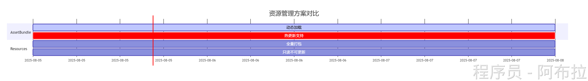
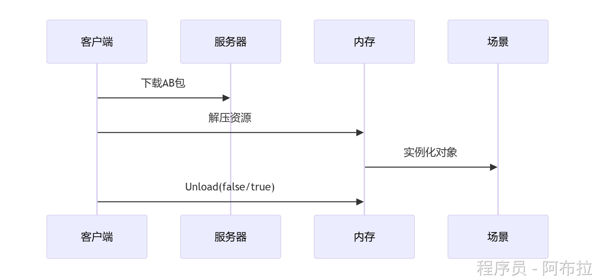
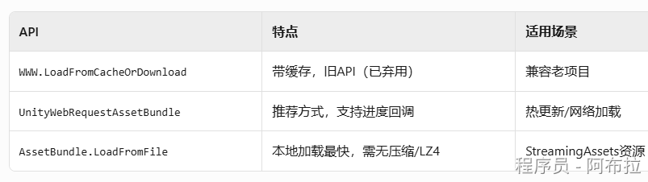
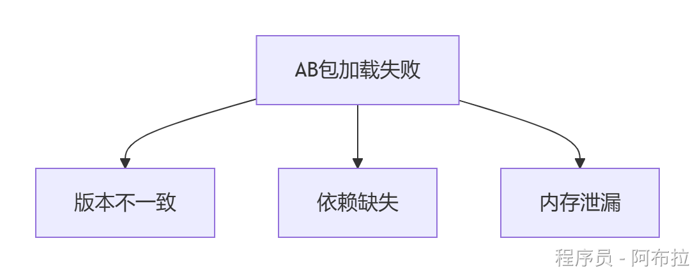
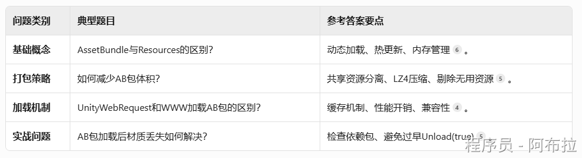
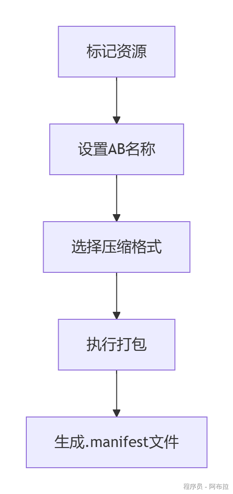
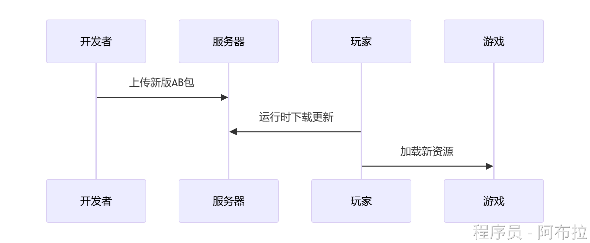
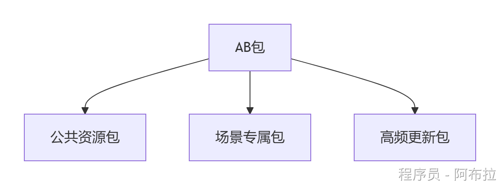
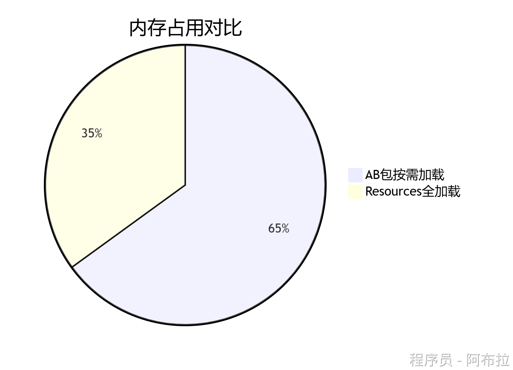
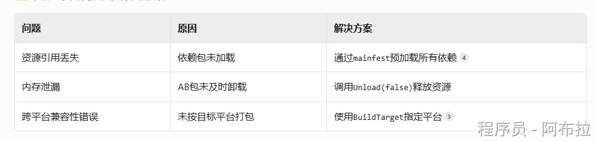

# AssetBundle概念

## 面试题

1. **什么是AssetBundle？**

Unity提供的资源打包格式，包含序列化后的游戏资源（模型、纹理、预制体等），支持压缩与动态加载。

2. **AssetBundle与Resources区别？**

- Resources：静态打包在应用内，**Resources**：仅适合小型静态资源（如配置表），不可热更。
- AssetBundle：支持网络下载与版本管理，灵活性强，适合大型项目、需热更新的场景。



3. **AssetBundle加载与卸载？**



4. **加载方式都有哪一些？**



5. **卸载策略都有哪一些？**

- `Unload(false)`：仅卸载AB包，保留已加载资源（需手动管理引用）。
- `Unload(true)`：强制卸载AB包及所有资源（易引发材质丢失）

6. **AB 包加载失败如何解决？**



7. **版本冲突**

使用`BuildAssetBundleOptions.AppendHashToAssetBundleName`添加哈希值校验。

8. **内存泄漏**

及时调用`Unload`，避免重复加载相同AB包。

9. **资源冗余**

通过`AssetBundleBrowser Tool`检测重复打包资源



## 概念

AssetBundle（AB包）是Unity提供的**资源打包技术**，将游戏资源（预制体、场景、材质等）序列化为二进制文件，支持动态加载与热更新。

Asset Bundle： https://docs.unity3d.com/Manual/AssetBundlesIntro.html

**特点**

- 资源按需加载，减少内存压力
- 支持LZMA/LZ4压缩，优化下载速度
- 依赖关系管理，避免资源冗余

## AssetBundle工作流程

#### 打包流程

1. 在Inspector中为资源设置AB名称（如`ui/icon`）
2. 使用`BuildPipeline.BuildAssetBundles()`生成包文件

```js
// 同步加载
AssetBundle ab = AssetBundle.LoadFromFile(path);
GameObject prefab = ab.LoadAsset<GameObject>("Player");

// 异步加载（推荐）
StartCoroutine(LoadABAsync("https://server.com/characters"));
IEnumerator LoadABAsync(string url) {
    UnityWebRequest request = UnityWebRequestAssetBundle.GetAssetBundle(url);
    yield return request.SendWebRequest();
    AssetBundle remoteAB = DownloadHandlerAssetBundle.GetContent(request);
    [3,6](@ref)
}
```



#### **加载与卸载**

```csharp
// 同步加载
AssetBundle ab = AssetBundle.LoadFromFile(path);
GameObject prefab = ab.LoadAsset<GameObject>("Player");

// 异步加载（推荐）
StartCoroutine(LoadABAsync("https://server.com/characters"));
IEnumerator LoadABAsync(string url) {
    UnityWebRequest request = UnityWebRequestAssetBundle.GetAssetBundle(url);
    yield return request.SendWebRequest();
    AssetBundle remoteAB = DownloadHandlerAssetBundle.GetContent(request);
    [3,6](@ref)
}
```


## 资源热更新

无需重新发布应用，即可更新游戏内容（如活动场景、角色皮肤）。



## 分包策略

- 公共资源（如Shader）独立打包
- 按功能模块划分（UI/角色/场景）
- 按更新频率分离



## 内存优化

仅加载当前需要的资源，及时卸载闲置AB包，避免内存浪费



## 常见问题



1. **压缩选择**：

- **LZ4**：运行时快速解压（推荐）
- **LZMA**：高压缩率，适合初始包

2. **缓存机制**：使用`UnityWebRequestAssetBundle`缓存下载的AB包

3. **依赖分析**：通过`AssetDatabase.GetDependencies()`避免重复打包
