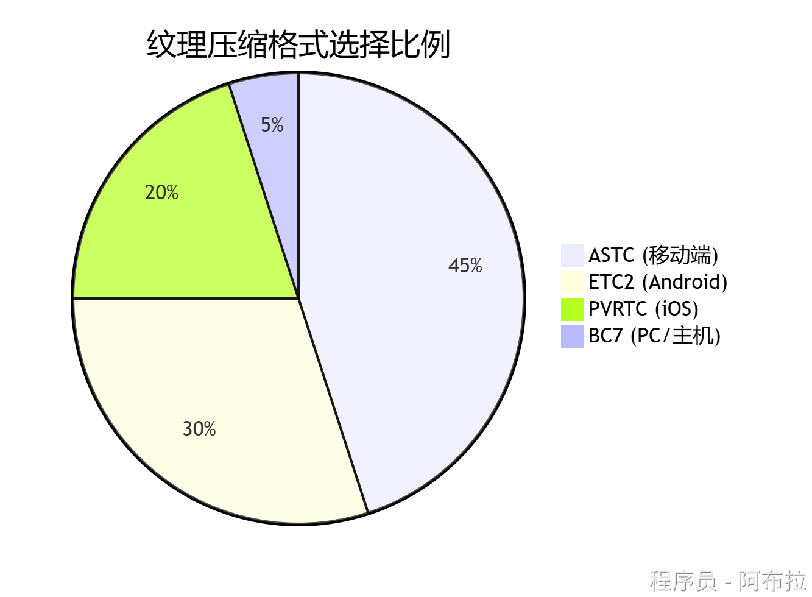

# 资源压缩策略

## 面试题

1. Unity 中各个资源压缩策略。

## 纹理资源压缩策略

#### 移动端（Android/iOS）

**ASTC**

- **优势**：高压缩率（支持1bpp至8bpp）、支持RGBA通道，适配鸿蒙/骁龙等现代GPU。
- **适用场景**：角色皮肤、场景贴图（推荐ASTC 4×4或6×6）。

**ETC2**

- **优势**：Android主流格式，支持Alpha通道（ETC2），兼容OpenGL ES 3.0+设备。
- **适用场景**：UI图集、动态纹理（需注意低端机兼容性）。

**PVRTC**

- **优势**：iOS专用，PowerVR GPU直接支持，压缩比高（4bpp）。
- **限制**：必须为2的幂次方正方形纹理，画质损失较明显。

#### PC/主机端

**BC7 (DXT5)**

- **优势**：支持高质量RGBA压缩，适合高光/金属材质。
- **适用场景**：3A级游戏的高清纹理。

**无压缩 (RGBA32)**： 

- **适用场景**：美术原画、需要无损编辑的纹理（内存占用大）。

#### 优化技巧

- 使用**Mipmap**减少远处纹理的内存占用，但对UI纹理禁用。
- 通过**纹理图集**合并小纹理，减少Draw Call和内存碎片。

## 音频资源压缩策略

- **长音频**：使用Vorbis压缩，降低比特率（如96kbps）。
- **短音效**：优先选择ADPCM，减少解码延迟。

| **格式**          | **比特率** | **适用场景**               | **平台适配性**                     |
| ----------------- | ---------- | -------------------------- | ---------------------------------- |
| **Vorbis (.ogg)** | 96-192kbps | 背景音乐、环境音效         | 全平台支持，平衡音质与体积。       |
| **ADPCM**         | 4:1压缩比  | 短音效（如脚步声、UI点击） | 低CPU开销，适合移动端。            |
| **MP3**           | 128kbps    | 兼容性要求高的老项目       | 部分平台有专利限制，不推荐新项目。 |
| **AAC**           | 64-128kbps | 移动端流媒体音乐           | iOS/Android原生支持，压缩效率高。  |

## 模型与动画压缩

**模型格式**

- **GLB (二进制GLTF)**： 

- **优势**：比FBX体积小40%，支持Draco压缩（可再减30%-50%），适合静态模型。

- **FBX + LZMA**： 

- **适用场景**：含动画的复杂模型，需高压缩率传输。

**动画优化**

- **关键帧精简**：将非关键动作（如待机）的采样率降至15-20帧/秒。
- **曲线压缩**：使用Unity的`Animation Compression`选项（如Keyframe Reduction）。

## 通用压缩算法

| **资源类型**    | **推荐算法** | **理由**               |
| --------------- | ------------ | ---------------------- |
| **纹理**        | ASTC/ETC2    | 高压缩率，硬件加速解压 |
| **音频**        | Vorbis/ADPCM | 低CPU占用，音质可接受  |
| **3D模型**      | Draco + GLB  | 体积最小，加载快       |
| **AssetBundle** | LZ4          | 按需解压，避免卡顿     |
