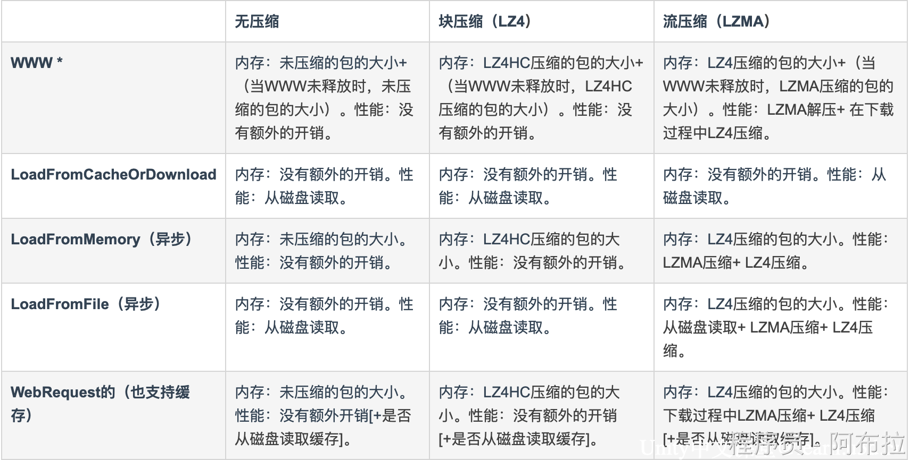
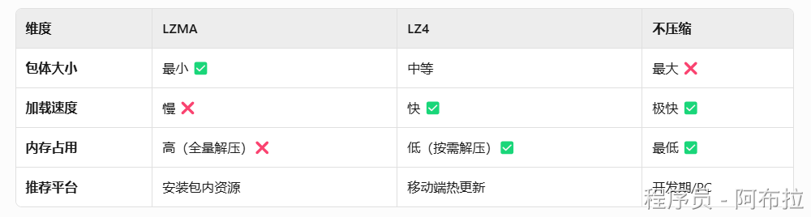
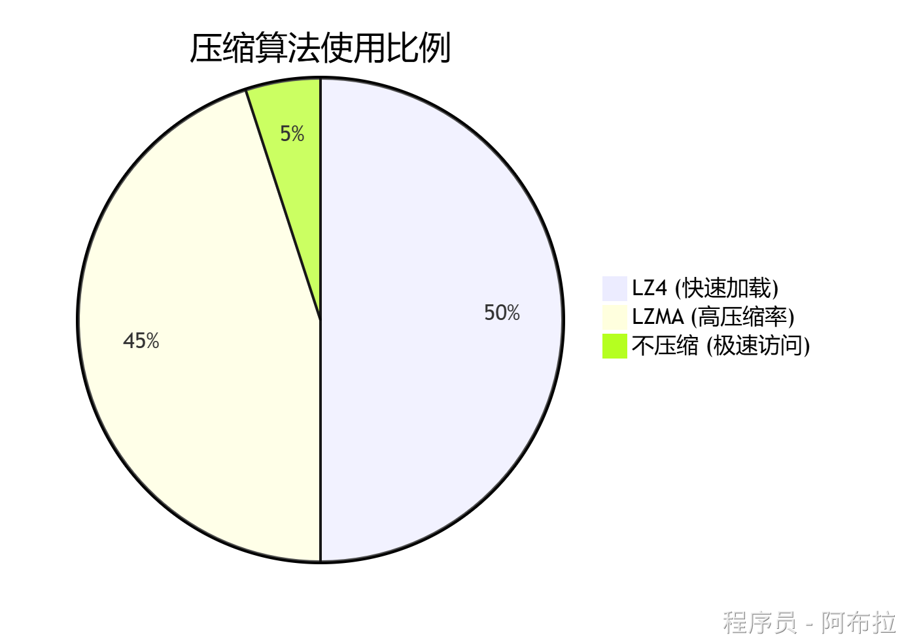

# 压缩算法

##  面试题

1. AssetBundle 压缩算法都有哪一些？



2. 如何设置压缩方式？

## 压缩算法

以下是Unity中AssetBundle支持的压缩算法详解。





### **LZMA压缩**

**特点**

1. 默认压缩算法，生成**最小体积**的AB包（压缩率可达50%-70%）。
2. **全量解压**：需解压整个包体才能使用资源，导致**加载卡顿和内存峰值**

**适用场景**

1. 初始安装包内AB包（如StreamingAssets中的资源）。
2. 网络下载且对带宽敏感的场景。

### **LZ4压缩**

**特点**

1. **按块压缩**：资源被分为独立数据块，可**按需解压**，大幅降低内存占用。
2. 加载速度快，适合**移动端热更新**（Unity 5.3+支持）。

**适用场景**

1. 频繁加载的动态资源（如角色模型、场景片段）。
2. 需要实时解压的移动设备。

### **不压缩**

**特点**

1. **零解压开销**：AB包体积最大，但**加载速度最快**。
2. 直接读取原始数据，无CPU解压负担。

**适用场景**

1. 开发期快速测试（避免压缩/解压耗时）。
2. 对加载速度极度敏感的PC/主机平台。

# 设置压缩方式

```js
// LZMA压缩（默认）
BuildPipeline.BuildAssetBundles(outputPath, BuildAssetBundleOptions.None, target);

// LZ4压缩
BuildPipeline.BuildAssetBundles(outputPath, BuildAssetBundleOptions.ChunkBasedCompression, target);

// 不压缩
BuildPipeline.BuildAssetBundles(outputPath, BuildAssetBundleOptions.UncompressedAssetBundle, target);
```
