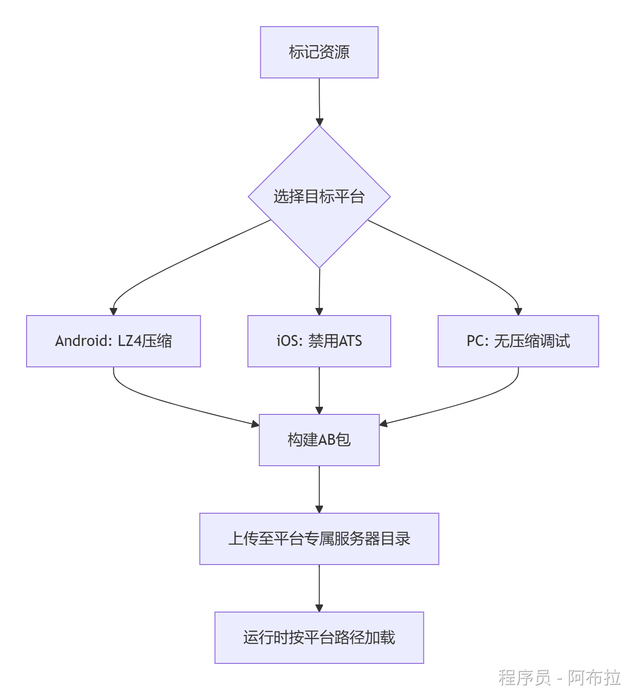
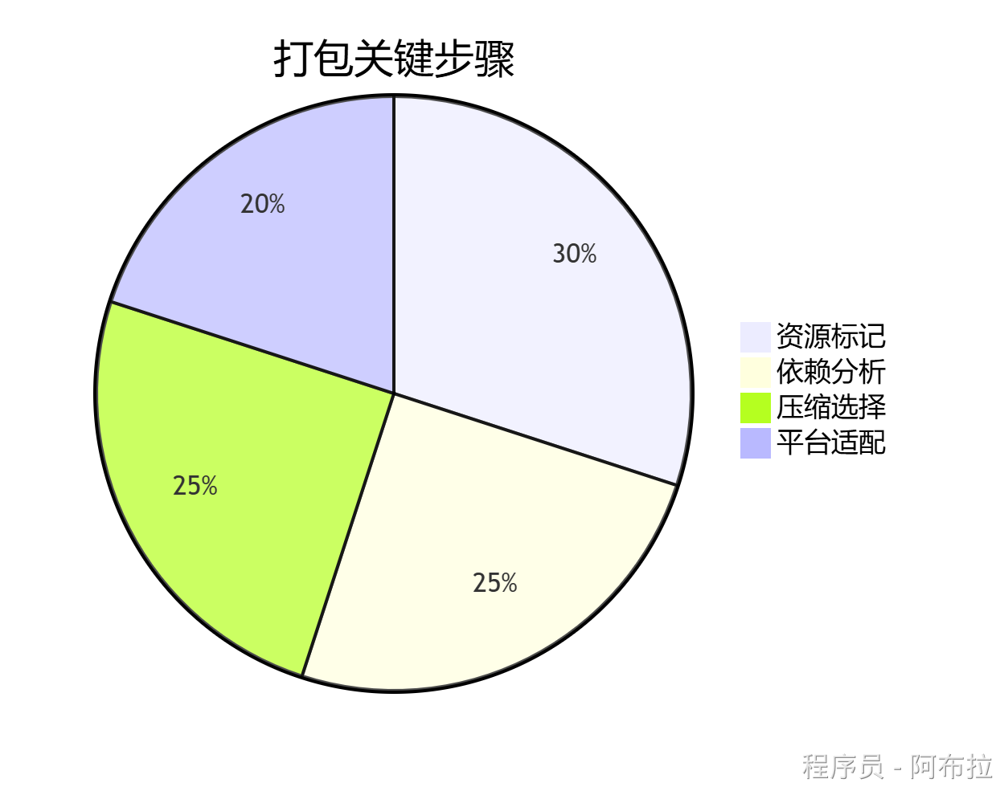

# 简易打包流程

### 面试题

1. 如何跨平台打包 AssetBundle?

以下是Unity AssetBundle在Android/iOS/PC三大平台的打包流程说明

可视化打包与依赖分析

**AssetBundle Browser**： https://github.com/Unity-Technologies/AssetBundles-Browser 

| **项目**     | **Android**         | **iOS**                         | **PC**            |
| ------------ | ------------------- | ------------------------------- | ----------------- |
| **压缩格式** | LZ4（推荐）         | LZ4（避免卡顿）                 | LZMA/None（调试） |
| **路径前缀** | `jar:file://`       | `Application.dataPath + "/Raw"` | 直接路径          |
| **变体支持** | 分辨率适配（hd/sd） | 同Android                       | 通常不需要        |
| **权限要求** | 需网络/存储权限     | 需ATS配置                       | 无特殊要求        |





### 📱**Android平台打包流程**

#### **资源标记与分组**

**设置AB包名**

- 在Project视图选中资源（如Prefab、贴图）→ Inspector底部设置AssetBundle名称（**必须小写字母**）
- **依赖处理**：共用资源（如材质）单独打包为`shared`包，避免重复。

#### **配置打包参数**

- **工具**：使用Unity官方插件`AssetBundle Browser`（需从GitHub导入）。
- **关键设置**

```csharp
Build Target → Android  
Compression → LZ4（平衡加载速度与包体大小）  
Output Path → 自定义目录（如`Assets/StreamingAssets`）
```

#### **打包**

- 点击`Build`按钮 → 生成`.unity3d`文件及`.manifest`依赖文件。

### 🍎 **iOS平台打包流程**

#### **资源标记**

- 与Android类似，但需注意： 

- **命名规则**：AB包名避免特殊字符（iOS文件系统敏感）。
- **变体支持**：通过`hd`/`sd`后缀适配不同分辨率设备。

#### **关键配置**

- **压缩格式**：优先选择`ChunkBasedCompression`（LZ4）避免解压卡顿。
- **路径处理**： 

```csharp
// iOS加载路径示例
string path = Application.dataPath + "/Raw/" + abName;
```

#### **打包输出**

- 使用相同插件，选择`Build Target → iOS` → 生成AB包。
- **ATS限制**：若从服务器下载AB包，需在`Info.plist`中禁用ATS或启用HTTPS。

### 💻 **PC平台打包流程**

#### **资源准备**

- **路径规范**：确保资源路径使用`/`而非`\`（Windows需转义）。
- **调试优化**：开发期可选择`UncompressedAssetBundle`加速迭代。

#### **打包配置**

```csharp
Build Target → StandaloneWindows/StandaloneLinux  
Compression → None（快速调试）或 LZMA（发布包）
```

#### **输出文件**

- 生成AB包后，直接通过本地路径加载： 

```csharp
AssetBundle.LoadFromFile("C:/Path/to/bundle.unity3d");
```

### 🔄**通用流程**

#### **1. 依赖管理**

- **加载顺序**：通过`AssetBundleManifest`获取依赖列表，先加载依赖包再加载主包。 

```js
AssetBundle manifestBundle = AssetBundle.LoadFromFile("AssetBundles/AssetBundles");
AssetBundleManifest manifest = manifestBundle.LoadAsset<AssetBundleManifest>("AssetBundleManifest");
string[] deps = manifest.GetAllDependencies("main.ab");
```

#### **2. 热更新策略**

- **版本控制**：服务器维护各平台的版本清单（如`version_android.txt`），比对哈希值决定是否更新。
- **增量更新**：仅下载差异包，减少流量消耗。
