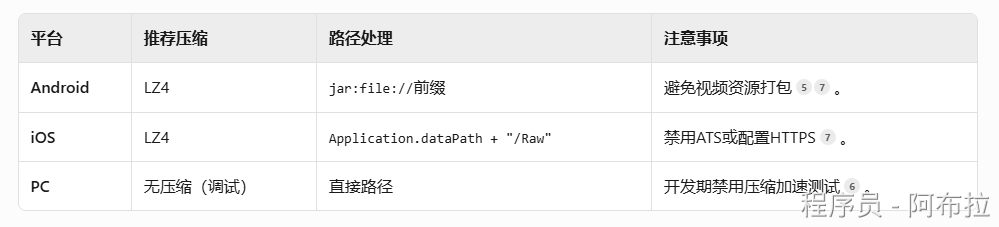
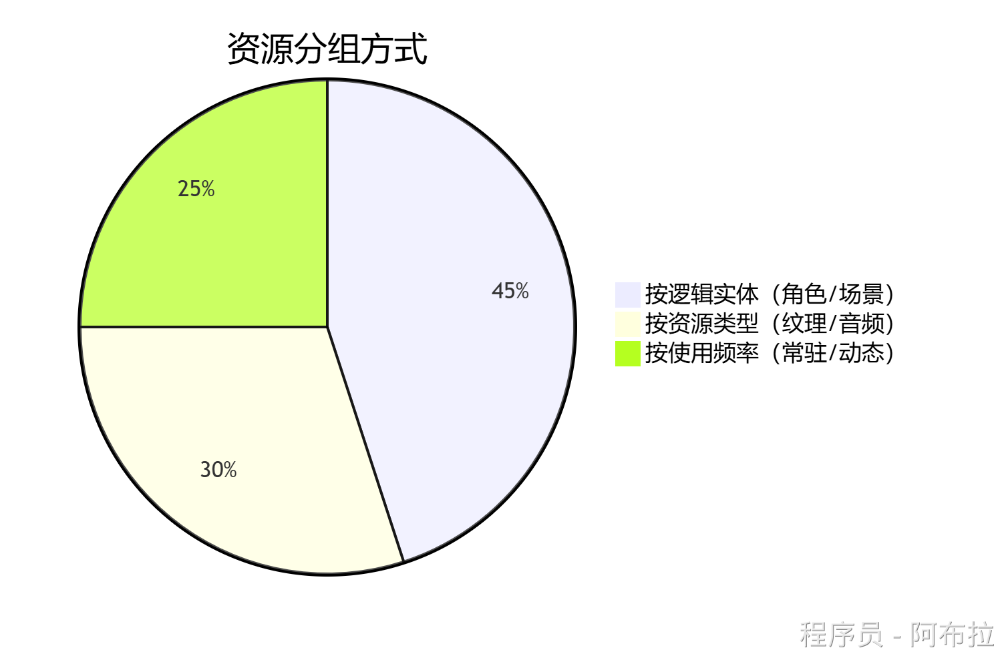
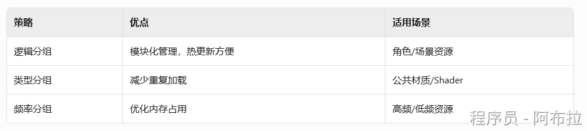
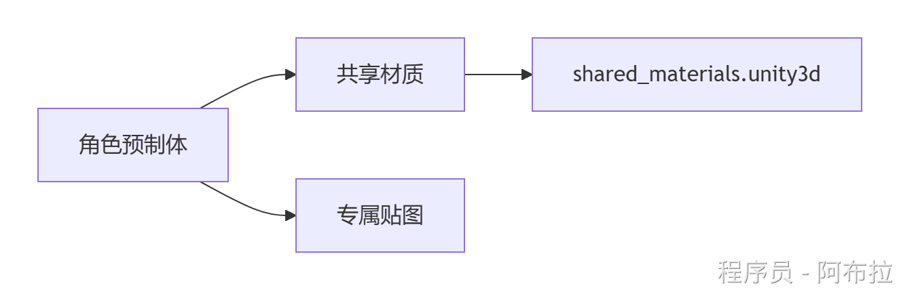
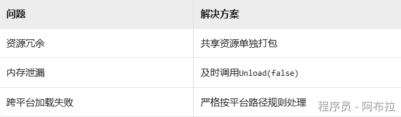

# 打包策略

## 面试题

1. AssetBundle 打包策略（打包颗粒度）
2. 资源卸载的注意事项？

**答案**

- **正确做法**

- `AssetBundle.Unload(false)`：仅卸载AB包内存镜像，已加载资源保留
- `AssetBundle.Unload(true)`：卸载AB包及所有实例化资源（易导致场景资源丢失）

- **避免内存泄漏**

- 及时调用`Resources.UnloadUnusedAssets()`
- 监控引用计数（如通过`WeakReference`管理资源）

## 各平台压缩适配

## 资源分组

**按逻辑实体分组：**

**场景包**：将同一场景的模型、贴图、音效打包（如`level1.unity3d`），切换场景时整体加载/卸载

**角色包**：单个角色的模型、动画、材质独立打包（如`hero_archer.unity3d`），便于皮肤热更新

**按资源类型分组：**

**共享包**：公共材质、Shader等打包为`shared_materials.unity3d`，避免重复加载

**音频包**：背景音乐与音效分离打包，按需加载

**按使用频率分组：**

**常驻包**：高频资源（如主UI）预加载为`resident.unity3d`

**动态包**：活动资源（如节日特效）独立打包，活动后卸载

## 依赖管理优化

使用`AssetDatabase.GetDependencies()`检测共享资源，单独打包。

加载时先通过`AssetBundleManifest`加载依赖包，再加载主资源。

## 常见问题

