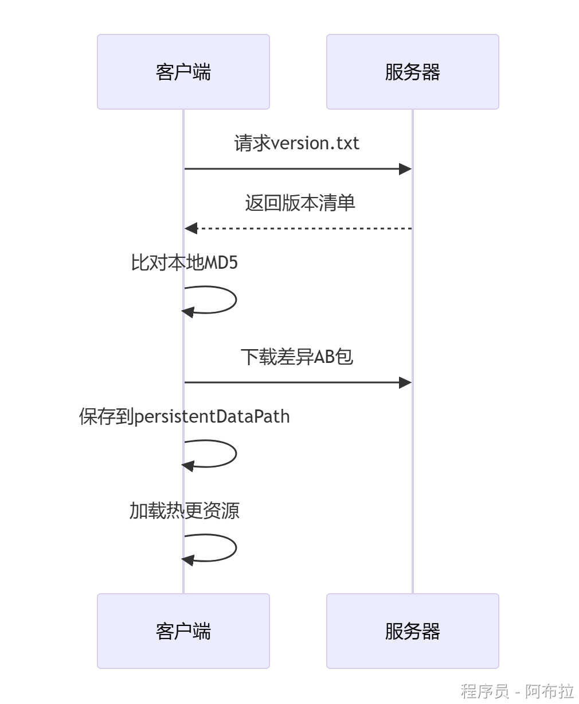

# 热更新方案

## 面试题

1. AssetBundle 热更流程（方案）/**如何设计热更新流程？**。
2. AssetBundle在热更新中的作用是什么？开发流程有哪些关键步骤？

**答案**

- **作用**：打包游戏资源（模型、贴图、配置等），支持动态下载与加载。
- **开发流程**：

1. 资源标记 → 打包AB包（`BuildPipeline.BuildAssetBundles`）
2. 上传服务器（含MD5校验文件）
3. 客户端下载AB包 → 校验完整性 → 加载资源（`AssetBundle.LoadFromFile`）
4. 卸载资源（`AssetBundle.Unload(false)`释放内存）

## 热更新方案

以下是一个完整的跨平台（Android/iOS/PC）AssetBundle热更新方案

其中包含**资源打包、版本管理、差异下载、加载执行**全流程，并针对不同平台进行适配优化。

### 前情提要

- iOS需在`Info.plist`中允许HTTP请求（或配置HTTPS）。
- Android需声明网络权限：`<uses-permission android:name="android.permission.INTERNET" />`。
- 大资源分帧加载，避免卡顿。
- 使用`Addressables`简化依赖管理（Unity官方方案）。
- 对AB包进行加密（如AES），防止篡改。
- 校验文件大小和MD5，确保下载完整性。

### 大概流程



### **资源打包与版本管理（Editor脚本）**

为Android/iOS/PC分别生成AB包，并自动创建版本清单文件（含MD5校验信息）

```js
// Assets/Editor/BuildAssetBundles.cs
using UnityEditor;
using System.IO;
using System.Security.Cryptography;
using System.Text;

public class BuildAssetBundles 
{
    [MenuItem("Tools/Build AssetBundles/All Platforms")]
    static void BuildAllPlatforms()
    {
        BuildForPlatform(BuildTarget.Android);
        BuildForPlatform(BuildTarget.iOS);
        BuildForPlatform(BuildTarget.StandaloneWindows);
    }

    static void BuildForPlatform(BuildTarget target) 
    {
        // 输出路径：平台子目录
        string outputPath = Path.Combine("AssetBundles", target.ToString());
        if (!Directory.Exists(outputPath)) Directory.CreateDirectory(outputPath);

        // 构建选项（移动端用LZ4，PC开发用无压缩）
        var options = target == BuildTarget.StandaloneWindows ? 
            BuildAssetBundleOptions.UncompressedAssetBundle : 
            BuildAssetBundleOptions.ChunkBasedCompression;

        // 执行打包
        BuildPipeline.BuildAssetBundles(outputPath, options, target);

        // 生成版本清单（记录文件名、MD5、大小）
        GenerateVersionFile(outputPath, target);
    }

    static void GenerateVersionFile(string path, BuildTarget target)
    {
        StringBuilder sb = new StringBuilder();
        foreach (var file in Directory.GetFiles(path, "*", SearchOption.AllDirectories)) 
        {
            if (file.EndsWith(".meta") || file.EndsWith(".manifest")) continue;

            using (var md5 = MD5.Create())
            {
                byte[] hash = md5.ComputeHash(File.ReadAllBytes(file));
                sb.AppendLine($"{Path.GetFileName(file)}|{System.BitConverter.ToString(hash)}|{new FileInfo(file).Length}");
            }
        }
        File.WriteAllText(Path.Combine(path, "version.txt"), sb.ToString());
    }
}
```

### **热更新管理器（运行时核心代码）**

**路径处理**：Android需加`jar:file://`前缀，iOS需用沙盒路径。

**差异更新**：通过MD5比对仅下载变更文件。

**加载优先级**：优先加载`persistentDataPath`下的热更资源

```js
// Assets/Scripts/HotUpdateManager.cs
using UnityEngine;
using UnityEngine.Networking;
using System.Collections;
using System.IO;
using System.Linq;

public class HotUpdateManager : MonoBehaviour
{
    private string serverURL = "http://your-server.com/AssetBundles";
    private string platformFolder => 
#if UNITY_ANDROID
        "Android";
#elif UNITY_IOS
        "iOS";
#else
        "StandaloneWindows";
#endif

    // 启动热更新流程
    public IEnumerator StartHotUpdate() 
    {
        // 1. 下载服务器版本清单
        string serverVersionPath = $"{serverURL}/{platformFolder}/version.txt";
        UnityWebRequest versionRequest = UnityWebRequest.Get(serverVersionPath);
        yield return versionRequest.SendWebRequest();

        if (versionRequest.result != UnityWebRequest.Result.Success) 
        {
            Debug.LogError($"版本检查失败: {versionRequest.error}");
            yield break;
        }

        // 2. 对比本地与服务器版本
        Dictionary<string, string[]> localVersions = ParseVersionFile(
            Path.Combine(Application.streamingAssetsPath, "AssetBundles", platformFolder, "version.txt"));
        Dictionary<string, string[]> serverVersions = ParseVersionFile(versionRequest.downloadHandler.text);

        var needUpdateFiles = serverVersions.Where(s => 
            !localVersions.ContainsKey(s.Key) || localVersions[s.Key][1] != s.Value[1]).ToList();

        // 3. 下载差异文件
        foreach (var file in needUpdateFiles) 
        {
            string remotePath = $"{serverURL}/{platformFolder}/{file.Key}";
            string localPath = Path.Combine(Application.persistentDataPath, file.Key);

            yield return DownloadFile(remotePath, localPath, file.Value[2]);
        }

        // 4. 加载更新后的资源
        yield return LoadUpdatedAssets();
    }

    // 下载单个文件（带进度回调）
    IEnumerator DownloadFile(string url, string savePath, string fileSize) 
    {
        using (UnityWebRequest request = UnityWebRequest.Get(url))
        {
            request.downloadHandler = new DownloadHandlerFile(savePath);
            yield return request.SendWebRequest();

            if (request.result != UnityWebRequest.Result.Success)
                Debug.LogError($"下载失败: {url}");
            else
                Debug.Log($"已更新: {Path.GetFileName(savePath)}");
        }
    }

    // 加载AB包资源
    IEnumerator LoadUpdatedAssets() 
    {
        // 优先从persistentDataPath加载（热更目录）
        string abPath = Path.Combine(Application.persistentDataPath, "ui.ab");
        if (!File.Exists(abPath))
            abPath = Path.Combine(Application.streamingAssetsPath, "AssetBundles", platformFolder, "ui.ab");

        // Android特殊路径处理
#if UNITY_ANDROID
        if (abPath.Contains(Application.streamingAssetsPath))
            abPath = "jar:file://" + abPath;
#endif

        AssetBundleCreateRequest request = AssetBundle.LoadFromFileAsync(abPath);
        yield return request;

        if (request.assetBundle != null) 
        {
            GameObject uiPrefab = request.assetBundle.LoadAsset<GameObject>("MainUI");
            Instantiate(uiPrefab);
            request.assetBundle.Unload(false);
        }
    }

    // 解析版本文件
    Dictionary<string, string[]> ParseVersionFile(string content) 
    {
        return content.Split('\n')
            .Where(line => !string.IsNullOrEmpty(line))
            .ToDictionary(
                line => line.Split('|')[0],
                line => new[] { line.Split('|')[0], line.Split('|')[1], line.Split('|')[2] });
    }
}
```

### **服务器端版本管理（示例）**

提供各平台AB包的版本清单，客户端通过MD5校验是否需要更新	

```js
# 服务器version.txt示例（Python Flask伪代码）
from flask import Flask
import os

app = Flask(__name__)

@app.route('/AssetBundles/<platform>/version.txt')
def get_version(platform):
    ab_dir = f"server_assets/{platform}"
    files = [f for f in os.listdir(ab_dir) if f.endswith('.ab')]

    version_info = []
    for file in files:
        md5 = calculate_md5(os.path.join(ab_dir, file))
        size = os.path.getsize(os.path.join(ab_dir, file))
        version_info.append(f"{file}|{md5}|{size}")

    return "\n".join(version_info)
```
