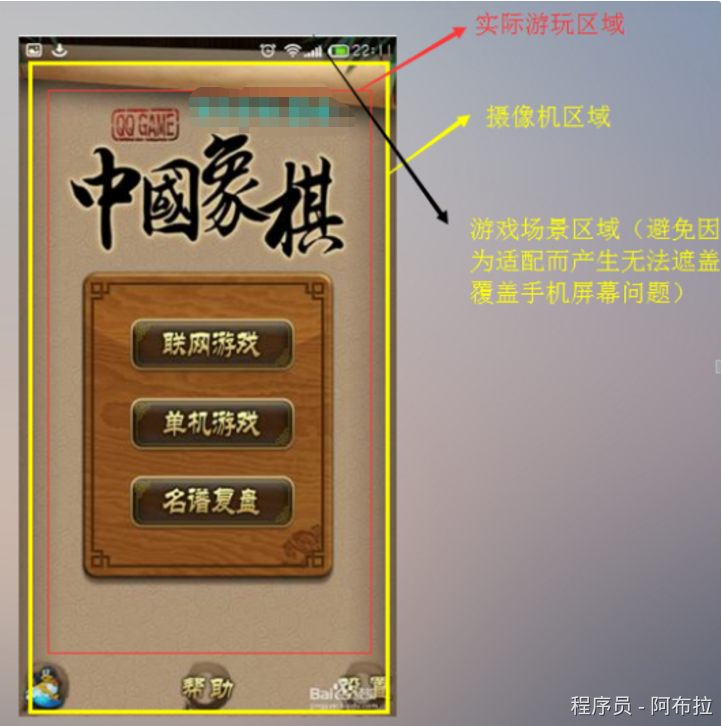

# 基础概念

屏幕适配是为了让我们的项目能够跑在各种电子设备上(手机,平板,电脑) 。

那么了解是适配之前首先要了解以下知识点：

## 什么是像素?

单位面积中构成图像的点的个数。 特点：单位面积内的像素越多，分辨率越高，图像的效果就越好。

## 什么是分辨率？

分辨率可以从显示分辨率与图像分辨率两个方向来分类。 示分辨率（屏幕分辨率）是屏幕图像的精密度，是指显示器所能显示的像素有多少.分辨率的单位有：（dpi点每英寸）、lpi（线每英寸）和ppi（像素每英寸）。 特点： 图像的分辨率越高，所包含的像素就越多，图像就越清晰，印刷的质量也就越好。 同时，它也会增加文件占用的存储空间。

###### 移动设备分辨率 –以iphone 为例


## 什么是适配?

适应、兼容各种不同的情况

###### 游戏开发中，适配的常见种类

1. 系统适配 针对不同版本的操作系统进行适配，例如Unity3D 5.4系统
2. 屏幕适配 针对不同大小的屏幕尺寸进行适配，例如Iphone5s，iphone7 iPhone的尺寸 3.5inch、4.0inch、4.7inch、5.5inch iPad的尺寸 7.9inch、9.7inch 屏幕方向 竖屏 横屏

## Unity3D 中的屏幕分辨

屏幕的宽高比（Aspect Ratio） = 屏幕宽度/屏幕高度

Unity2D中摄像机镜头的尺寸决定了我们实际看到游戏内容的多少，在编辑器中我们可以通过调整摄像机Camera的orthographicSize属性值来调整摄像机的大小


注:Unity3D中这个比例的默认值是100，即100像素等于1单位。 如果我们的游戏屏幕有640像素高，那么实际换算成单位高度则是6.4个单位， 当我们摄像机的orthographicSize值是3.2时，摄像机大小刚好与屏幕大小相等

## Unity3D中的屏幕适配设置

### 像素适配设置（固定分辨率）


### 屏幕宽高比 屏幕的宽高比Aspect Ratio = 屏幕宽度/屏幕高度


## Unity3D中的摄像机设置

Unity编辑器中只能直接调整摄像机的高度，那摄像机的宽度是如何确定的呢？ 答案就是我们最前面提到的屏幕宽高比。Unity会根据当前屏幕实际的宽高比和摄像机的orthographicSize值来计算出摄像机的宽度值，即： 摄像机实际宽度 = 摄像机orthographicSize * 2 * 屏幕宽高比 即是 摄像机实际宽度 = 摄像机高度 * 屏幕宽高比

我举个例子说明一下，iPhone4的屏幕像素为640*960，宽高比为2:3，假设Pixels To Units值为100，那么如果设摄像机高度size值为4.8，那么摄像机实际宽度按照公式算出6.4，刚好就是屏幕的单位宽度。

## Unity3D中的图片像素比设置


## Unity3D:关于适配的一些UI问题解决

这里就是重中之重,也是坑点较多的地方

调整相机为设计尺寸,添加Canvas到场景中进行UI设计,但是Canvas默认大小和相机并不重合。

### 1.  办法 1

调整Canvas的Render Mode属性为Screen Space - Camera：

将映射游戏内容的Camera拖入Render Camera中，下一个属性Plane Distance表示UI 与Camera的在Z轴距离（其实就是变相反映了UI的Z轴位置）。

接着在Canvas Scaler属性里将Ui Scale Mode属性设置为Scale With Screen Size， 表示Canvas会根据屏幕比例缩放。 下面的Reference Resolution，表示UI宽和高一半的大小。例如设计尺寸为640x960， 则x应为640 / 2 = 320，宽应为960 / 2 = 480。 下面的Screen Match Mode属性选中Match Width Or Height，表示采用宽度（上文有提到过） 或高度（Unity自带适配方式）适配。然后Match调整为0或1，0表示完全宽度适配， 1表示完全高度适配，其他值表示介于两者之间采用比例适配


### 2.  办法 2

调整Canvas的Render Mode属性为World Space 1、将Event Camera设置为映射游戏内容的Camera。 2、然后调整Rect Transform组件中的Width和Height为设计尺寸的宽和高，同时将Scale属性的X和Y都调整为0.01（对应unity2d默认情况下像素Pixels与引擎单位Unit对应比例100）。这时，Canvas的宽高正好与摄像机相同。 这两种方法都可以将UI调整为与设计尺寸一致，并且在编辑器中运行与真机中运行效果保持一致。


### 3.  办法3

给摄像机挂下图脚本就可以搞定比例问题:

**设定好就如下图所示**



解决屏幕分辨率适配的问题，其实就是解决如何让游戏摄像机尺寸限定在给定范围的问题。

```js
using System.Collections;
using System.Collections.Generic;
using UnityEngine;

public class LeoPlayerSetting : MonoBehaviour {
    void Update()
    {
        //  按ESC退出全屏  
        if (Input.GetKey(KeyCode.Escape))
        {
            Screen.fullScreen = false;  //退出全屏           
        }
        //设置7680*1080的全屏  
        if (Input.GetKey(KeyCode.B))
        {
            Screen.SetResolution(1920, 1080, true);
        }
        if (Input.GetKey(KeyCode.C))
        {
            Screen.SetResolution(Screen.width, Screen.height, true);
        }
        //按A全屏  
        if (Input.GetKey(KeyCode.A))
        {
            //获取设置当前屏幕分辩率  
            Resolution[] resolutions = Screen.resolutions;
            //设置当前分辨率  
            Screen.SetResolution(resolutions[resolutions.Length - 1].width, resolutions[resolutions.Length - 1].height, true);
            Screen.fullScreen = true;  //设置成全屏,  
        }
    }
}
```

## 适配总结

1.游戏有效内容，指游戏中一定需要完整显示在屏幕上的内容；

2.游戏实际内容，指全部的游戏内容，包括有效内容和主要是为了适配多分辨率的或其他不重要的目的而增加的内容。

实际的分辨率适配问题与三个尺寸相关，他们分别是：摄像机尺寸，游戏内容尺寸（包括有效内容尺寸和无效内容尺寸）和实际屏幕尺寸。

## 扩展

### 游戏中的摄像机

相机（Camera） 是向玩家捕获和显示世界的设备。通过自定义和操纵摄像机， 你可以使你的游戏表现得真正独特。您在场景中摄像机的数量不受限制。 他们可以以任何顺序设定放置在屏幕上的任何地方，或在屏幕的某些部分。


**摄像机属性**


**Clear Flags 清除标识** 确定了屏幕哪些部分将被清除，方便多个摄像机画不同的游戏元素


**Skybox 天空盒**：这是默认设置。屏幕上的任何空的部分将显示当前相机的天空盒。 如果当前的相机没有设置天空盒，它会默认在渲染设置（Render Settings ）选择天空盒

**Solid Color** 纯色 任何空部分，屏幕显示为当前相机的背景色。 

**Depth Only** 仅深度 如果你想绘制一个玩家的枪，又不让它内部环境被裁剪，你会设置深度为0的相机绘制环境， 和另一个深度为1的相机单独绘制武器。武器相机的清除标志（Clear Flags ）应设置 为depth only。 Don't Clear 不清除 此模式不清除颜色或深度缓存。每一帧在下一帧结束后绘制，看上去像是涂抹（smear-looking）的效果。 这在游戏中不常用，最好是在自定义着色器（custom shader）上使用。

**Rendering Path-渲染路径** 定义什么绘制方法被用于相机的选项


Use Player Settings 使用玩家设置：在玩家设置（Player Settings.）相机使用哪个渲染路径。 

Vertex Lit 顶点光照 ：所有被这个相机渲染的物体都将渲染成Vertex-Lit物体。 

Forward 正向渲染：所有对象每材质渲染只渲染一次，和Unity 2.x中的标准一样 Deferred 延迟照明：所有物体将在无光照的环境渲染一次，然后在渲染队列尾部将物体的光照一起渲染出来。

**Traget Texture-目标纹理:**


渲染纹理 （Render Texture）包含相机视图输出。这会使相机渲染在屏幕上的能力被禁止。

### Vertex Lit：顶点光照

这个Shader是Vertex-Lit，是最简单的Shader之一。这个Shader渲染代价是非常小的 所有照射在该物体上的光源通过一次光能传递渲染完成并且只计算顶点光源。

因为是Vertex-Lit，所以不会有任何基于像素渲染的效果，例如：Light Cookies，Normal Mapping 和Shadows。这个Shader对模型的细分同样更加敏感，假如在很靠近立方体的地方放置一个 点光源，并且应用这个Shader，这个光源只会在此角落进行计算

General shader performance 通常的着色器性能

 Unlit 这只是一个纹理，不被任何光照影响 

VertexLit. 顶点光照 

Diffuse. 漫反射 

Normal mapped. 法线贴图，比漫反射更昂贵：增加了一个或更多纹理（法线贴图）和几个着色器结构

Specular. 高光。这增加了特殊的高光计算 

Normal Mapped Specular. 高光法线贴图。这比高光更昂贵一点 

Parallax Normal mapped. 视差法线贴图。这增加了视差法线贴图计算 

Parallax Normal Mapped Specular. 视差高光法线贴图。这增加了视差法线贴图和镜面高光计算
