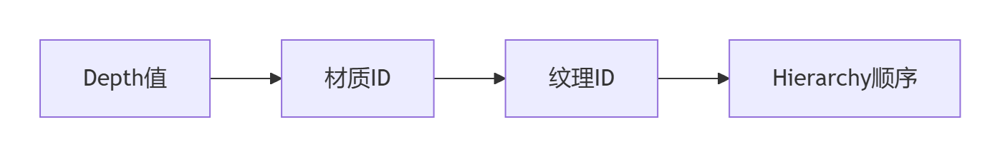

# 图集

# 面试题

1. **Unity 里面怎么打图集？**

https://docs.unity.cn/cn/2021.3/Manual/SpriteAtlasWorkflow.html

https://blog.csdn.net/qq_30144243/article/details/136060414

https://blog.csdn.net/weixin_45136016/article/details/139477227

2. **如何解决图集边缘撕裂？**

增大`Padding`值（4-8像素），避免纹理压缩后边缘像素混合。

3. **图集打包后Draw Call未减少？**

检查是否满足合批三要素：

相同材质、连续层级、无特殊组件干扰。

4. **动态UI元素如何优化？**

独立Canvas+对象池复用，避免频繁触发图集重建。

5. **为什么图片的大小要设成2的N次方？**

因为大部分游戏引擎底层的渲染方式都是基于OpenGL的，OpenGL载入纹理图片时，所用内存会自动扩张到2的N次方（500 x 500 → 512 x 512）。

- 因为转化过程比较慢，由运行程序转换十分耗时，所以Unity3D提前将资源转化为符合标准的图片，这样可以提升转化速度
- 节省内存。一张图片的大小为10*10像素，OpenGL会按照16*16的规格将图片载入到内存中；如果图片大小为64*65，那么就会按照64*128载入了，这就造成了内存的无必要开销。
- 减少包体。打成图集后的合成的大图会比之前所有的散图所占用的物理存储更小。这样从通过减小图片资源物理存储大小起到压缩游戏安装包的作用。

6. **为什么打图集能够减少 DrawCall?**

图集（Sprite Atlas）能够显著减少Draw Call的核心原理在于**合并渲染指令**和**优化资源管理。**

- **合并纹理**：图集将多个小图合并为一张大纹理，使得多个UI元素共享同一纹理资源，避免因纹理切换触发新Draw Call。
- **材质复用**：相同图集的元素默认使用同一材质实例，满足合批条件（材质一致是合批的前提）。
- **静态合批**：若图集内元素在层级中连续排列且无其他材质隔断，Unity会自动合并为一个Draw Call。
- **动态合批补充**：对动态UI元素（如动画控件），图集仍可通过材质一致性支持动态合批（需满足顶点数等限制）。
- 不同纹理或材质会强制GPU切换渲染状态（如着色器参数、混合模式），而图集通过共享状态减少切换次数

7. **打图集的策略是什么？**

8. **打图集时可以合批的条件是什么？**

## 图集（Sprite Atlas）

## 合批条件

#### 1. **材质与纹理一致**

- **条件**：所有UI元素必须使用**同一材质**和**同一图集纹理**（或同一图集的不同区域）。
- **原理**：合批的本质是合并相同材质的Draw Call，材质或纹理不同会强制中断合批。
    *例如：图中三个按钮使用同一图集，材质相同，可合并为1个Draw Call*。

#### 2. **层级连续无打断**

- **条件**：相同材质/图集的元素在Hierarchy中**连续排列**，中间无其他材质元素插入。
- **原理**：UGUI按深度（Depth）和层级顺序排序，非连续层级会强制分批次渲染。
    *例如：左图连续排列可合批；中间有 Text, 紧接着右图，其中 Text 将俩个图隔断，拆分为2个Draw Call*。

#### 3. **无特殊组件干扰**

- **条件**：避免使用`Mask`、`Canvas Group`或`RectMask2D`等打断合批的组件。
- **原理**：`Mask`会生成新材质实例，`RectMask2D`虽不打断合批但需额外计算裁剪区域。

## 合批流程示意图

#### 1. **UGUI合批优先级排序**

Unity按以下顺序决定合批优先级：

*深度相同、材质/纹理一致且层级连续的元素才会合并*。

#### 2. **合批成功与失败案例**

| **场景**              | **结果**            |
| --------------------- | ------------------- |
| 同图集+连续层级       | 1个Draw Call        |
| 同图集+被不同材质隔断 | 拆分为多个Draw Call |
|                       |                     |

------

## 合批中断条件

- 动态修改`Image.color`或`Material`属性会创建新材质实例，中断合批。

- 同一界面引用多个图集（如`CommonAtlas`和`MenuAtlas`），导致材质切换。

- UI元素的Z轴≠0或发生旋转时，脱离默认渲染平面，合批失效。

## 打图集策略

1. 将同一功能的UI元素（如登录界面按钮、图标）打包到同一图集，避免无关纹理混合。
2. 单图集尺寸≤2048x2048（移动端），图片宽高尽量为2的幂次方。（非2次幂纹理会强制拉伸填充，增加内存占用）
3. 高频更新元素（如血条）与静态元素（如背景）分属不同图集。
4. 使用`Variant`类型图集，通过调整Scale生成高清/低清版本（如Scale=0.5为低清版）。
5. ETC1压缩格式需拆分Alpha通道，单独生成`_Alpha`图集（如技能特效）。

| 图集名           | 包含内容                 | 说明                       |
| ---------------- | ------------------------ | -------------------------- |
| `UIAtlas_Common` | 通用按钮、底框、面板背景 | 所有界面共享               |
| `UIAtlas_Home`   | 主界面相关 UI 图         | 按功能模块拆分             |
| `UIAtlas_Fight`  | 战斗中用到的 UI 元素     | 战斗场景专用，防止资源浪费 |

## 图集访问

Sprite Atlas作为一种资源开放给用户，可以在脚本中访问，还可以通过名字获取图集中的精灵。这样用户可以更加直接地随时编辑图集，而且不用去单独加载图集中的每个精灵。

```js
var atlas = AssetDatabase.LoadAssetAtPath<SpriteAtlas>(a.AssetPath);
if (atlas == null)
     continue;
var s = atlas.GetSprite(spriteName);
if (s != null)
{
    GetComponent<SpriteRenderer>.sprite = s;
}
```

**注意：**

- UGUI的图集，无论新旧，在构建AssetBundle的时候，**同一个图集内的所有图元都要放在同一个****AssetBundl****e中**，否则，如果同一个图集的图元被分散到多个AssetBundle中，那么每一个AssetBundle都会包含一份这个图集的Copy，最终的结果就是**包体冗余、内存膨胀和加载耗时**等问题。
- SpriteAltas文件可勾选Include In Build，但是不要特意打包，会造成冗余和包体膨胀。
- 代码中动态加载Sprite的地方，直接使用散图的资源路径去加载就可以了，比如：var sprite = Assets.LoadAsset\<Sprite\>(path)。
