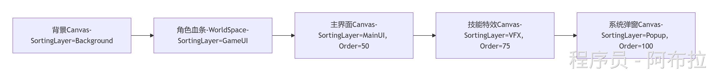

# UI策略

## 场景与策略

| **场景**         | **策略**                                                     |
| ---------------- | ------------------------------------------------------------ |
| **基础层级控制** | Sorting Layer按功能分组，Order in Layer动态调整              |
| **多Canvas架构** | 动静分离+按功能分层，限制重建范围                            |
| **渲染模式选择** | Overlay用于全屏UI，Camera用于3D集成，World Space用于场景内UI |
| **性能优化**     | 减少重建+合批优化+对象池                                     |
| **特效与UI混合** | 独立Canvas+Stencil Buffer或Shader控制渲染顺序                |

### 

- **血条管理**：World Space模式，Z轴调整确保不被场景物体遮挡。
- **技能特效**：独立Canvas，Order=75介于主界面和弹窗之间。
- **弹窗层级**：最高Order=100，始终置顶，关闭时销毁Canvas释放资源

## 优化策略

结合Profiler监控`Canvas.BuildBatch`耗时，针对性优化重建频率

| **优化场景**       | **技巧组合**                 | **预期效果**               |
| ------------------ | ---------------------------- | -------------------------- |
| 多按钮界面         | 扁平层级 + 同图集 + 无重叠   | 10个按钮→1个Draw Call      |
| 带遮罩的滚动列表   | `RectMask2D` + 列表内同材质  | 减少2个Mask额外Draw Call   |
| 动态血条与静态背景 | 独立Canvas + Z轴归零         | 血条刷新仅触发子Canvas重建 |
| 透明点击区域       | `Empty4Raycast`替代透明Image | 消除无效渲染与合批中断     |

**减少Canvas重建（Rebuild）**

- **问题**：频繁修改Text、Image属性或RectTransform会触发重建。
- **解决方案**

- 动态文本：用`StringBuilder`拼接字符串，减少Text组件的赋值次数。
- 位置更新：避免在Update中连续修改RectTransform，改用事件驱动。

**合批优化**

- **规则**：同材质、同纹理的相邻UI自动合批。
- **技巧**

将相同材质的UI放在同一Canvas下（如所有按钮图标）。

禁用透明重叠：半透明UI混合增加GPU开销，减少非必要透明区域。

**对象池与分帧加载**

- 滚动列表复用Item：用`ScrollRect`+对象池避免频繁实例化。
- 分帧生成UI：每帧生成10个物品，避免卡顿

```js
IEnumerator LoadItems(List<Item> items) {
    for (int i = 0; i < items.Count; i++) {
        Instantiate(itemPrefab);
        if (i % 10 == 0) yield return null;  // 每10个分一帧
    }
}
```
