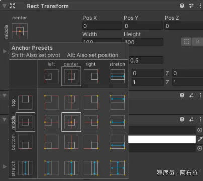

# 锚点

# 面试题

1. UGUI中锚点是什么？

# 概念

在Unity的UGUI（Unity Graphical User Interface）系统中，锚点（Anchors）是一个核心概念，用于确定UI元素在其父容器（通常是Canvas）中的位置和缩放方式。锚点是UI元素四个角上的可移动点，通常表示为四个小三角形的顶点，它们两两相对。

锚点的主要作用有两个方面

1. **屏幕自适应**：通过调整锚点的位置和组合方式，UI元素可以自动适应不同的屏幕尺寸和分辨率。例如，当锚点设置为屏幕的四角时，无论屏幕尺寸如何变化，UI元素都会保持相对于屏幕边缘的固定位置。
2. **固定区域定位**：锚点也可以用于将UI元素固定在屏幕上的某个特定区域。通过调整锚点的位置，你可以控制UI元素相对于其父容器或屏幕边缘的偏移量和大小。
