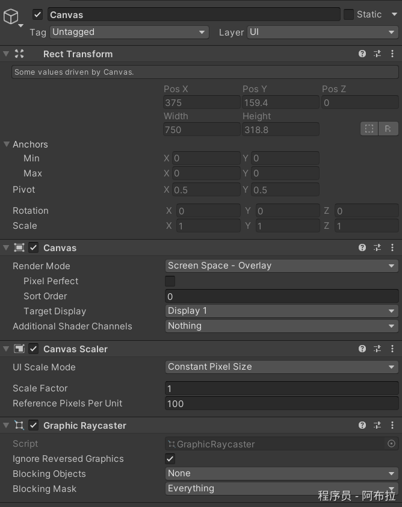
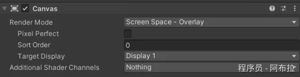
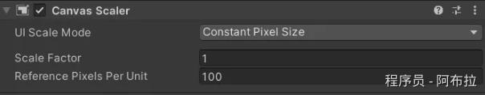
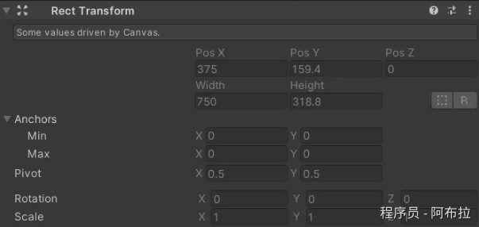

# Canvas默认组件

在Unity的Hierarchy视图中，当你创建一个Canvas时，通常会看到以下几个组件与其相关：

**Canvas** 

- 这是最顶层的容器，所有的UI元素都直接或间接地附加在这个Canvas下。
- 它负责渲染和管理其下的所有UI元素。
- 提供了多种渲染模式（Render Mode）。

1. 屏幕空间覆盖（Screen Space - Overlay）
2. 屏幕空间相机（Screen Space - Camera）
3. 世界空间（World Space）

**Canvas Scaler** 

- 这个组件用于处理Canvas的缩放问题，特别是当你想在不同的屏幕分辨率或DPI（每英寸点数）下保持UI的一致大小时。
- 提供了多种缩放模式，例如基于屏幕分辨率、DPI或固定大小。
- 允许你设置参考分辨率，这样Canvas可以在不同分辨率下按比例缩放。

**Graphic**

- 这是一个抽象的基类，用于表示所有可视的UI元素，如Text、Image、Rectangle等。
- 它提供了绘制的基础功能，但通常不会直接在场景中作为一个独立的组件出现。

**RectTransform**

- 这是一个非常重要的组件，用于描述UI元素在Canvas上的位置和大小。
- 它提供了锚点（Anchors）、位置（Position）、尺寸（Size）和旋转（Rotation）等属性，这些属性决定了UI元素如何定位和缩放。
- RectTransform是UI元素布局和位置调整的核心。

**UI元素（如Button、Text、Image等）** 

- 这些是具体的UI组件，如按钮、文本标签、图像等。
- 它们通常作为Canvas的直接子元素，并且有自己的RectTransform组件来确定其在Canvas上的位置和大小。
- 这些组件通常有自己的属性和事件，例如按钮可以有点击事件，文本可以显示文本内容等。
