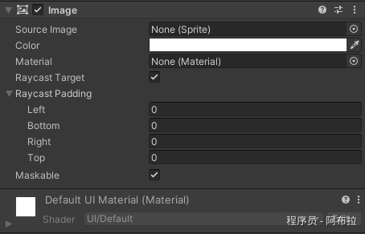

# Image与RawImage

# 面试题

1. Image 和 RawImage 的区别？

# Image 组件

`Image` 组件是UGUI中最常用的用于显示图像的组件。它支持多种图像类型（如Sprite、Sprite Atlas、Texture2D等），并且提供了一些方便的属性来调整图像的显示方式，如`color`（颜色）、`material`（材质）、`sprite`（精灵）等。



**主要特点**

1. **支持Sprite和Texture2D**：可以直接使用Unity中的Sprite或Texture2D资源。
2. **具有内置的颜色调整**：可以通过`color`属性调整图像的颜色。
3. **支持材质**：可以通过`material`属性应用自定义的Shader效果。

**示例代码**

```js
using UnityEngine;
using UnityEngine.UI;

public class ImageExample : MonoBehaviour
{
    public Image myImage; // 拖拽赋值或通过代码查找

    void Start()
    {
        // 设置Sprite（需要先在项目中有一个Sprite资源）
        myImage.sprite = Resources.Load<Sprite>("MySprite");

        // 设置颜色
        myImage.color = Color.red;
    }
}
```

# RawImage 组件

`RawImage` 组件则提供了更底层的图像显示功能。它主要用于显示`Texture2D`类型的图像，并且不提供像`Image`那样的高级特性（如颜色调整或Sprite支持）。但是，`RawImage`具有更高的灵活性，因为它允许你直接使用原始的Texture2D数据。

**主要特点**

1. **仅支持Texture2D**：只能使用Texture2D资源。
2. **无内置颜色调整**：颜色调整需要在Shader级别进行（如果需要的话）。
3. **更高的灵活性**：可以直接操作Texture2D数据，实现更复杂的图像效果。

**示例代码**

```js
using UnityEngine;
using UnityEngine.UI;

public class RawImageExample : MonoBehaviour
{
    public RawImage myRawImage; // 拖拽赋值或通过代码查找

    void Start()
    {
        // 假设你有一个Texture2D资源（需要先在项目中创建或加载）
        Texture2D myTexture = new Texture2D(128, 128);
        // ... 这里可以填充myTexture的数据 ...

        // 设置Texture2D到RawImage
        myRawImage.texture = myTexture;

        // 注意：RawImage没有color属性，所以颜色调整需要在Shader中进行
    }
}
```

# 总结

选择`Image`还是`RawImage`取决于具体需求。如果需要显示Sprite或需要内置的颜色调整功能，那么`Image`是更好的选择。但是，如果需要直接操作Texture2D数据或需要更高的灵活性，那么`RawImage`可能更适合，注意：同个游戏对象不同同时挂载Image、RawImage，同个游戏对象**只能包含一个"Graphic"组件**。
