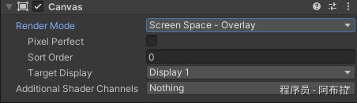
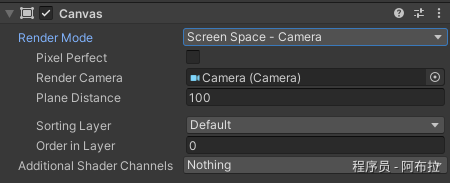
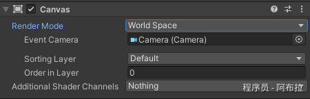

# Render Mode(渲染模式)

# 面试题

1. Unity 中的 Canvas 渲染模式有哪些？

# Render Mode(渲染模式)

Canvas的 Render Mode(渲染模式) 三种方式

在Unity的UI系统中，`Canvas` 组件有一个 `Render Mode`（渲染模式）属性，它决定了Canvas如何被渲染到屏幕上。

Unity提供了三种主要的渲染模式：

1. `Screen Space - Overlay`（屏幕空间-覆盖层）
2. `Screen Space - Camera`（屏幕空间-相机）
3. `World Space`（世界空间）

### 1. Screen Space - Overlay（屏幕空间-覆盖层）



- **说明**：此模式下，Canvas始终渲染在屏幕的最上层，不受任何相机（Camera）的影响。Canvas的坐标基于屏幕像素，左上角为(0,0)，右下角为(Screen.width, Screen.height)。
- **示例**：显示一个始终位于屏幕中心的UI元素（如文本）。

**代码实现**（不需要特殊代码，只需在Unity编辑器中设置Canvas的Render Mode为Screen Space - Overlay，并放置UI元素即可）：

```js
// 例如，你可以在Canvas下添加一个Text组件，并通过代码设置其文本内容
public Text myText;
void Start()
{
    myText.text = "Screen Space - Overlay mode.";
}
```

**应用场景**

- **HUD（Head-Up Display）界面**：比如游戏中的生命值、得分、时间等显示，这些UI元素需要始终显示在屏幕上方，不受场景中的相机移动和旋转影响。
- **UI菜单和选项**：游戏的主菜单、暂停菜单、设置选项等，这些UI元素也需要始终保持在屏幕上的固定位置。
- **提示和通知**：如游戏中的提示信息、任务完成通知等，这些信息通常会在屏幕上方短暂显示，然后消失。

### 2. Screen Space - Camera（屏幕空间-相机）



- **说明**：此模式下，Canvas会渲染到指定的相机上。Canvas的坐标仍然基于屏幕像素，但会受到相机的影响（如相机的裁剪平面、视场角等）。
- **示例**：在一个自定义相机视图中显示UI元素。

**代码实现**（同样不需要特殊代码，只需设置Canvas的Render Mode为Screen Space - Camera，并指定一个相机）：

```js
// 假设你已经有了一个Camera组件的引用，并设置它为Canvas的Render Camera
// 你可以在Canvas组件的"Render Camera"属性中选择它

// 在代码中，你可以通过Camera组件来控制Canvas的渲染效果，比如改变相机的位置和旋转
public Camera myCamera;
void Update()
{
    // 示例：通过代码旋转相机
    myCamera.transform.Rotate(0, Time.deltaTime * 45, 0);
}
```

**应用场景**

- **与特定相机绑定的UI**：如果你希望UI只出现在某个相机的视图中，比如第一人称射击游戏中的HUD，或者某个特定的游戏模式或关卡中，那么Screen Space - Camera模式就非常有用。
- **UI跟随相机移动**：在某些游戏中，你可能希望UI元素能够跟随相机的移动而移动，但又不希望它们受到相机旋转的影响。这时，你可以将Canvas设置为Screen Space - Camera模式，并将其Render Camera设置为你的目标相机。
- **UI的层级控制**：在某些情况下，你可能希望UI元素能够按照特定的顺序进行渲染，比如某个UI元素需要始终显示在其他元素之上。通过调整不同Canvas的渲染顺序（Sort Order）和深度（Depth），你可以实现这种效果。

### 3. World Space（世界空间）



- **说明**：此模式下，Canvas被视为场景中的一个普通对象，具有三维坐标和旋转。Canvas会渲染到所有能看到它的相机上。
- **示例**：将一个UI面板放置在三维场景中的某个位置，并随着玩家移动。

**代码实现**（在Unity编辑器中设置Canvas的Render Mode为World Space，并调整其位置和旋转）：

```js
// 你可以通过代码动态改变Canvas的位置和旋转
public Canvas myCanvas;
void Update()
{
    // 示例：通过代码移动Canvas
    myCanvas.transform.position += new Vector3(0, 0, Time.deltaTime); // 沿Z轴向前移动

    // 示例：通过代码旋转Canvas
    myCanvas.transform.Rotate(0, Time.deltaTime * 45, 0); // 绕Y轴旋转
}
```

**应用场景**

- **3D UI元素**：比如游戏中的3D按钮、面板等，这些UI元素需要像其他3D对象一样在场景中移动和旋转。通过将Canvas设置为World Space模式，你可以将这些UI元素放置在场景中的任意位置，并像操作其他3D对象一样操作它们。
- **与场景中的物体交互**：如果你希望UI元素能够与场景中的其他物体进行交互，比如点击一个3D按钮来触发某个事件，那么World Space模式是一个很好的选择。通过将Canvas设置为World Space模式，你可以将UI元素放置在场景中，并为其添加碰撞体和事件监听器来实现交互功能。
- **动态UI布局**：在某些情况下，你可能需要根据场景中的物体位置或数量来动态生成UI元素。通过将Canvas设置为World Space模式，你可以根据物体的位置信息来生成UI元素，并将它们放置在场景中的合适位置。
