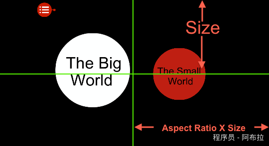
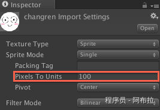
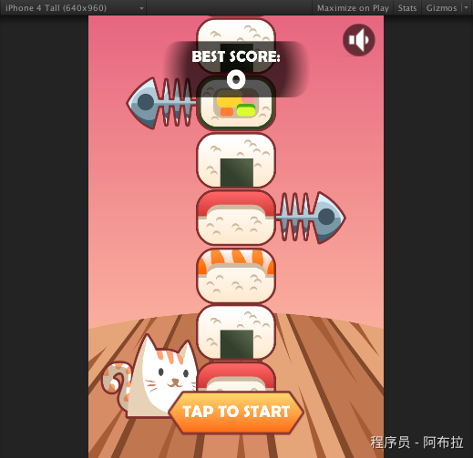
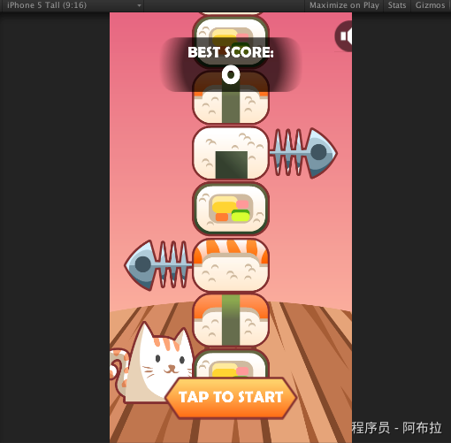
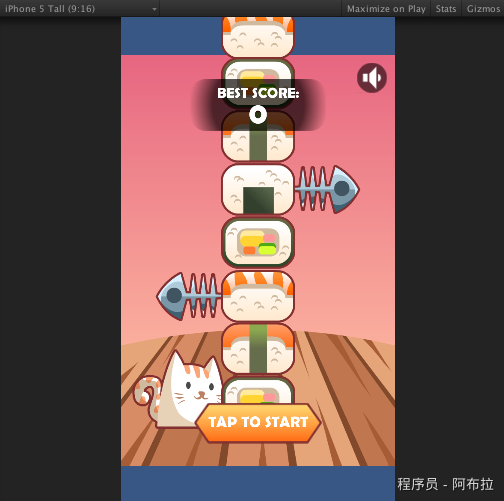
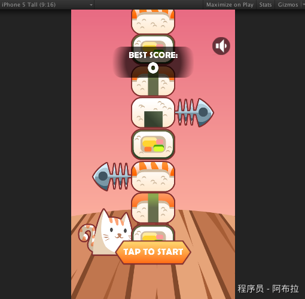
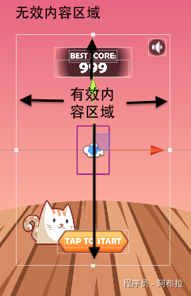
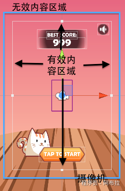

# 多分辨率屏幕适配

简单有效的Unity2D多分辨率屏幕适配方案，该方案适用于基于原生开发的Unity2D游戏

## 基本概念

屏幕的宽高比：Aspect Ratio = 屏幕宽度/屏幕高度

Unity2D中摄像机镜头的尺寸，决定了我们实际看到游戏内容的多少。

在编辑器中我们可以通过调整摄像机Camera的orthographicSize属性值来调整摄像机的大小。

如下图所示，当摄像机orthographicSize属性值等于当前屏幕高度单位的一半时，摄像机大小正好与屏幕大小相等。

注意这里提到的是屏幕单位高度的一半，这个数值是经过像素到单位比即Pixels To Units换算的。

Unity2D中这个比例的默认值是100，即100像素等于1单位。

如果我们的游戏屏幕有640像素高，那么实际换算成单位高度则是6.4个单位，当我们摄像机的orthographicSize值是3.2时，摄像机大小刚好与屏幕大小相等。





(可以通过此选项调整每张图片的像素单位比)

看到这里你可能会发出疑问，Unity编辑器中只能直接调整摄像机的高度，那摄像机的宽度是如何确定的呢？答案就是我们最前面提到的屏幕宽高比。Unity会根据当前屏幕实际的宽高比和摄像机的orthographicSize值来计算出摄像机的宽度值，即：

**摄像机实际宽度 = 摄像机orthographicSize \* 2 \* 屏幕宽高比**

也即是

**摄像机实际宽度 = 摄像机高度 \* 屏幕宽高比**

我举个例子说明一下，iPhone4的屏幕像素为640*960，宽高比为2:3，假设Pixels To Units值为100，那么如果设摄像机高度size值为4.8，那么摄像机实际宽度按照公式算出6.4，刚好就是屏幕的单位宽度。

**不同的屏幕分辨率，相同的摄像机orthographicSize值会产生不同的摄像机尺寸，不同的摄像机尺寸导致实际显示的游戏内容的不同。**

接下来我再提出两个概念，为了方便后文的说明：

1. 游戏有效内容，指游戏中一定需要完整显示在屏幕上的内容；
2. 游戏实际内容，指全部的游戏内容，包括有效内容和主要是为了适配多分辨率的或其他不重要的目的而增加的内容。

我们的开发一般都会选择在一个固定的设计分辨率上进行，比如常用的iOS竖屏游戏设计分辨率640*960，我们就以这个设计分辨率为例。通常情况下，设计分辨率尺寸就是我们游戏有效内容的尺寸。

采用这个分辨率，我们将摄像机的orthographicSize值设为4.8。

## 案例

假设我们不做任何多分辨率的适配处理，使我们游戏的有效内容区域和实际内容区域尺寸相同，都为6.4*9.6(已经做过像素到单位的换算，下同)，让这个游戏运行在一款iPhone5设备上（即屏幕是640*1136）时，我们来看看会发生什么情况。

为了更好的说明，我们先设变量：

- 游戏有效内容尺寸为gameValidContentSize
- 游戏实际内容尺寸为gameContentSize
- 摄像机尺寸为cameraSize
- 实际屏幕尺寸为screenSize
- 屏幕宽高比为aspectRatio

接着开始计算：

- orthographicSize = 4.8
- aspectRatio = 640/1136 = 9/16
- cameraSize.height = 摄像机orthographicSize * 2 = 4.8 * 2 = 9.6
- cameraSize.width = cameraSize.height * aspectRatio = 9.6 * 9 /16 = 5.4

根据计算，我们得到实际摄像机的宽度为5.4，而游戏有效内容宽度是6.4，摄像机宽度小于游戏有效内容宽度，即cameraSize.width < gameValidContentSize.width = gameContentSize.width，这时游戏内容被摄像机裁减！

以下以我做的一个小游戏为例子，我们可以更清楚的看到这个问题：

第一张是在640*960的设备上运行时的效果，一切正常。第二张是在640*1136的设备上运行的效果，可以看到游戏内容被剪得很明显，右上角的按钮都快没有了。





如何解决这个问题呢？最直接的想法是，如果我们的游戏在640*1136屏幕的设备上，摄像机宽度依然保持是6.4，那肯定就不会剪切了。为了做到这一点，我们必须在运行时来调整camera的orthographicSize值。方法很简单，还是套用上面讲到的公式：

- aspectRatio = 9/16
- 为了使cameraSize.width = 6.4，我们计算
- cameraSize.height = cameraSize.width/aspectRatio = 6.4 * 16 / 9 （因为除不尽，后面就不继续写了）
- camera的orthographicSize = cameraSize.height / 2 约=5.69

我们再一次运行游戏，动态修改camera的orthographicSize值为5.69，可以看到：



宽的方面是完全显示出来了，可是上下都出现了的“黑边”（这里是蓝边，呵呵）。这是因为摄像机的高度已经大于了游戏内容的高度，所以自然会出现没有内容的区域，即“黑边”。为了解决这个问题，我们就需要给游戏增加上下边，直接上和黑边同尺寸的图是一种方法，但是还有一种更简易的办法，直接将游戏背景放大一些，以盖住黑边！这个游戏比较简单，我们就用这个简易的方法，我们将游戏背景放大到1.3倍，如下图：



OK！现在我们的游戏看起来已经很正常了，已经完成了iPhone5的适配。

**注意到这个时候我们游戏的有效内容区域已经不等于实际内容区域了，我们放大了背景图片，实际上等于为游戏增加了一层外边缘。如图，在白框内部的就是有效内容区域，在白框外部的就是无效内容区域。整体实际游戏内容区域已经大于了有效内容区域。**



根据以上解决分辨率问题的过程，我们可以得出，**实际的分辨率适配问题与三个尺寸相关，他们分别是：摄像机尺寸，游戏内容尺寸（包括有效内容尺寸和无效内容尺寸）和实际屏幕尺寸**。为了能够显示我们需要的有效内容，并且不显示黑边，我们必须要保证：

**摄像机的尺寸既必须要小于或等于游戏实际内容尺寸，又必须要大于或等于游戏有效内容尺寸。如下图，蓝色的线框表示摄像机的尺寸，我们即只要保证蓝色框在白框外，在图内就能保证游戏内容的显示正确。**



只要能够确保以上这一点，那么我们的游戏就能够应对几乎所有的屏幕分辨率。

按照这种方案，说到底，**解决屏幕分辨率适配的问题，其实就是解决如何让游戏摄像机尺寸限定在给定范围的问题。**

总结起来，步骤就是：首先，需要确定游戏的有效内容区域和实际内容区域；然后，游戏启动时，根据实际的屏幕宽高比将你的摄像机尺寸调整到合适你游戏的大小即可。

用这个方案一劳永逸地解决了多分辨率适配特别是Android设备适配的问题。这种方法的好处一方面是只要理解了，操作起来很简单，另外一方面不同于缩放游戏内容的方案，这种方法保证了游戏内容的原汁原味。当然，缺点可能也是有的，暂时能想到的可能是对于一些需要依赖摄像机做效果或者操作的游戏，改变摄像机的大小可能会造成一些影响。目前这方面经验还比较少，希望以后可以不断地完善这个方案。

以下是 一段简单的调整orthographicSize值的脚本，用于保证camera的width值不会小于游戏有效内容宽度，有效内容尺寸为6.4*9.6。这个脚本只要附加在游戏的Camera上就可以生效。

```js
using UnityEngine;
using System.Collections;

public class GameCamera : MonoBehaviour {

    float devHeight = 9.6f;
    float devWidth = 6.4f;


    void Start () {

        float screenHeight = Screen.height;

        Debug.Log ("screenHeight = " + screenHeight);

        //this.GetComponent<Camera>().orthographicSize = screenHeight / 200.0f;

        float orthographicSize = this.GetComponent<Camera>().orthographicSize;

        float aspectRatio = Screen.width * 1.0f / Screen.height;

        float cameraWidth = orthographicSize * 2 * aspectRatio;

        Debug.Log ("cameraWidth = " + cameraWidth);

        if (cameraWidth < devWidth)
        {
            orthographicSize = devWidth / (2 * aspectRatio);
            Debug.Log ("new orthographicSize = " + orthographicSize);
            this.GetComponent<Camera>().orthographicSize = orthographicSize;
        }

    }

    // Update is called once per frame
    void Update () {

    }
}
```


 
