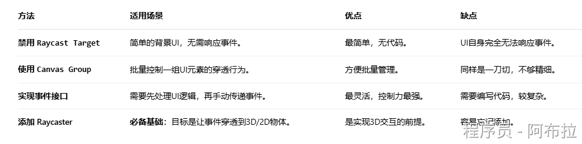

# UI事件穿透

### 什么是 UI 事件穿透？

简单来说，**UI 事件穿透（Event Penetration）**是指：当一个 UI 元素（如一个半透明面板）接收到一个输入事件（如点击、拖拽）后，我们不仅希望它自己能处理这个事件，还希望这个事件能够**继续传递**给下层被它遮挡的对象。

这些下层对象可以是：

1. 更底层的 UI 元素（如后面的另一个面板或按钮）。
2. 3D 场景中的物体（如角色、建筑等带有 Collider 的对象）。
3. 2D 场景中的精灵（带有 Collider 2D 的对象）。

**经典应用场景：**
一个弹出的设置菜单覆盖在游戏场景上。你希望：

- 点击菜单上的**按钮**，触发按钮功能（不穿透）。
- 点击菜单的**半透明背景**，同时关闭菜单**并且**选中背景后面的一个游戏单位（穿透）。

### 实现事件穿透的核心原理

Unity 处理输入事件的系统叫做 **EventSystem**。它的核心是一个射线检测（Raycast）的过程：

1. Graphic Raycaster：负责检测 Canvas 下的 UI 元素。它会检查哪些 UI 元素的 `Raycast Target` 是开启的，并且鼠标位置在其范围内。
2. **Physics Raycaster** / **Physics 2D Raycaster**：负责检测 3D 或 2D 场景中带有碰撞体（Collider）的物体。

EventSystem 会按顺序询问这些 Raycaster，默认情况下，一旦 `Graphic Raycaster` 检测到了 UI 元素，它就会“拦截”这个事件，后面的 `Physics Raycaster` 就不会再执行了。

**因此，实现穿透的关键就是控制这个射线检测的过程。**

### 实现穿透常规方法



#### 方法一：禁用 UI 元素的 `Raycast Target`（最简单）

这是最直接、最常用的方法。适用于你希望该UI元素**完全不拦截事件**的情况。

- **操作**：在 Unity 编辑器中，选中 Image、Text、RawImage 等 UI 组件，在检查器中**取消勾选** `Raycast Target` 属性。
- **原理**：该UI元素不再参与 `Graphic Raycaster` 的射线检测，事件会直接“穿过”它，被下层对象捕获。
- **优点**：极其简单，无需代码。

- **缺点**：该UI元素**自身完全无法响应**任何事件（点击、悬停等）。

- **适用场景**：纯粹的背景遮罩、装饰性UI。你可以禁用背景板的 `Raycast Target`，同时保留上面按钮的 `Raycast Target` 为开启状态。

#### 方法二：使用 `Canvas Group` 的 `Blocks Raycasts`

`Canvas Group` 组件可以影响一整个节点及其所有子节点的射线检测行为。

- **操作**：给父级节点添加 `Canvas Group` 组件，然后**取消勾选** `**Blocks Raycasts**` 属性。

- **原理**：这会同时禁用该节点下所有子UI元素的射线检测能力。

- **优点**：可以批量控制一组UI的穿透行为。

- **缺点**：同样是一刀切，整个组都无法接收事件。

#### 方法三：实现接口，手动传递事件（最灵活）

这是功能最强大的方法。允许你先处理UI自身的事件，然后再**手动地**将事件传递（“转发”）给下层的对象。

你需要编写一个脚本，实现如 `IPointerClickHandler` 这样的接口。

```js
using UnityEngine;
using UnityEngine.EventSystems;
using System.Collections.Generic;

public class PenetrableUI : MonoBehaviour, IPointerClickHandler
{
    public void OnPointerClick(PointerEventData eventData)
    {
        // 1. 先处理这个UI自己的逻辑
        Debug.Log("UI Clicked! Doing my job...");

        // 2. 关键：手动重新进行射线检测，找到所有被点击到的对象
        List<RaycastResult> results = new List<RaycastResult>();
        EventSystem.current.RaycastAll(eventData, results);

        // 3. 遍历所有检测结果
        foreach (RaycastResult result in results)
        {
            // 跳过自己，否则会无限循环触发自己的事件
            if (result.gameObject == gameObject)
                continue;

            // 4. 将点击事件“转发”或“传递”给下一个对象
            // 例如，执行它的 OnPointerClick 方法
            ExecuteEvents.Execute(result.gameObject, eventData, ExecuteEvents.pointerClickHandler);

            // 通常穿透一次就够了，所以break
            break;
        }
    }
}
```

**优点**

极度灵活。你可以决定在什么条件下穿透、穿透给谁、穿透什么类型的事件（`pointerDown`， `pointerUp`等）。

**缺点**

需要编写代码，复杂度较高。

#### 方法四：确保存在正确的 Raycaster（用于3D/2D物体）

如果你的目标是让事件穿透UI后能点击到3D或2D物体，你必须确保场景中存在相应的 Raycaster 组件。

**对于3D物体**：主摄像机（Main Camera）上必须挂载 `Physics Raycaster` 组件。

**对于2D物体**：主摄像机（Main Camera）上必须挂载 `Physics 2D Raycaster` 组件。

**Unity 默认不会添加这些组件**。如果没有它们，即使UI完美穿透了，EventSystem 也无法检测到场景中的物体，这是初学者最容易忽略的一点。

#### 推荐用法

1. **规划UI层级**：使用不同的 Canvas 和 Sorting Layer 来管理UI的前后关系。
2. **精细控制射线检测**：对需要交互的UI元素（按钮、滑块）**开启** `Raycast Target`；对不需要交互的装饰性元素（背景、边框）**关闭** `Raycast Target`。这是最核心、最高效的做法。
3. **处理3D交互**：如果项目需要，记得给主摄像机加上 `Physics Raycaster` 或 `Physics 2D Raycaster`。
4. **复杂场景备用方案**：对于极其特殊的交互需求（如点击UI后同时触发多个对象），再考虑使用**方法三**编写自定义穿透逻辑。
