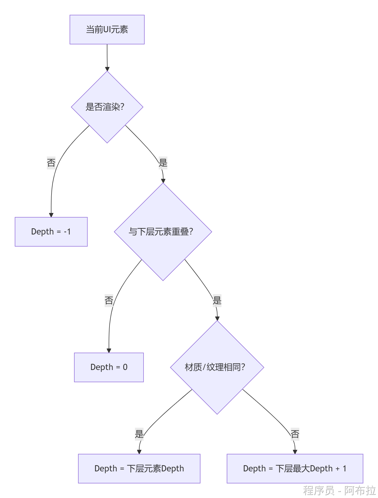
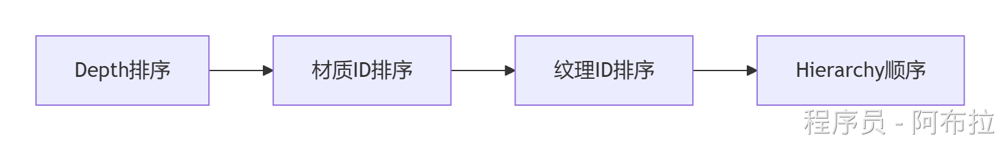
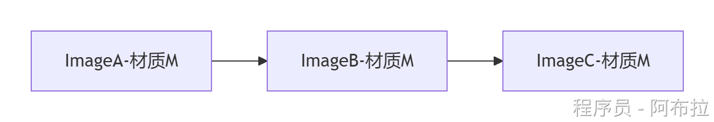
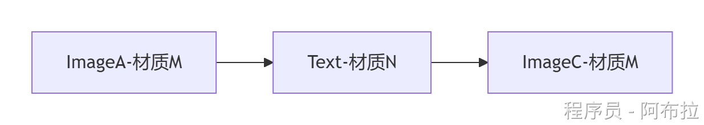
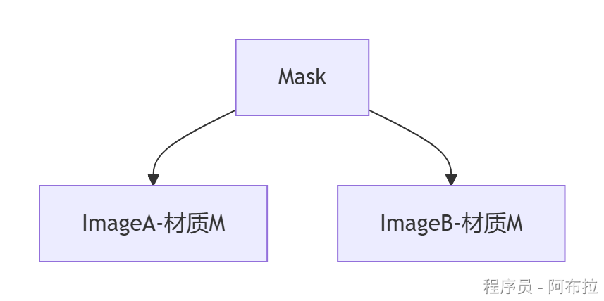

# 合批机制

## 面试题

1. UGUI 合批条件是什么？

**四级排序**：UGUI对元素按以下优先级排序：

- **深度**（Depth）：优先级最高。
- **材质ID**（Material ID）：相同材质才能合批。
- **纹理ID**（Texture ID）：相同纹理（或图集区块）才能合批。
- **Hierarchy顺序**：深度、材质、纹理均相同时，按层级顺序绘制。

**合批触发**：相邻元素需满足**材质相同、纹理相同、深度连续**，否则合批中断

**静态合批**：对静止UI自动合并网格，生成`BatchedMesh`（需满足上述条件）。

**动态合批**：运行时合并顶点数较少（通常\<300）的网格，但要求顶点属性格式一致

2. UGUI 深度规则？

- 若元素与其他元素**无重叠**，深度为`0`。
- 若元素与下层元素**重叠且材质/纹理相同**，则继承相同深度。
- 若元素与下层元素**重叠但材质/纹理不同**，则深度为下层元素深度`+1`。
- 若元素与**多个下层元素重叠**，取最大深度值`+1`

3. 打断合批的条件？

**材质与纹理差异**

- 材质实例必须**完全相同**（包括属性值），动态修改材质属性（如`Graphic.color`）会创建新实例，中断合批。
- 不同纹理或非同一图集的元素无法合批（例：两个技能图标分属不同图集）。

**层级与遮挡**

- **深度不连续**：若两个相同材质/纹理的元素之间插入其他元素（如按钮打断多个Image），合批中断。
- **重叠判定**：合批依赖**实际网格重叠**（非RectTransform矩形框）。例如文本与Image重叠但网格未重叠时仍可合批。

**特殊组件打断**

- **Mask组件**

- 强制生成子Canvas，导致合批中断。
- 自身增加2个Draw Call（模板缓冲写入与清除）。

- **RectMask2D**

- 不会中断合批，但裁剪区域外的元素不绘制。
- 性能优于Mask，但子元素需满足合批条件。

- **Canvas Group**

- 修改透明度或交互状态可能触发重建，间接中断合批。

**渲染队列差异**

- 若UI元素使用不同的渲染队列（如自定义Shader设置`RenderQueue=3100`），即使材质相同也会中断合批

4. UGUI 合批流程？

## 合批机制

UGUI的合批机制是Unity优化UI渲染性能的核心技术，通过合并相同材质的UI元素减少Draw Call。

### **合批核心流程**

#### 1. **深度计算（Depth Calculation）**

- **目标**：确定UI元素的渲染层级，解决重叠导致的合批中断问题。
- **计算规则**（按Hierarchy从上到下遍历）： 

- **关键点**： 

- **重叠判定**：指实际渲染网格重叠（非RectTransform矩形框）。
- **多层重叠**：取所有重叠元素中的最大Depth+1（如图中红色Image的Depth=2）。

#### 2. **多级排序（四级排序规则）**

排序优先级从高到低：

1. **Depth值**（低→高）
2. **材质ID**（相同材质优先）
3. **纹理ID**（相同纹理优先）
4. **Hierarchy顺序**（从上到下）

**输出结果**：生成有序列表（如`[ImgA, TextB, ImgC]`）。

#### 3. **合批执行**

- **条件**：相邻元素需满足： 
- 相邻元素需满足： 

- 相同材质与纹理
- 未被特殊组件（如Mask）打断。

- **合并方式**：
    将相邻且材质/纹理相同的元素网格合并，提交一次Draw Call。
    **中断示例**：若`ImgA`和`ImgC`之间插入不同材质的`TextB`，则`ImgA`与`ImgC`无法合批。

### 合批限制条件（关键中断原因）**

#### 1. **材质与纹理不一致**

- 材质实例不同（如动态修改`Image.color`会创建新材质）。
- 纹理非同一图集（如技能图标分属不同图集）。
    **优化**：将功能相关UI打入同一图集（≤1024×1024）。

#### 2. **层级与遮挡问题**

- **深度不连续**
    相同材质元素被不同Depth的元素隔开（如图中白色Image与蓝色Image被Text隔断）。
- **实际网格重叠**
    即使RectTransform不重叠，但文本网格覆盖Image也会影响Depth计算。

#### 3. **特殊组件强制中断**

| **组件**        | **影响**                                            | **优化方案**       |
| --------------- | --------------------------------------------------- | ------------------ |
| **Mask**        | 生成新材质，增加2个Draw Call（模板缓冲写入/清除）。 | 用`RectMask2D`替代 |
| **RectMask2D**  | 不中断合批，但裁剪区域外不渲染。                    | 优先使用           |
| **CanvasGroup** | 修改透明度触发重建，间接导致合批中断。              | 避免高频修改       |

#### 4. **其他中断因素**

- **Z轴偏移**：UI的Z值≠0时无法合批。
- **旋转/缩放**：使UI脱离渲染平面，中断合批。
- **动态修改属性**：如改变Text内容、Image颜色触发重建（Rebuild）。

### **合批成功与失败案例**

#### 案例1：**成功合批**

- **结果**：合并为1个Draw Call（材质相同且连续）。

#### 案例2：**合批中断**

- **结果**：拆分为2个Draw Call（`ImageA`与`ImageC`被`Text`隔断）。

#### 案例3：**Mask导致的合批中断**

- **结果**： 

- `ImageA`和`ImageB`可合批（同材质且在Mask内）。
- **但Mask自身新增2个Draw Call**。

## 优化总结

1. **图集管理**：将同一功能UI打入同一图集，避免纹理差异。
2. **层级调整**：相同材质元素在Hierarchy中连续排列，避免穿插。
3. **替换Mask**：用`RectMask2D`替代`Mask`，减少Draw Call。
4. **动静分离**：高频更新UI（如倒计时）放入独立Canvas，限制重建范围。
5. **避免Z轴偏移**：所有UI的Z值保持为0。
