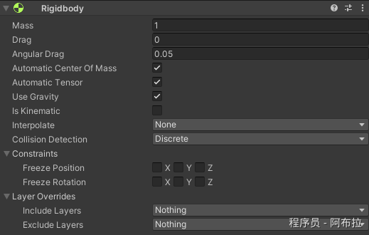
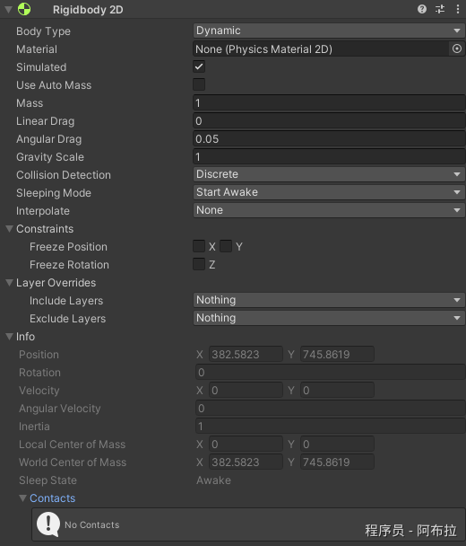
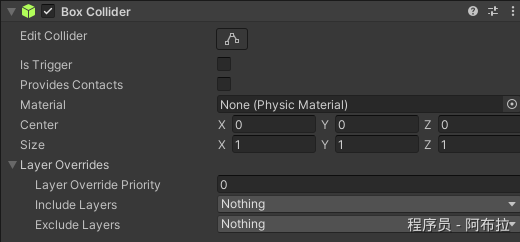
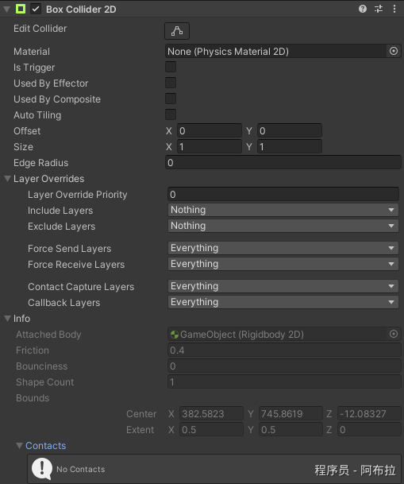
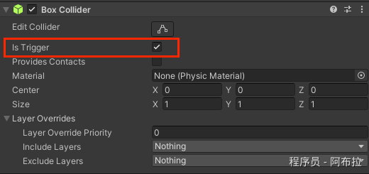
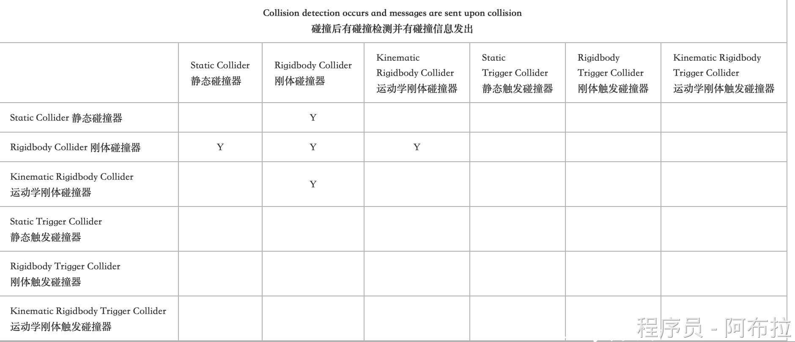
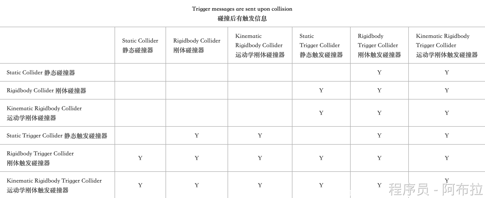
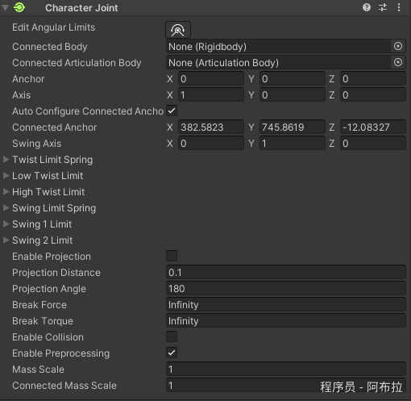
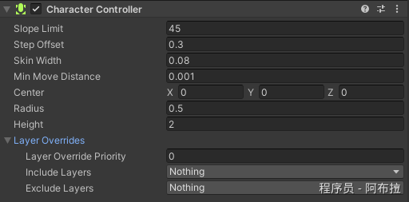

# 初认识

## 物理引擎

Unity中实际上有两个独立的物理引擎

官方文档： https://docs.unity3d.com/Manual/PhysicsSection.html

- 3D物理
- 2D物理

两个引擎的主要概念是相同的，但是它们是使用不同的组件实现的。

例如，Rigidbody和Rigidbody2D。

## 组成部分

物理系统主要由以下几部分组成

1. Rigidbody（刚体）
2. Collider（碰撞器）
3. Triggers（触发器） 
4. Joint（关节）
5. Character Controller（角色控制器）

### 1. Rigidbody（刚体）/ Rigidbody2D（2D刚体） 

在使用Unity中如果想要游戏对象拥有重力，可以发生碰撞反馈等，那就必不可少需要添加一个组件Rigidbody。由于该组件代替了它本身的运动，所有不应该通过Transform来改变位置，旋转；相反应该使用Forces来推动GO并让物理引擎计算结果。 

Rigidbody组件拥有一个Is Kinematic 的属性，该属性可以将其从引擎的控制中移除，从而可以用脚本控制GO的运动。注意：尽量不要使用脚本控制该属性的开关。 

Sleeping：当刚体的速度远低于一个设定的最小线性速度时，物理引擎就会认为它陷入睡眠状态。此时，GO不会再次移动，直到它收到一个讯号。这种模式意味着处理器不会花费时间更新刚体状态。可以使用WakeUp函数来唤醒GameObject。





### 2. Colliders（碰撞器） 

Colliders组件为物理碰撞定义了一个物体的形状。它不需要完全符合GO的网格形状；事实上，大致相似在游戏中更加有效率。 

**Unity中最简单的几种碰撞器**

3D 碰撞器 Box Collider、Sphere Collider 、Capsule Collider、Wheel Collider和Terrain Colllider

2D 碰撞器：Collider 2D 和 Circle Collider 2D

 有时候需要以组合的形式附加到物体上，这种形式可以保持较低的处理器开销，也增加一定的灵活性；但它们应该只有一个Rigidbody组件在父物体上。那组合的碰撞器也不能满足我们的需求，这就需要 Mesh Collider；它可以精确的匹配对象的网格形状。但不要经常使用，它对性能的要求挺高。需要碰撞检测的时候可以把它设置为Convex，它一般被使用在几何图形上。物体可以被单独添加一个碰撞器（可以没有刚体），不过一般这个物体是静态的。

另外我们可以在碰撞中可以设置Physics materials（物理材质） 物体之间相互碰撞的时候，物体表面会模拟它身上材质的属性，比如冰块，篮球等；物体的摩擦系数，弹性系数可以用物理材质来配置。





### 3. Triggers（触发器） 

通过脚本可以通过OnCollisionEnter启动检测什么时候发生的碰撞，也可以通过修改碰撞器上Is Trigger，来启动是否需要碰撞检测。启动之后会允许碰撞物体穿过，穿过的时候将调用物体脚本的OnTriggerEnter函数：



```csharp
Is Trigger = falseOnCollisionEnter //碰撞第一次调用
OnCollisionStay //保持碰撞中调用 
OnColliosionExit //退出碰撞时调用 
Is Trigger = trueOnTriggerEnter //进入触发器
OnTriggerStay //停留触发器
OnTriggerExit //离开触发器
```

【重点说明】 碰撞触发函数主要有两类，一类是碰撞器的，一类是触发器的。

每类有三种，分别是进入、保持和离开。

触发类消息，参数是Collider：

OnTriggerEnter, OnTriggerStay, OnTriggerExit 

碰撞类消息，参数是Collision：

 OnCollisionEnter, OnCollisionStay, OnCollisionExit 

#### 触发条件

首先说明一下，碰撞器的种类。 

1. Static Collider：静态碰撞器。有Collider，没有Rigidbody，没有Trigger。 
2. Rigidbody Collider：刚体碰撞器。有Collider，有Rigidbody，没有Trigger 
3. Kinematic Rigidbody Collider：运动学刚体。有Collider，有Rigidbody，刚体是Kinematic，没有Trigger。 
4. Static Trigger Collider：静态触发器。有Collider，没有Rigidbody，有Trigger。 
5. Rigidbody Trigger Collider：刚体触发器。有Collider，有Rigidbody，有Trigger。 
6. Kinematic Rigidbody Trigger Collider：运动学刚体触发器。有Collider，有Rigidbody，刚体是Kinematic，有Trigger。





### 4. Joints 

可以使用各种Joint组件将两个物体进行链接，比如一个物体围绕另一个静态物体旋转。还可以做类似弹簧，绳子的效果。特殊效果：当施加的力大于这个值的时，可以设置一个关节断开。关节之间可以产生驱动力，使其自动运动。

#### **常用关节（Joints）**

- **链条关节（Hinge Joint）**：模拟门、钟摆
- **弹簧关节（Spring Joint）**：连接两个刚体并模拟弹性
- **固定关节（Fixed Joint）**：强制两个物体保持相对位置



### 5. Character Controllers（角色控制器） 

为第一人称或第三人称游戏中的角色做基于碰撞的物理特性。不能穿过静态碰撞物体；可以利用它设置物体的速度和方向等。



### 6. Physics Debug Visualization（可视化物理调试工具） 

可视化物理调试允许您快速检查场景中的碰撞几何，并分析常见的物理场景。它提供了哪些GameObjects应该和不应该相互碰撞的可视化。当场景中有许多Colliders，或者Render和Collision Meshes不同步时，这是特别有用的。

文档链接：https://docs.unity3d.com/cn/current/Manual/PhysicsDebugVisualization.html

# 
