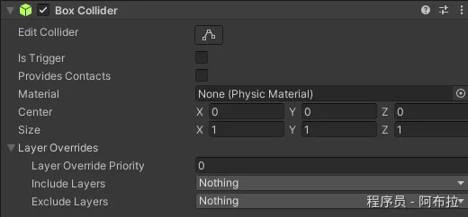
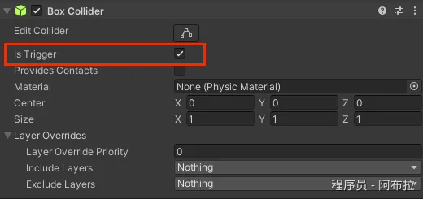
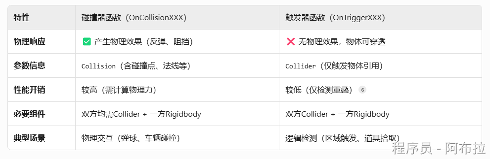
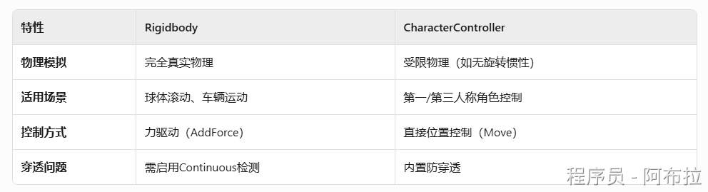

# 面试题

#### 1. 碰撞器（Collider）与触发器（Trigger）函数有哪些？

**碰撞器（Collider）**

用于处理**物理碰撞响应**（需取消勾选Collider的`Is Trigger`属性）



```
OnCollisionEnter(Collision collision)
```

- **触发时机**：两个物体首次发生物理碰撞时调用（仅一次）。
- **参数**：`Collision`对象，包含碰撞点、法线、相对速度等物理信息。

**应用场景**：子弹命中目标时播放音效、角色踩踏地面时触发脚步声

```js
void OnCollisionEnter(Collision collision) {
    ContactPoint contact = collision.contacts[0];
    Vector3 hitPoint = contact.point; // 获取碰撞点坐标
}
OnCollisionStay(Collision collision)
```

- **触发时机**：物体持续接触时**每帧调用**。
- **注意事项**：避免在此函数内执行复杂计算，可能导致性能问题。

**应用场景**：角色推箱子时持续施加力。

```
OnCollisionExit(Collision collision)
```

- **触发时机**：碰撞结束时调用（例如物体分离）。
- **应用场景**：角色离开地面时关闭跳跃状态。

**触发器（Trigger）**



用于**检测物体重叠**（需勾选Collider的`Is Trigger`属性）

```
OnTriggerEnter(Collider other)
```

- **触发时机**：物体**首次进入**触发器范围时调用。
- **参数**：`Collider`对象，仅提供触发物体的碰撞体引用（无物理细节）。

**应用场景**：玩家拾取道具、进入传送门

```csharp
void OnTriggerEnter(Collider other) {
    if (other.CompareTag("Player")) 
        Destroy(gameObject); // 拾取后销毁道具
}
OnTriggerStay(Collider other)
```

- **触发时机**：物体停留在触发器内时**每帧调用**。
- **优化建议**：用`Time.deltaTime`控制检测频率（如每0.5秒检测一次）。

**应用场景**：角色站在毒雾中持续扣血	

```
OnTriggerExit(Collider other)
```

- **触发时机**：物体**离开**触发器范围时调用。
- 应用场景：玩家离开安全区时触发警报

#### 2. 碰撞器（Collider）与触发器（Trigger）的区别？



- **碰撞器**：物理实体边界，用于物理碰撞响应（如反弹、阻挡）。

`Is Trigger=false`→ 物理碰撞 + `OnCollisionXXX`

OnCollisionEnter() // 碰撞发生时触发

- **触发器**：仅检测物体重叠，无物理效果。

`Is Trigger=true`→ 无物理效果 + `OnTriggerXXX`

OnTriggerEnter()  // 物体进入触发区域时触发

**适用场景**：触发区域检测（如收集道具）、穿透型交互（如子弹穿墙检测）

#### 3. 碰撞器（Collider）与触发器（Trigger）函数触发条件？

碰撞器函数 → 双方Collider的`Is Trigger = false`+ 至少一个非Kinematic刚体。

触发器函数 → 至少一个Collider勾选`Is Trigger`+ 一个刚体（可Kinematic）。

#### 4. CharacterController 与 Rigidbody 区别？

**CharacterController是专为角色移动封装的简化物理组件**



#### 5. 物理更新函数

**FixedUpdate()**

物理更新位置

- **必须使用** `FixedUpdate()`
- **原因**：物理计算需固定时间步长（默认0.02s），与帧率无关

```js
void FixedUpdate() {
    rigidbody.AddForce(Vector3.forward * 10f);
}
```
