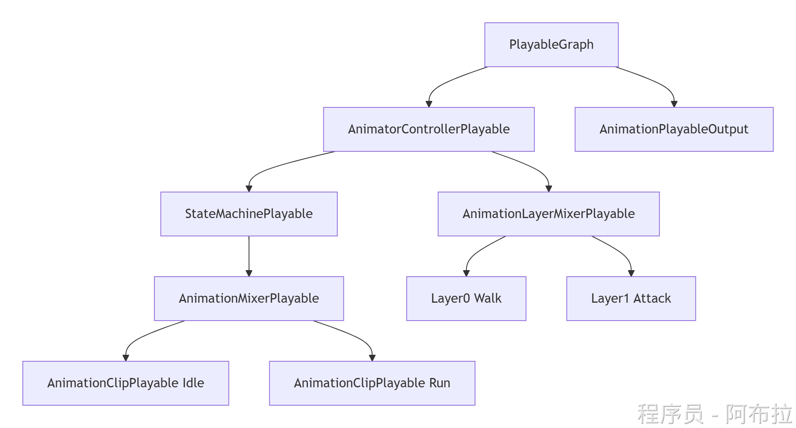

# Playable Graph底层架构

## Unity动画管线核心

**关键组件说明**

1. **AnimatorControllerPlayable**：状态机的根节点，管理状态切换逻辑
2. **StateMachinePlayable**：处理动画状态机逻辑（如Idle/Run状态）
3. **AnimationMixerPlayable**：混合多个动画片段（如行走与奔跑渐变过渡）
4. **AnimationLayerMixerPlayable**：实现动画分层（如上半身攻击+下半身行走）
