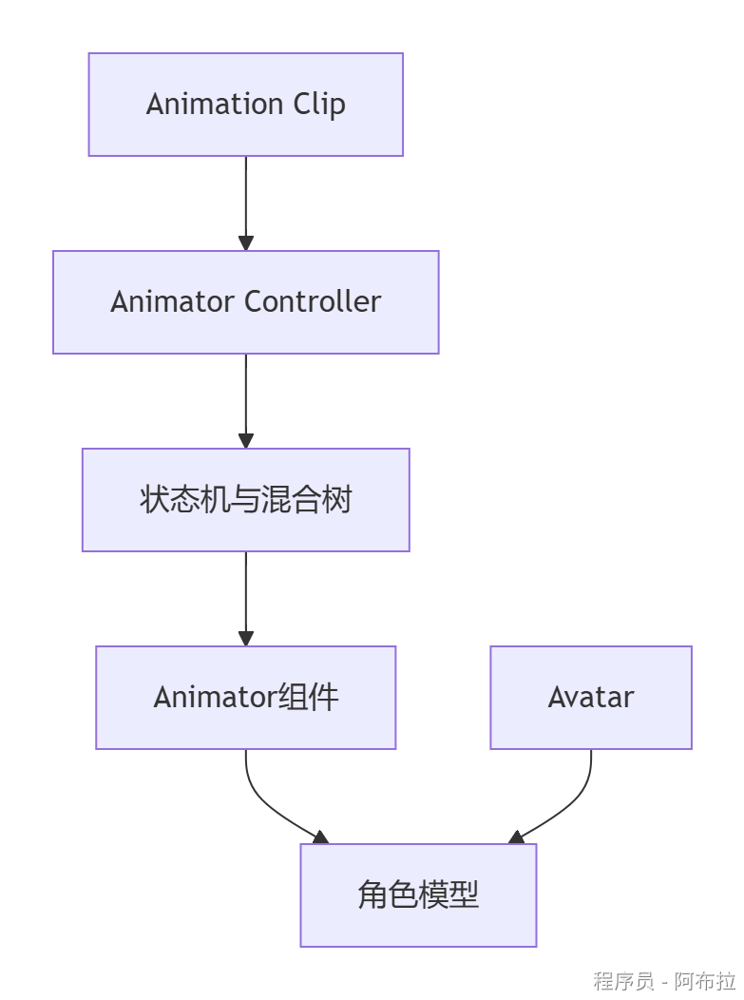
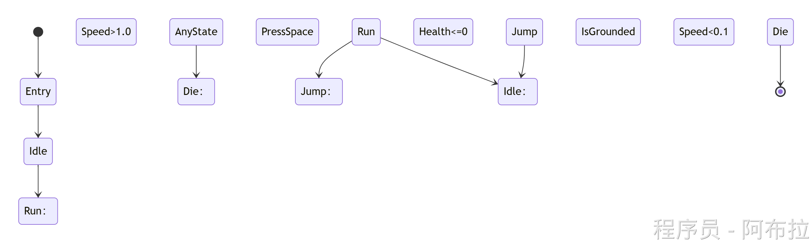
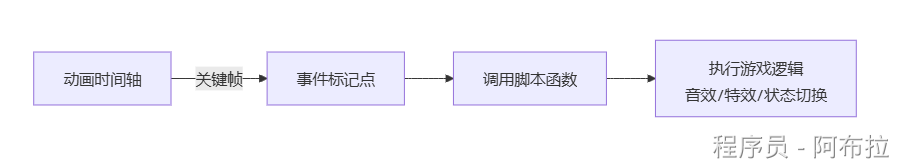
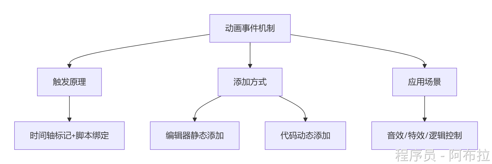
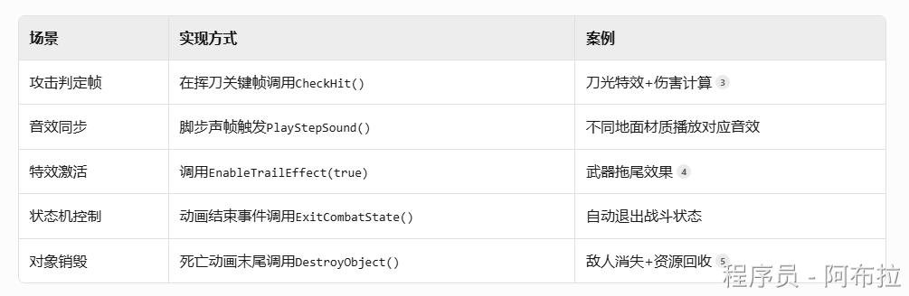

# Mecanim系统

## 工作流



**组件协作关系**：

- **动画片段**：存储关键帧数据（位置/旋转/缩放曲线）
- **动画控制器**：通过状态机管理片段切换逻辑（含Entry/AnyState/Exit节点）
- **Animator组件**：挂载在游戏对象，关联控制器驱动动画
- **Avatar**：骨骼映射中间层，实现人形动画重定向

## 动画状态机核心元素



**关键节点解析**

1. **Entry**：状态机入口，指向默认状态（如Idle）
2. **AnyState**：全局跳转节点（如角色死亡强制中断当前动画）
3. **过渡条件**：基于参数（Float/Bool/Trigger）触发状态切换
4. **Exit**：状态机结束节点（动画播放完成或对象销毁）

## 动画事件机制

- **在Animation Clip中插入事件帧，绑定C#方法**





#### 工作流程

1. 在动画时间轴特定位置插入**事件标记点**（如第15帧）
2. 动画播放到该帧时，Unity引擎**自动检测**事件标记
3. 触发绑定在**同一游戏对象**上的脚本函数
4. 执行预设逻辑（攻击判定/播放音效等）

#### 编辑器静态添加

通过编辑器直接添加，工作不推荐此方法。

#### **动态添加（运行时代码控制）**

- 程序化生成动画内容时（如技能编辑器），推荐使用。

```js
// 动态添加事件示例
void AddEventDynamically(Animator animator, string clipName) {
    AnimationClip clip = GetClip(animator, clipName); // 获取动画片段
    AnimationEvent evt = new AnimationEvent {
        time = 0.5f, // 触发时间（秒）
        functionName = "OnAttackFrame",
        stringParameter = "SwordSwing" // 传递字符串参数
    };
    clip.AddEvent(evt);
    animator.Rebind(); // 强制更新动画控制器[4,7](@ref)
}
```

**精准时间控制**

- 使用`animationEvent.messageOptions`设置**调用时机**：

- `SendMessage`：默认即时调用
- `RequireReceiver`：确保接收对象存在

**多参数传递**

```js
// 通过AnimationEvent对象传递复合参数
evt.objectReferenceParameter = damageData; 
evt.floatParameter = 2.5f;
```

接收函数：

```js
public void OnHit(object refObj, float value) {
    DamageData data = (DamageData)refObj; // 类型转换
} [6](@ref)
```

**注意：**

- 避免在**高频事件**中实例化对象（如`new Vector3()`）
- 使用**对象池**管理特效资


