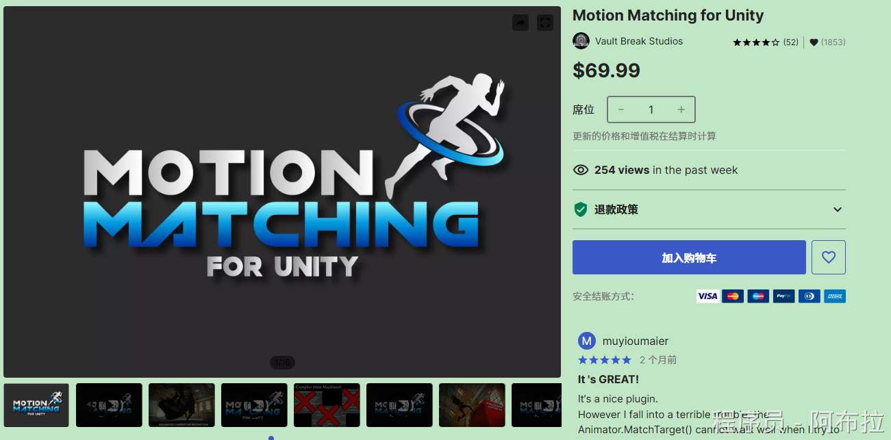

# Motion Matching动画方案

推荐一个知乎：https://zhuanlan.zhihu.com/p/468756512

## Motion Matching 概述

Motion Matching 是一种新型的动画系统，使用得当可以大幅减少手工动作量，但是用于手机游戏的话有一定的风险比如 cpu 性能、数据量以及对动画师的要求。
	Motion Matching 需要的动画比一般的动画要严格，比如我在写这个库的时候匹配转向动画，发现 Turn 动画第一帧竟然有 RootMotion 的前进速度，导致匹配一直失败…

Motion Matching 源于育碧2016年在 GDC 的技术分享，为取代复杂的动画状态机而生的下一代动画系统。
	复杂状态机维护起来很头疼，耗费大量的时间，也容易产生 BUG，Motion Matching 取代了这一步，
	根据玩家输入包括速度、方向、跳跃等和玩家当前骨骼位置、旋转、速度等对比离线烘焙的所有动画骨骼以及根据 RootMotion 预测的坐标数据，选择最匹配的一个动画帧播放。
	具体是如何实现的呢？

## Motion Matching 运行时数据

动作部分的数据主要是骨骼旋转和位移以及RootMotion的速度等

```js
public class MotionBoneData
{
    public Vector3 localPosition;
    public Quaternion localRotation;
    //Bone Velocity
    public Vector3 velocity;

    //Debug
    public string boneName;
    public int boneIndex;
    public Vector3 position;
    public Quaternion rotation;
}
```

预测出来的路径点无非就是坐标和转向等。

```js
public class MotionTrajectoryData
{
    public Vector3 localPosition;
    public Vector3 position;
    public Vector3 velocity;
    public Vector3 direction;
}
```

输入部分就是玩家的操作，比如移动方向和移动速度、跳跃、下蹲等。

```js
public struct PlayerInput
{
    public float velocity;
    public float acceleration;
    public float brake;
    public float turn;
    public bool jump;
    public bool crouch;

    public Vector3 direction;

    public float angularVelocity;

    public float m_TurnAmount;
    public float m_ForwardAmount;
}
```

根据玩家的速度和角速度预测未来几个时间点的坐标和方向，我选择的是 0, 0.1f, 0.3f, 0.5f, 0.7f, 1.0f这几个时间段。然后获取当前骨骼的数据，这个也比较简单，拿到位置和选择数据，local和global记得转换一下就可以了。
	这一部分有几个优化，我在最后一段会特别讲一下，这里为了清晰先不说。

## Motion Matching Baking

这一步是离线的，和上面一样主要是两个部分数据 BoneSnapShot 和 TrajectorySnapShot。
	我们加载所有需要烘焙的动画，然后挨个播放他们，保存当前帧的骨骼数据以及根据 RootMotion 速度预测路径点，同样的上面的那几个时间段。然后根据帧号把数据保存起来，用于后面的匹配。

## Motion Matching 匹配最适合的动画

根据上面两步的数据，我们计算当前数据和动画库所有动画每一帧的差值，选取差值（cost）最小的一个，就是适合我们的动画。计算公式如下，

```js
bonesCost = bonePosCost + boneRotCost;
trajectorysCost = trajectoryPosCost + trajectoryVelCost + trajectoryDirCost;
rootMotionCost = Mathf.Abs(motionFrameData.velocity - currentMotionFrameData.velocity) * motionCostFactorSettings.rootMotionVelFactor;
motionCost = bonesCost + trajectorysCost + rootMotionCost;
```

比如一根骨骼的位置消耗就是当前骨骼坐标和数据库中的对应骨骼的坐标的差值，然后所有骨骼的位置消耗加起来。

```js
float bonePosCost = Vector3.SqrMagnitude(motionBoneData.localPosition - currentMotionBoneData.localPosition);
```

但是有一点，因为每一部分的重要程度是不一样的，比如角色方向的 cost就比骨骼的旋转cost要重要一些，因为方向都错了其他都不重要了。
	所以可以设置每一部分的重要度系数乘以 cost，这个系数的调整非常重要，决定了匹配系统的精确度，如下，

```js
public class MotionCostFactorSettings : ScriptableObject
{
    [Tooltip("")]
    public float bonePosFactor = 1.0f;

    [Tooltip("")]
    public float boneRotFactor = 1.0f;

    [Tooltip("")]
    public float boneVelFactor = 1.0f;

    [Tooltip("")]
    public float rootMotionVelFactor = 1.5f;

    [Tooltip("")]
    public float predictionTrajectoryPosFactor = 20.0f;

    [Tooltip("")]
    public float predictionTrajectoryVelFactor = 20.0f;

    [Tooltip("")]
    public float predictionTrajectoryDirFactor = 10.0f;
}
```

## Motion Matching 优化

刚才提到的优化，我们这里具体讲一下。

1. 我们烘焙以及匹配的时候是没必要选择所有的骨骼，一个角色可能五十根甚至更多的骨骼，我们选取比较重要的七八根根就可以了，比如头，脖子，左右手等等。
2. 同样的，因为考虑到离线数据大小以及运行时性能消耗的问题，我们也没必要烘焙动画每一帧，我的策略是跳帧，每间隔三五帧烘焙一次，当前间隔越小越精确，帧间隔越大离线数据越大，运行时匹配的消耗也越小。
3. 烘焙的数据精度问题也影响离线数据大小，保留了三位用于减小离线数据的体积。

## 用第三方插件

这样就可以不用造轮子 ，直接用就行！

https://assetstore.unity.com/packages/tools/animation/motion-matching-for-unity-145624?locale=zh-CN


