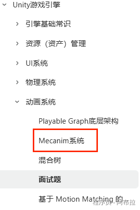

# 面试题

| **概念**                  | **核心要点**                                                 | **主要应用/特点**                              |
| ------------------------- | ------------------------------------------------------------ | ---------------------------------------------- |
| **Avatar**                | 骨架映射系统，实现动画重定向。                               | 人形动画共享、IK、身体遮罩。                   |
| **动画类型**              | 关键帧动画（顶点插值）、骨骼动画（驱动骨骼，蒙皮变形）、关节动画（分部件组合）。 | 骨骼动画是现代游戏主流，高效灵活。             |
| **Animator Controller**   | 基于状态机管理多个动画状态和过渡。                           | 通过参数（Bool, Trigger等）控制复杂动画逻辑。  |
| **Animation vs Animator** | Animation管单个动画，Animator管一套动画逻辑和状态机，功能更强但内存占用更大。 | 旧系统 vs 新系统。                             |
| **性能优化**              | 压缩动画、减少骨骼数量、使用动画裁剪和LOD。                  | 保障游戏流畅运行，尤其在低性能平台。           |
| **反向动力学 (IK)**       | 通过控制子骨骼（如手、脚）目标位置，自动计算父骨骼链旋转。   | 使角色与环境交互更自然（如踏地、注视、抓取）。 |

#### 1. 新旧动画系统区别？

- Legacy系统：`Animation组件` → 直接播放单片段
- Mecanim系统：`Animator+状态机` → 支持混合/重定向/根运动

#### 2. 动画事件机制？

详情请看：



Unity 动画系统是面试中的重点考察领域。下面我为你梳理一些高频且深入的面试题及其解答思路，希望能帮助你更好地准备。

#### 3. Mecanim 系统中，Avatar 的作用是什么？

Avatar 是 Unity 中一种**骨架映射**系统。它的核心作用是充当一个“翻译器”，将用户自定义的模型骨骼结构与 Unity 标准的 Mecanim 人体骨骼结构进行关联和适配。

- **重定向功能**：这是 Avatar 最强大的特性。它允许你将为一个模型（例如，一个标准人形角色）制作的动画应用给另一个完全不同但结构也为人形的模型（例如，一个高矮胖瘦不同的怪物角色），而无需重新制作动画。
- **身体遮罩与反向动力学**：通过 Avatar，你可以使用 **Avatar Mask** 来指定动画只影响身体的某些部位（例如，仅上半身播放投掷动画，下半身保持行走）。同时，它也支持**反向动力学**，使得你可以通过控制手或脚的位置来自然影响整个手臂或腿部的骨骼姿态。

**AnimationType的三种类型**：

- **Humanoid**：人形骨骼。可享受重定向、IK 等全部 Mecanim 高级功能。
- **Generic**：通用骨骼。适用于非人形角色（如猫、狗、巨龙），无法使用重定向，但依然可以使用状态机等功能。
- **Legacy**：旧版动画系统。主要用于兼容 Unity 4.0 及更早版本的项目。

#### 4. 请描述游戏动画有哪几种，以及其原理？

主要的游戏动画类型有关键帧动画、骨骼动画和关节动画。

- **关键帧动画**：在动画序列的**关键时间点**记录模型**顶点的空间位置信息及其改变量**，然后由计算机通过**插值运算**自动生成中间帧，从而实现平滑的动画效果。这种方式动画较真实，但数据量可能较大。
- **骨骼动画**：这是目前**最广泛应用**的动画方式。模型包含一个**层次结构的骨骼系统**，每块骨骼存储其空间变换信息。模型的网格（皮肤）顶点**依附（蒙皮）在骨骼上**，并可以受到多块骨骼的权重影响。通过驱动骨骼的旋转、平移，来自动带动蒙皮网格的变形，从而产生动画。它高效且数据量小，非常适合游戏角色。
- **关节动画**：可视为骨骼动画的前身。它将一个角色模型**拆分成多个独立部分的网格**（如头、躯干、四肢），每个部分对应一个独立的动画。通过将这些部分的动画连接起来，组合成一个整体的动画。角色表现比较灵活，但可能在关节处产生裂缝。

#### 5. 如何使用 Mecanim 动画状态机控制角色动画（如行走、奔跑、攻击）？

使用 Mecanim 的 **Animator Controller** 和**状态机**是控制角色动画的核心流程。

1. **创建状态与放置动画**：在 Animator Controller 中创建不同的状态（如 `Idle`, `Walk`, `Run`, `Attack`），并将相应的动画片段（Animation Clip）拖拽到每个状态上。
2. **创建状态转换与设置参数**：使用**转换线**连接各个状态。点击转换线，在 Inspector 窗口中**添加条件**。这些条件由**参数**控制，参数类型包括 `Float`, `Int`, `Bool`, `Trigger`。例如，可以创建一个 `Bool` 型参数 `isRunning`。
3. **编写脚本控制状态切换**：在角色控制脚本中获取 `Animator` 组件，并根据游戏逻辑（如玩家输入、速度等）使用 `SetBool`, `SetFloat`, `SetTrigger` 等方法改变 Animator Controller 中的参数，从而驱动状态切换。

```js
public class PlayerMovement : MonoBehaviour
{
    public Animator animator;
    public float speed = 0f;
    public float runningThreshold = 10f;

    void Update()
    {
        float horizontalInput = Input.GetAxis("Horizontal");
        float verticalInput = Input.GetAxis("Vertical");
        speed = Mathf.Sqrt(horizontalInput * horizontalInput + verticalInput * verticalInput);
        animator.SetBool("isRunning", speed > runningThreshold);
    }
}
```

#### 6. Animation 和 Animator 的区别是什么？

这是 Unity 新旧两套动画系统的核心区别。

- **Animation**：是**旧版**动画系统。它主要用于控制**单个动画片段**的播放，功能相对简单直接。每个 `Animation` 组件基本上管理一个动画。
- **Animator**：是 **Mecanim** 新动画系统的核心组件。它通过 **Animator Controller**（一种可视化的**状态机**）来管理**多个动画状态**及其之间的**复杂过渡和混合**。它支持丰富的功能，如状态机、混合树、动画层、 Avatar IK 等，非常适合管理角色复杂的动画行为。但功能强大的同时，其**内存占用通常比 Animation 大**。

简而言之，**Animation 管一个动画，Animator 管一套动画逻辑。**

#### 7. 如何进行动画性能优化？

动画性能优化是保证游戏流畅的关键，尤其是在移动设备上。

- **使用动画压缩**：在动画资源的导入设置中，可以调整**动画精度**和**压缩选项**，以减少动画数据的内存占用和计算量。
- **优化骨骼数量**：模型的**骨骼数量**是影响动画计算性能的主要因素之一。应尽量减少不必要的骨骼，尤其是在移动端平台。
- **使用动画裁剪**：对于远处或屏幕外的角色，可以启用基于**视锥体的裁剪**，避免计算不可见角色的动画。
- **利用动画 LOD**：可以为同一个角色制作不同精度的动画（或在不同距离上禁用某些复杂的动画效果），根据角色与摄像机的距离动态切换，这是一种**多层次细节**技术。

#### 8. 简述反向动力学（IK）及其在 Unity 中的应用。

**反向动力学**是一种通过控制子骨骼（如手或脚）的**目标位置和旋转**，来**自动计算并调整**其父骨骼链（如整条手臂或腿）的关节旋转，从而使末端效应器达到目标位置的技术。它与正向动力学（FK，从父骨骼开始逐级影响子骨骼）相反。

在 Unity 中，可以通过在 Animator Controller 的 **Layer Settings** 中启用 **IK Pass**，然后在脚本中重写 `OnAnimatorIK` 方法来轻松实现 IK。这常用于：

- **脚部 IK**：让角色的脚部更自然地适应不平坦的地面。
- **头部/视线 IK**：让角色的头部和眼睛始终看向某个目标或玩家。
- **抓取 IK**：让手部精确地抓取或触摸场景中的物体。
