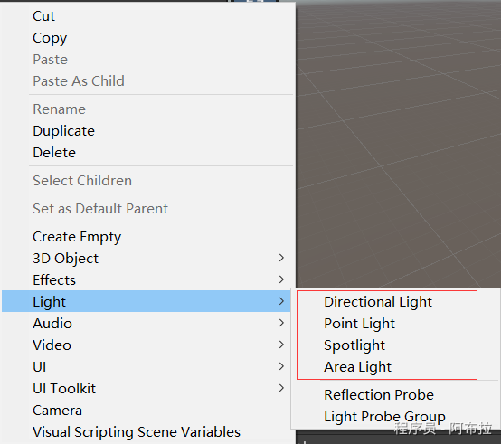
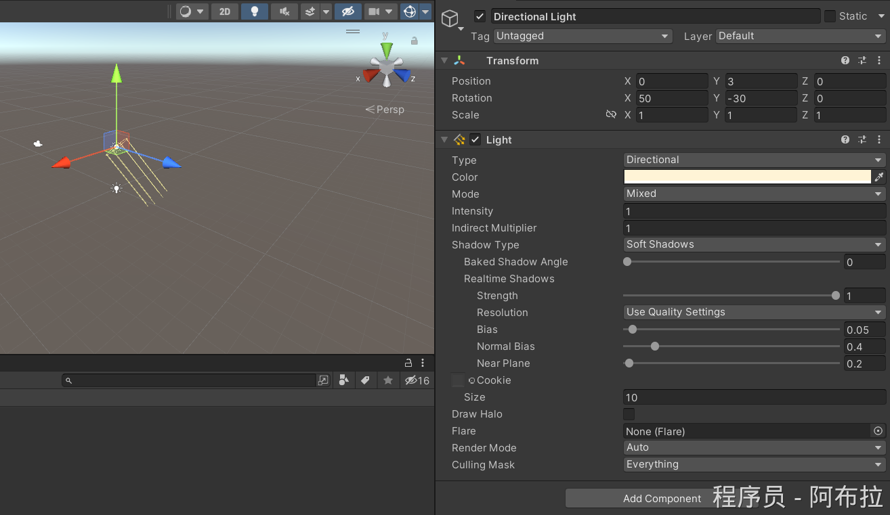
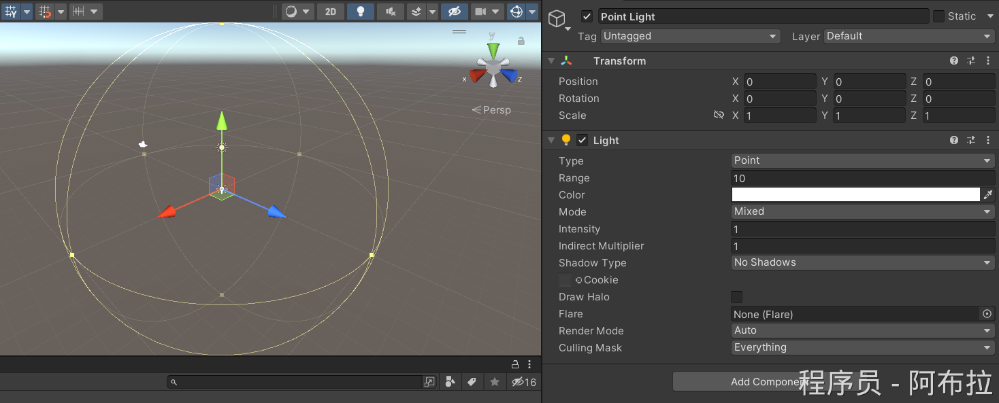
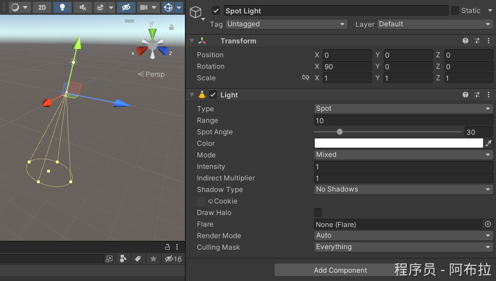
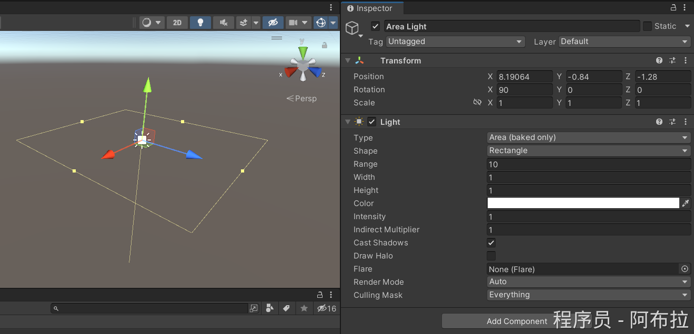

# 光照

### 1. Unity中都有哪些灯光，以及应用场景

在Unity中，有多种类型的灯光可供使用，每种灯光都有其独特的特点和应用场景。

以下是对Unity中各种灯光的详细说明



**答案**

1. **Directional Light（平行光）**：模拟太阳光，全局照射，阴影方向一致
2. **Point Light（点光源）**：向四周发射光线，强度随距离衰减（如灯泡）
3. **Spot Light（聚光灯）**：锥形光照区域，可调角度（如手电筒）
4. **Area Light（区域光）**：平面光源，产生柔和阴影，仅支持烘焙

1. **平行光源（Directional Light）**：

- 特点：模拟太阳光的平行光源，可以从一个方向照射整个场景。光源发出的光没有距离的限制且相互平行，因此无论放在什么位置都能照射到指定方向的区域，投射出来的阴影也都是一样的。
- 应用场景：通常用于模拟白天、夜晚等自然光照条件。例如，在游戏或电影场景中，使用平行光源来模拟太阳光的效果，为场景提供基础的光照。



1. **点光源（Point Light）**：

- 特点：类似于一个点发出的光源，可以在场景中向所有方向发光。光线强度和照射距离成反比，即距离越远，光线越弱。阴影会随光源的位置而发生变化。
- 应用场景：通常用于模拟灯泡、火焰等小型光源。例如，在室内场景中，使用点光源来模拟灯泡或壁灯的光照效果，为场景增添局部照明和细节。



1. **聚光灯（Spot Light）**：

- 特点：类似于手电筒，可以指定一个方向发光，仅照亮一个锥形范围内的对象。聚光灯在其照亮范围内随距离增加而亮度衰减。
- 应用场景：通常用于模拟手电筒、车灯等光源，或在电影制作中用于营造特定的光影效果，如主角的追光效果。聚光灯在游戏或电影中经常用于创造聚焦、引导观众视线的效果。



1. **区域光（Area Light）**：

- 特点：模拟一个较大的发光表面对周围环境的照明效果。通常面积光的灯光亮度衰减很快，阴影非常柔和。在Unity中，区域光主要用于光照贴图烘焙（lightmap baking），不能用于实时渲染。
- 应用场景：适用于需要柔和阴影和复杂光照效果的场景。例如，在建筑或室外场景中，使用区域光来模拟大型光源（如大型窗户或天空光）对场景的影响，创造出更加真实的光照环境。



### 2. 如何调整灯光的颜色和强度？

- **答案**： 

- **颜色**：通过`Light.color`属性设置，需注意值范围（0-1或Color32的0-255）。
- **强度**：`Light.intensity`控制亮度，默认1-2，点光源可更高。

```js
Light directionalLight = GetComponent<Light>();
directionalLight.color = new Color(0.5f, 0.5f, 0.5f); // 灰色
directionalLight.intensity = 1.5f; // 中等亮度
```

- **过曝问题**：颜色值过高会导致曝光，需归一化或使用`Color32`。

### 3. 什么是灯光烘焙（Light Baking）？如何操作？

- **答案**： 

**目的**：将静态物体光照预计算为纹理（Lightmap），提升运行时性能。

**步骤**： 

1. 标记物体为`Static`。
2. 在`Light`组件中选择`Baked`模式。
3. 通过`Window > Rendering > Lighting`窗口烘焙。

### 4. 如何实现动态全局光照（Realtime GI）？

- **答案**： 

- 启用`Precomputed Realtime GI`，预计算光路信息，运行时动态调整光源位置/颜色。
- **注意**：需配合`Bounce Intensity`控制间接光强度。

```js
Lightmapping.realtimeGI = true; // 启用实时GI
```

### 5. 如何优化阴影性能？

- **答案**： 

- **降低分辨率**：减少`Shadow Resolution`（如从High降到Medium）。
- **使用级联阴影（CSM）**：对远距离物体降低阴影质量。
- **烘焙静态阴影**：静态物体使用`Baked Shadows`。

### 6. 如何减少实时光照的DrawCall？

- **答案**： 

**光照探针（Light Probes）**：为动态物体提供间接光照，避免实时计算。

**混合光照（Mixed Lighting）**：静态部分烘焙，动态部分实时计算。

### 7. 为什么修改灯光颜色后场景过曝？

- **原因**：颜色值超出0-1范围（如`new Color(80, 80, 80)`）。
- **解决**： 

- 使用归一化值：`new Color(80/255f, 80/255f, 80/255f)`。
- 或改用`Color32`：`new Color32(80, 80, 80, 255)`。

### 8. 如何实现灯光跟随角色（如手电筒）？

- **答案**： 

将聚光灯设为角色的子物体，或通过代码更新位置： 

```js
void Update() {
    transform.position = player.position + offset;
    transform.rotation = player.rotation;
}
```

### 9. 如何用脚本控制灯光开关与闪烁？

```js
IEnumerator FlashLight() {
    while (true) {
        light.enabled = !light.enabled; // 切换开关
        yield return new WaitForSeconds(0.5f); // 间隔0.5秒
    }
}
```

### 10. PBR材质如何与灯光交互？

- **答案**： 

PBR材质通过`Metallic`和`Smoothness`属性影响光反射： 

- 高金属度：强镜面反射。
- 高光滑度：清晰高光。
